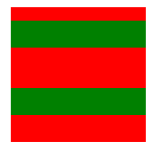
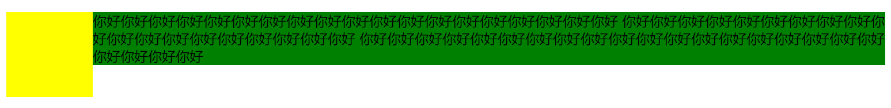

# CSS 中的 BFC 详解

## 引言：

这篇文章是我对 BFC 的理解及总结，带你揭开 BFC 的面纱。你将会知道 BFC 是什么，形成 BFC 的条件，BFC 的相关特性，以及他的实际应用。

## 一、何为 BFC

`BFC（Block Formatting Context）`格式化上下文，是 Web 页面中盒模型布局的 CSS 渲染模式，指一个独立的渲染区域或者说是一个隔离的独立容器。

## 二、形成 BFC 的条件

1、浮动元素，float 除 none 以外的值

2、定位元素，position（absolute，fixed）

3、display 为以下其中之一的值 inline-block，table-cell，table-caption

4、overflow 除了 visible 以外的值（hidden，auto，scroll）

## 三、BFC 的特性

1、内部的 Box 会在垂直方向上一个接一个的放置。

2、垂直方向上的距离由 margin 决定。

3、bfc 的区域不会与 float 的元素区域重叠。

4、计算 bfc 的高度时，浮动元素也参与计算。

5、bfc 就是页面上的一个独立容器，容器里面的子元素不会影响外面元素。

可能看到这里，大家是不是有丈二和尚摸不着头脑的感觉，下面我就用案例来帮助理解认识：

## 四、实践是检验真理的唯一标准

### （1）BFC 中的盒子对齐

特性的第一条是：内部的 Box（块级元素）会在垂直方向上一个接一个的放置。（这条特性不必纠结，即便不在 BFC 里块级盒子也会垂直排列）

### （2）外边距折叠

特性的第二条：垂直方向上的距离由 margin 决定

在常规文档流中，两个兄弟盒子之间的垂直距离是由他们的外边距所决定的，但不是他们的两个外边距之和，而是以较大的为准。


html：

```html
<div class="container">
  <div class="box1"></div>
  <div class="box2"></div>
</div>
```

css

```css
.container {
  overflow: hidden;
  width: 100px;
  height: 100px;
  background-color: red;
}

.box1 {
  height: 20px;
  margin: 10px 0;
  background-color: green;
}

.box2 {
  height: 20px;
  margin: 20px 0;
  background-color: green;
}
```

这里我门可以看到，第一个子盒子有上边距（不会发生 margin 穿透的问题）；两个子盒子的垂直距离为 20px 而不是 30px，因为垂直外边距会折叠，间距以较大的为准。

那么有没有方法让垂直外边距不折叠呢？答案是：有。特性的第 5 条就说了：bfc 就是页面上的一个独立容器，容器里面的子元素不会影响外面元素，同样外面的元素不会影响到 BFC 内的元素。所以就让 box1 或 box2 再处于另一个 BFC 中就行了。



### （3）不被浮动元素覆盖

以常见的两栏布局为例。

左边固定宽度，右边不设宽，因此右边的宽度自适应，随浏览器窗口大小的变化而变化。


html

```html
<div class="column"></div>
<div class="column"></div>
```

CSS

```css
.column:nth-of-type(1) {
  float: left;
  width: 200px;
  height: 300px;
  margin-right: 10px;
  background-color: red;
}

.column:nth-of-type(2) {
  overflow: hidden; /*创建bfc */
  height: 300px;
  background-color: purple;
}
```

还有三栏布局。

左右两边固定宽度，中间不设宽，因此中间的宽度自适应，随浏览器的大小变化而变化。


html

```html
<div class="contain">
  <div class="column"></div>
  <div class="column"></div>
  <div class="column"></div>
</div>
```

CSS

```css
.column:nth-of-type(1),
.column:nth-of-type(2) {
  float: left;
  width: 100px;
  height: 300px;
  background-color: green;
}

.column:nth-of-type(2) {
  float: right;
}

.column:nth-of-type(3) {
  overflow: hidden; /*创建bfc*/
  height: 300px;
  background-color: red;
}
```

也可以用来防止字体环绕：

众所周知，浮动的盒子会遮盖下面的盒子，但是下面盒子里的文字是不会被遮盖的，文字反而还会环绕浮动的盒子。这也是一个比较有趣的特性。



html

```html
<div class="left"></div>
<p>
  你好你好你好你好你好你好你好你好你好你好你好你好你好你好你好你好你好你好你好
  你好你好你好你好你好你好你好你好你好你好你好你好你好你好你好你好你好你好你好
  你好你好你好你好你好你好你好你好你好你好你好你好你好你好你好你好你好你好你好你好你好你好你好
</p>
```

CSS

（1）环绕

```css
.left {
  float: left;
  width: 100px;
  height: 100px;
  background-color: yellow;
}

p {
  background-color: green;
  /* overflow: hidden; */
}
```

（2）利用 bfc 防止环绕

```css
.left {
  float: left;
  width: 100px;
  height: 100px;
  background-color: yellow;
}

p {
  background-color: green;
  overflow: hidden;
}
```

（4）BFC 包含浮动的块

这个是大家再熟悉不过的了，利用`overflow:hidden`清除浮动嘛，因为浮动的盒子无法撑出处于标准文档流的父盒子的 height。这个就不过多解释了，相信大家都早已理解。

## 总结

我希望这篇文章已经向你展示了 BFC 的相关特性，以及他们如何影响元素在页面上的视觉定位。所有的例子都展示了它们在实际案例中的应用，这应该会使得他们更加清晰。

## 最后

文中若有不准确或错误的地方，欢迎指出，有兴趣可以的关注下[Github](https://github.com/GolderBrother)~
