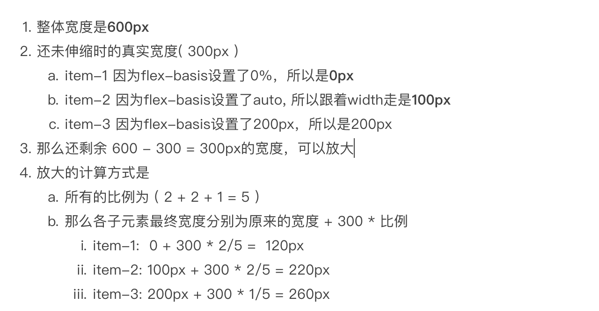
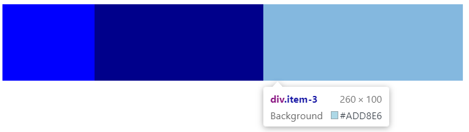

# 弹性盒子中 flex: 0 1 auto 表示什么意思

三个参数分别对应的是 flex-grow, flex-shrink 和 flex-basis，默认值为 0 1 auto。

1. `flex-grow` 属性定义项目的放大比例，默认为 0，即如果存在剩余空间，也不放大。
2. `flex-shrink` 属性定义了项目的缩小比例，默认为 1，即如果空间不足，该项目将缩小。
3. `flex-basis` 属性定义了在分配多余空间之前，项目占据的主轴空间（main size）（设置了宽度跟宽度走，没设置宽度跟内容实际宽度走）。

比如我们这样写

```html
<!DOCTYPE html>
<html lang="en">
  <head>
    <meta charset="UTF-8" />
    <meta name="viewport" content="width=device-width, initial-scale=1.0" />
    <title>css-flex</title>
  </head>

  <body>
    <div class="parent">
      <div class="item-1"></div>
      <div class="item-2"></div>
      <div class="item-3"></div>
    </div>

    <style type="text/css">
      .parent {
        display: flex;
        width: 600px;
      }

      .parent > div {
        height: 100px;
      }

      .item-1 {
        width: 140px;
        flex: 2 1 0%;
        background: blue;
      }

      .item-2 {
        width: 100px;
        flex: 2 1 auto;
        background: darkblue;
      }

      .item-3 {
        flex: 1 1 200px;
        background: lightblue;
      }
    </style>
    
  </body>
</html>
```

可以看下效果




## 最后

文中若有不准确或错误的地方，欢迎指出，有兴趣可以的关注下[Github](https://github.com/GolderBrother)~
