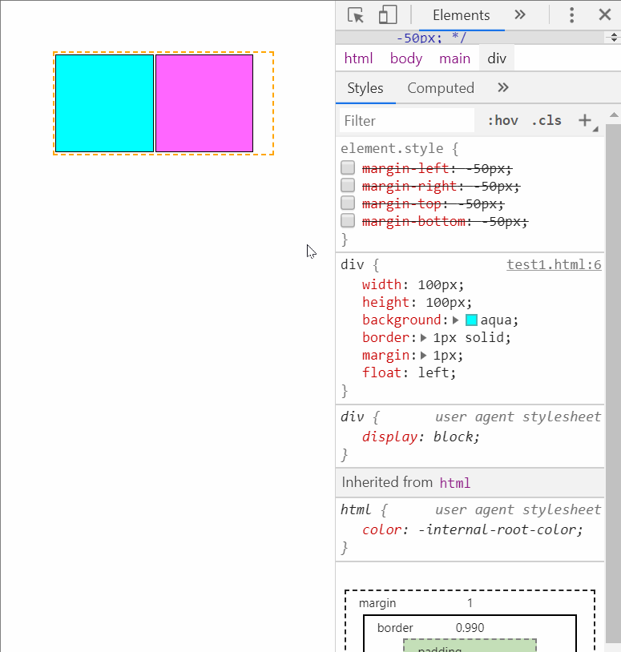
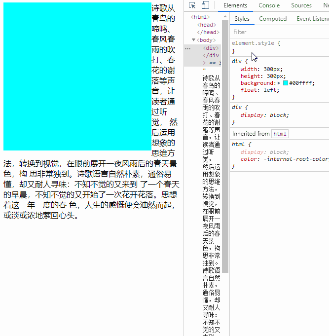
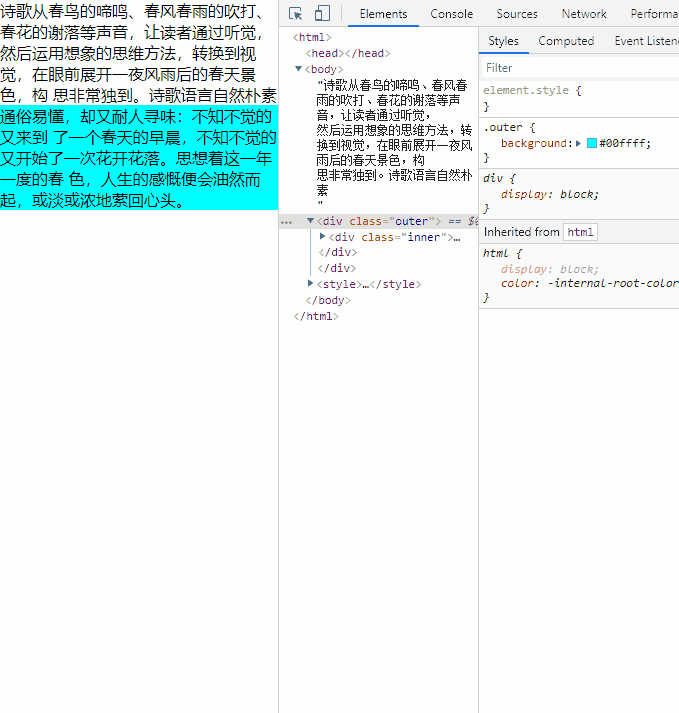
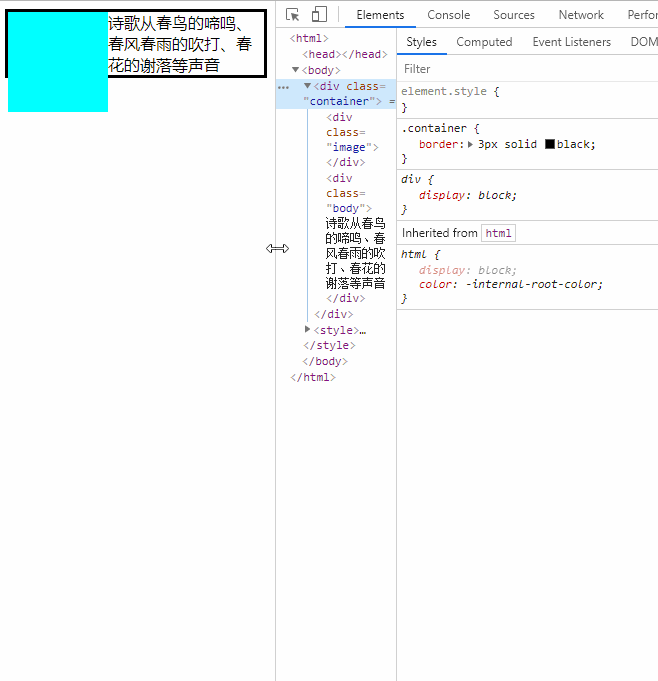
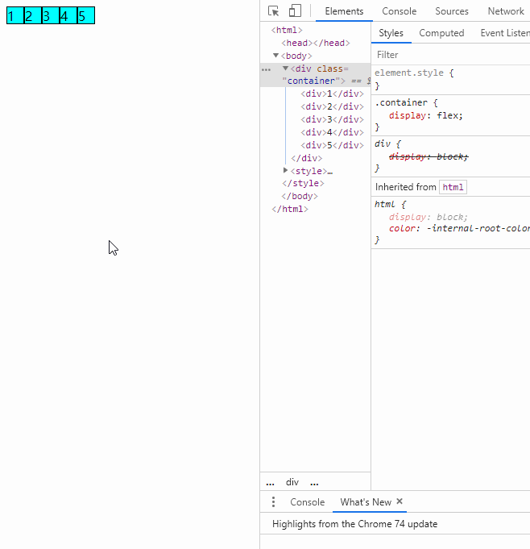
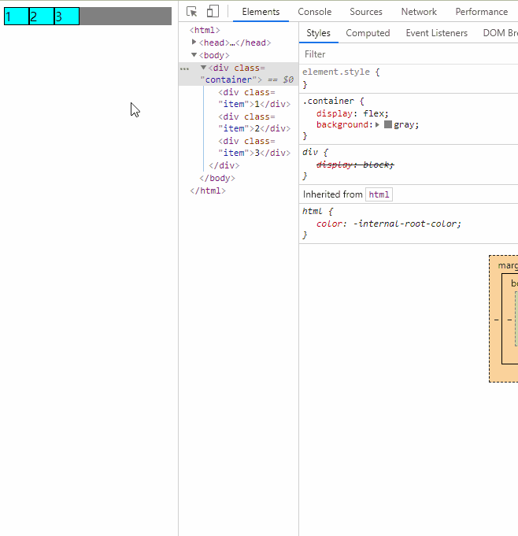
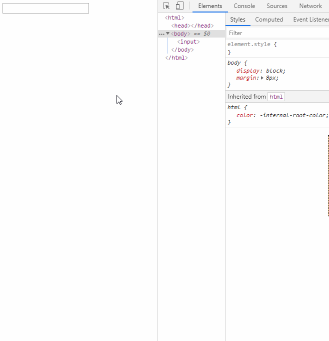

# 你未必知道的 49 个 CSS 知识点

## 01.【`负边距`】💘 负边距的效果。注意左右负边距表现并不一致。左为**负**时，是**左移**，右为**负**时，是**左拉**。上下与左右类似



## 02.【`shape-outside`】💘 不要自以为是了。你以为自己是方的，在别人眼里你却是圆的



## 03.【BFC 应用】💓BFC 应用之阻止外边距合并（margin collapsing）



实现代码是这样的：

```html
<style>
  .outer {
    background-color: aqua;
    overflow: hidden;
  }

  .inner {
    margin-top: 30px;
  }
</style>
秋风用时光的旋律，用桂花的芬芳、苹果的馨香、菊花的灿烂、牵牛花的奔放、一串红的艳丽，把一望无际的田野乡村，演绎得在自然中沉醉，渲染得天地间空旷而又阳刚。
<div class="outer">
  <div class="inner">
    酷热的夏天刚刚过去，秋风吹来，秋牵着一个个节气的手，舞动着长袖，用婀娜多姿的舞姿，用变幻神奇的旋律，动听的音符，把蓝天吹得一会白云飘飘，一会云蒸霞蔚，一会仙女舞袖，一会又涌来千顷碧波。更让那成千上万得雀鸟，不顾辛苦劳顿，路途遥远，赶赴银汉，为牛郎织女架起一座相会的鹊桥，就为这对生离死别的鸳鸯说上一晚悄悄话。
    秋天的风，优雅中体现成熟和高雅。砍高粱、掐谷子、掰玉米、刨芋头、割豆子、下苹果、晒柿子、揪石榴、摘花生、耩麦子，一个个音符，无不让秋风演奏得动听、感人。仰望湛蓝的长空，会让你一扫往日沉闷枯燥的苦闷，心情更加舒畅了，一股热爱蓝天热爱大自然钟爱乡村田野的激情，便油然而生。
  </div>
</div>
```

## 04.【BFC 应用】💔BFC 应用之消除浮动的影响



实现代码是这样的：

```html
<style>
  .container {
    display: flow-root;
    border: 3px solid black;
  }

  .image {
    float: left;
    width: 100px;
    height: 100px;
    background-color: aqua;
  }

  .body {
    display: flow-root;
  }
</style>
<div class="container">
  <div class="image"></div>
  <div class="body">
    秋风用时光的旋律，用桂花的芬芳、苹果的馨香、菊花的灿烂、牵牛花的奔放、一串红的艳丽，把一望无际的田野乡村，演绎得在自然中沉醉，渲染得天地间空旷而又阳刚。
    酷热的夏天刚刚过去，秋风吹来，秋牵着一个个节气的手，舞动着长袖，用婀娜多姿的舞姿，用变幻神奇的旋律，动听的音符，把蓝天吹得一会白云飘飘，一会云蒸霞蔚，一会仙女舞袖，一会又涌来千顷碧波。更让那成千上万得雀鸟，不顾辛苦劳顿，路途遥远，赶赴银汉，为牛郎织女架起一座相会的鹊桥，就为这对生离死别的鸳鸯说上一晚悄悄话。
  </div>
</div>
```

## 05.【flex 不为人知的特性之一】💕flex 布局下 margin:auto 的神奇用法



实现代码是这样的

```html
<style>
    .container {
      display: flex;
    }

    .item {
      border: 1px solid black;
      width: 30px;
      height: 30px;
      background-color: aqua;
      text-align: center;
      /* margin: auto; */
    }

    .item:first-child {
      margin-right: auto;
    }

    .item:nth-child(3) {
      margin: auto;
    }

    .item:last-child {
      margin-left: auto;
    }
  </style>
  <div class="container">
    <div class="item">1</div>
    <div class="item">2</div>
    <div class="item">3</div>
    <div class="item">4</div>
    <div class="item">5</div>
  </div
```

## 06.【flex 不为人知的特性之二】💖flex 布局，当 flex-grow 之和小于 1 时，只能按比例分配部分剩余空间，而不是全部



实现代码是这样的：

```html
<style>
  .container {
    display: flex;
    background-color: brown;
  }

  .item {
    border: 1px solid black;
    width: 30px;
    background-color: aqua;
    flex-grow: 0.1;
  }

  .item:first-child {
    flex-grow: 0.3;
  }
</style>
<div class="container">
  <div class="item">1</div>
  <div class="item">2</div>
  <div class="item">3</div>
</div>
```

## 07.【input 的宽度】💗 并不是给元素设置 display:block 就会自动填充父元素宽度。input 就是个例外，其默认宽度取决于 size 特性的值



实现代码是这样的

```html
<style>
  .container {
    display: flex;
  }

  input {
    display: block;
    width: 100%;
  }
</style>
<div class="container">
  <input type="text" size="30" />
</div>
```
