# 你未必知道的 49 个 CSS 知识点

## 下边列举的每一条都是亲测有效的~

### 01.【`负边距`】💘 负边距的效果。注意左右负边距表现并不一致。左为**负**时，是**左移**，右为**负**时，是**左拉**。上下与左右类似


实现代码是这样的：

```html
<style>
  .container {
    width: 300px;
    height: 200px;
    border: 2px dotted pink;
  }

  .container div {
    /* float: left; */
    width: 100px;
    height: 100px;
    border: 1px solid;
  }

  .container div:nth-child(1) {
    background-color: aqua;
  }

  .container div:nth-child(2) {
    background-color: purple;
    margin-top: -50px;
    margin-right: -50px;
    margin-bottom: -50px;
    margin-left: -50px;
  }
</style>
<div class="container">
  <div></div>
  <div></div>
</div>
```

### 02.【`shape-outside`】💘 不要自以为是了。你以为自己是方的，在别人眼里你却是圆的


实现代码是这样的：

```html
<style>
  .container {
    width: 600px;
    border: 2px dotted pink;
    margin: auto;
  }

  .container div {
    float: left;
    width: 300px;
    height: 300px;
    background-color: aqua;
    shape-outside: circle();
  }
</style>
<div class="container">
  <div></div>
  <p>
    生命的美丽，永远展现在她的进取之中；就像大树的美丽，是展现在它负势向上高耸入云的蓬勃生机中；像雄鹰的美丽，是展现在它搏风击雨如苍天之魂的翱翔中；像江河的美丽，是展现在它波涛汹涌一泻千里的奔流中。
    生命的美丽，永远展现在她的进取之中；就像大树的美丽，是展现在它负势向上高耸入云的蓬勃生机中；像雄鹰的美丽，是展现在它搏风击雨如苍天之魂的翱翔中；像江河的美丽，是展现在它波涛汹涌一泻千里的奔流中。
    生命的美丽，永远展现在她的进取之中；就像大树的美丽，是展现在它负势向上高耸入云的蓬勃生机中；像雄鹰的美丽，是展现在它搏风击雨如苍天之魂的翱翔中；像江河的美丽，是展现在它波涛汹涌一泻千里的奔流中。
  </p>
</div>
```

### 03.【BFC 应用】💓BFC 应用之阻止外边距合并（margin collapsing）


实现代码是这样的：

```html
<style>
  .outer {
    background-color: aqua;
    overflow: hidden;
  }

  .inner {
    margin-top: 30px;
  }
</style>
秋风用时光的旋律，用桂花的芬芳、苹果的馨香、菊花的灿烂、牵牛花的奔放、一串红的艳丽，把一望无际的田野乡村，演绎得在自然中沉醉，渲染得天地间空旷而又阳刚。
<div class="outer">
  <div class="inner">
    酷热的夏天刚刚过去，秋风吹来，秋牵着一个个节气的手，舞动着长袖，用婀娜多姿的舞姿，用变幻神奇的旋律，动听的音符，把蓝天吹得一会白云飘飘，一会云蒸霞蔚，一会仙女舞袖，一会又涌来千顷碧波。更让那成千上万得雀鸟，不顾辛苦劳顿，路途遥远，赶赴银汉，为牛郎织女架起一座相会的鹊桥，就为这对生离死别的鸳鸯说上一晚悄悄话。
    秋天的风，优雅中体现成熟和高雅。砍高粱、掐谷子、掰玉米、刨芋头、割豆子、下苹果、晒柿子、揪石榴、摘花生、耩麦子，一个个音符，无不让秋风演奏得动听、感人。仰望湛蓝的长空，会让你一扫往日沉闷枯燥的苦闷，心情更加舒畅了，一股热爱蓝天热爱大自然钟爱乡村田野的激情，便油然而生。
  </div>
</div>
```

### 04.【BFC 应用】💔BFC 应用之消除浮动的影响


实现代码是这样的：

```html
<style>
  .container {
    display: flow-root;
    border: 3px solid black;
  }

  .image {
    float: left;
    width: 100px;
    height: 100px;
    background-color: aqua;
  }

  .body {
    display: flow-root;
  }
</style>
<div class="container">
  <div class="image"></div>
  <div class="body">
    秋风用时光的旋律，用桂花的芬芳、苹果的馨香、菊花的灿烂、牵牛花的奔放、一串红的艳丽，把一望无际的田野乡村，演绎得在自然中沉醉，渲染得天地间空旷而又阳刚。
    酷热的夏天刚刚过去，秋风吹来，秋牵着一个个节气的手，舞动着长袖，用婀娜多姿的舞姿，用变幻神奇的旋律，动听的音符，把蓝天吹得一会白云飘飘，一会云蒸霞蔚，一会仙女舞袖，一会又涌来千顷碧波。更让那成千上万得雀鸟，不顾辛苦劳顿，路途遥远，赶赴银汉，为牛郎织女架起一座相会的鹊桥，就为这对生离死别的鸳鸯说上一晚悄悄话。
  </div>
</div>
```

### 05.【flex 不为人知的特性之一】💕flex 布局下 margin:auto 的神奇用法


实现代码是这样的

```html
<style>
    .container {
      display: flex;
    }

    .item {
      border: 1px solid black;
      width: 30px;
      height: 30px;
      background-color: aqua;
      text-align: center;
      /* margin: auto; */
    }

    .item:first-child {
      margin-right: auto;
    }

    .item:nth-child(3) {
      margin: auto;
    }

    .item:last-child {
      margin-left: auto;
    }
  </style>
  <div class="container">
    <div class="item">1</div>
    <div class="item">2</div>
    <div class="item">3</div>
    <div class="item">4</div>
    <div class="item">5</div>
  </div
```

### 06.【flex 不为人知的特性之二】💖flex 布局，当 flex-grow 之和小于 1 时，只能按比例分配部分剩余空间，而不是全部


实现代码是这样的：

```html
<style>
  .container {
    display: flex;
    background-color: brown;
  }

  .item {
    border: 1px solid black;
    width: 30px;
    background-color: aqua;
    flex-grow: 0.1;
  }

  .item:first-child {
    flex-grow: 0.3;
  }
</style>
<div class="container">
  <div class="item">1</div>
  <div class="item">2</div>
  <div class="item">3</div>
</div>
```

### 07.【input 的宽度】💗 并不是给元素设置 display:block 就会自动填充父元素宽度。input 就是个例外，其默认宽度取决于 size 特性的值


实现代码是这样的

```html
<style>
  .container {
    display: flex;
  }

  input {
    display: block;
    width: 100%;
  }
</style>
<div class="container">
  <input type="text" size="30" />
</div>
```

### 08.【定位特性】💙 绝对定位和固定定位时，同时设置 left 和 right 等同于隐式地设置宽度

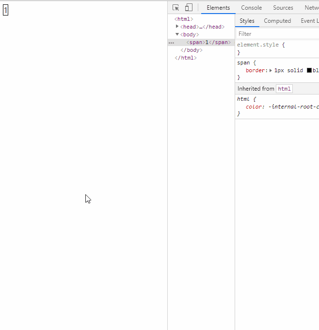

实现代码是这样的

```html
<style>
  .container {
    position: absolute;
    position: fixed;
    left: 30px;
    right: 30px;
    border: 1px solid rgb(59, 57, 57);
  }
</style>
<div class="container">
  container
</div>
```

### 09.【层叠上下文】💚 层叠上下文：小辈就是小辈，再厉害也只是个小辈

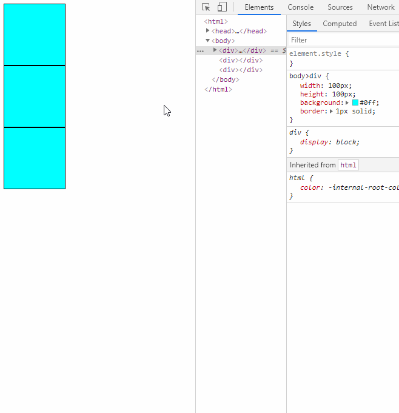

实现代码是这样的

```html
<style>
  div {
    width: 200px;
    height: 200px;
    background-color: aqua;
    border: 1px solid;
  }

  div.outer {
    position: relative;
    z-index: 1;
  }

  p.inner {
    position: absolute;
    width: 200px;
    height: 200px;
    background-color: red;
    /* 跟外层div不在同一个层级，z-index调成再高也没用 */
    z-index: 100000000;
  }

  div:nth-of-type(2) {
    position: relative;
    margin-top: -70px;
    margin-left: 30px;
    z-index: 1;
  }

  div:nth-of-type(3) {
    margin-top: -70px;
    margin-left: 60px;
  }
</style>
<div class="outer">
  <p class="inner"></p>
</div>
<div></div>
<div></div>
```

### 11.【相邻兄弟选择器】💜 相邻兄弟选择器之常用场景

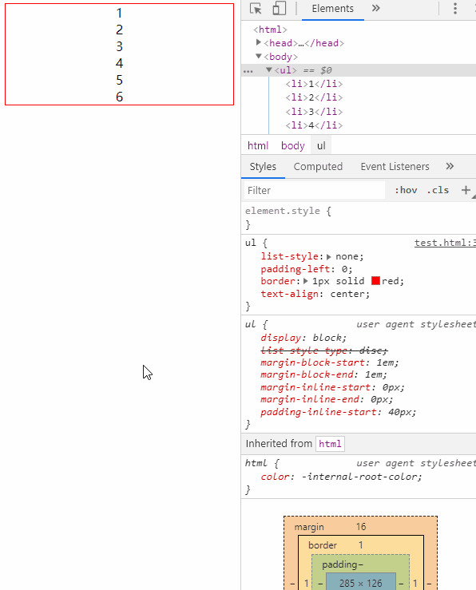

实现代码是这样的

```html
<style>
  ul {
    text-align: center;
    border: 1px solid red;
    padding-left: 0;
    list-style: none;
  }

  ul > li + li {
    border-top: 1px solid blueviolet;
  }
</style>
<ul>
  <li>1</li>
  <li>2</li>
  <li>3</li>
  <li>4</li>
  <li>5</li>
  <li>6</li>
</ul>
```

### 12.【三角形】💝css 绘制等边三角形的原理

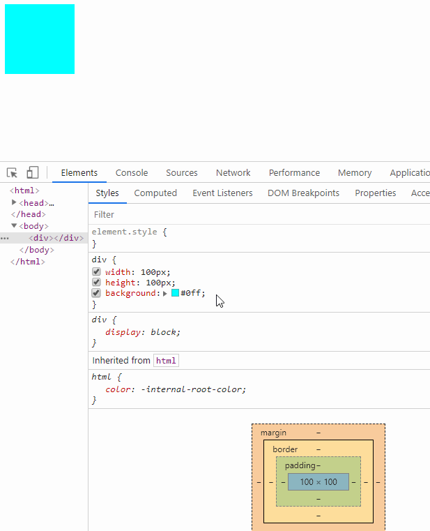

实现代码是这样的

```html
<style>
  div {
    width: 0;
    border: 100px solid;
    /* height: 100px; */
    /* background-color: palevioletred; */
    /* 如果没给边框设置颜色，默认是黑色 */
    border: solid;
    border-color: red transparent transparent;
    border-width: calc(100px * 1.732) 100px;
  }
</style>
<!-- 我是等边三角形 -->
<div></div>
```

### 13.【table 布局】💞display:table 实现多列等高布局

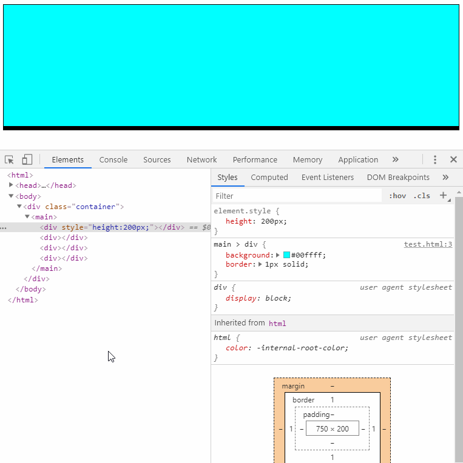

实现代码是这样的

```html
<style>
  .container {
    margin-top: -30px;
    margin-right: -30px;
  }

  .container main {
    display: table;
    width: 100%;
    border-spacing: 30px 0;
  }

  .container main div {
    display: table-cell;
    width: 200px;
    background-color: aqua;
    border: 1px solid;
  }
</style>
<div class="container">
  <main>
    <div style="height: 200px;"></div>
    <div></div>
    <div></div>
    <div></div>
  </main>
</div>
```

### 【定宽高比】♥css 实现定宽高比的原理：padding 的百分比是相对于其包含块的宽度，而不是高度

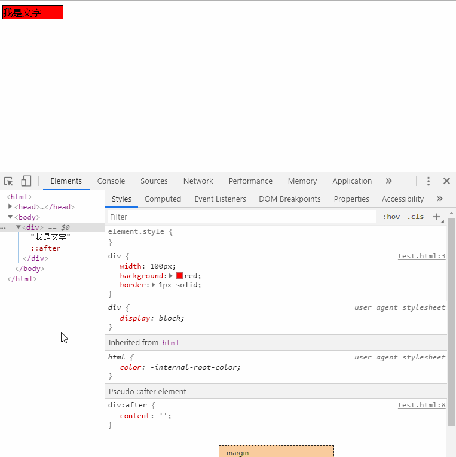

实现代码是这样的

```html
<style>
  .container {
    width: 100px;
    display: flex;
    background-color: red;
    border: 1px solid;
  }

  .container:after {
    content: '';
    padding-top: 100%;
  }
</style>
<div class="container">
  我是文字
</div>
```

### 15. 【隐藏文本】🐯 隐藏文字内容的两种办法

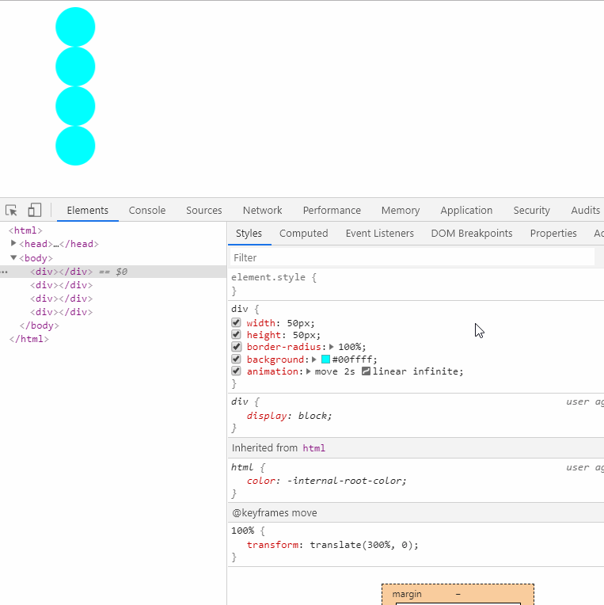

实现代码是这样的

```html
<style>
  h1 {
    width: 200px;
    height: 200px;
    background: url('./knowledge/200.png');
    /* text-indent: -200px; */
    font-size: 0;
  }
</style>
<h1>我是文本</h1>
```

### 16.【角向渐变】🐲 新的渐变：角向渐变。可以用来实现饼图

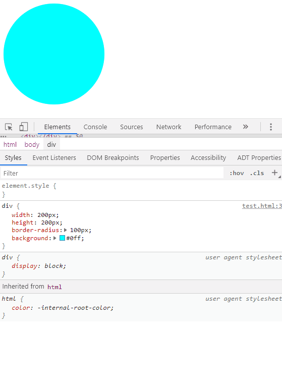

实现代码是这样的

```html
<style>
  div {
    width: 200px;
    height: 200px;
    border-radius: 50%;
    /* 重点 */
    background: conic-gradient(
      red 0 calc(100% / 3),
      green calc(100% / 3) calc(100% / 3 * 2),
      blue calc(100% / 3 * 2) 100%
    );
  }
</style>
<div></div>
```

### 17.【背景附着】🐐background-attachment 指定背景如何附着在容器上，注意其属性值 local 和 fixed 的使用


实现代码是这样的

```html
<style>
  body {
    height: 200vh;
  }

  div {
    width: 400px;
    height: 200px;
    background-image: url('./knowledge/200.png');
    overflow: auto;
    background-attachment: fixed;
  }
</style>
<div></div>
```

### 18.【动画延时】🐵 动画添加延迟时间可以使步调不一致

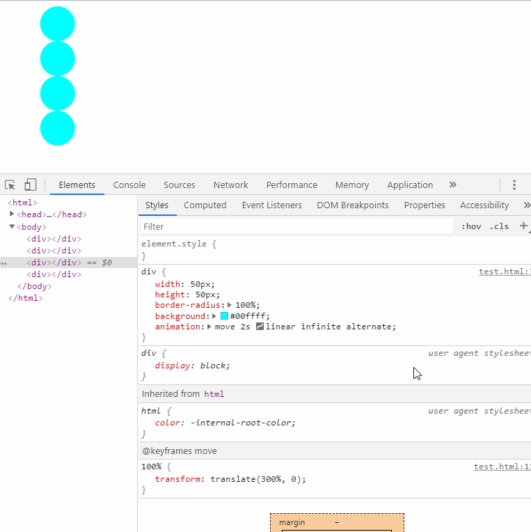

实现代码是这样的

```html
<style>
  div {
    width: 50px;
    height: 50px;
    background-color: aqua;
    border-radius: 100%;
    animation: move 2s ease-in-out infinite alternate;
  }

  div:nth-child(2n + 1) {
    animation-delay: 2s;
  }

  @keyframes move {
    100% {
      transform: translate(300%, 0);
    }
  }
</style>
<div></div>
<div></div>
<div></div>
<div></div>
```

### 19. 【tab-size】🐷 浏览器默认显示 tab 为 8 个空格，tab-size 可以指定空格长度

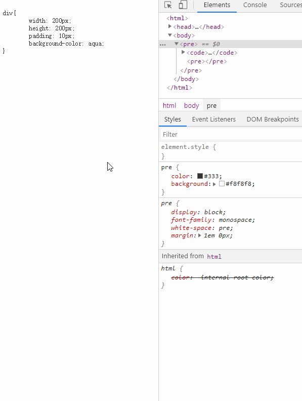

实现代码是这样的

```html
<style>
  pre {
    color: brown;
    background-color: aqua;
    /* tab-size可以指定空格长度 */
    tab-size: 10;
  }
</style>
<div>
  <pre>
      <code>
      div {
        width: 50px;
        height: 50px;
        padding: 10px;
        background-color: aqua;
      }
    </code>
  </pre>
</div>
```

### 20.【动画暂停】🥝CSS 动画其实是可以暂停的

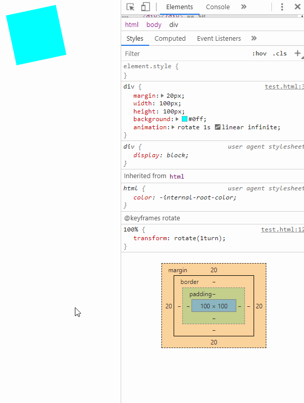

实现代码是这样的

```html
<style>
  .box {
    width: 200px;
    height: 200px;
    background-color: aqua;
    margin: auto;
    animation: rotate 1s linear infinite;
  }

  .box:hover {
    /* 暂停动画 */
    animation-play-state: paused;
  }

  @keyframes rotate {
    100% {
      transform: rotate(1turn);
    }
  }
</style>
<div class="box"></div>
```

### 21.【object-fit】🍓 图片在指定尺寸后，可以设置 object-fit 为 contain 或 cover 保持比例

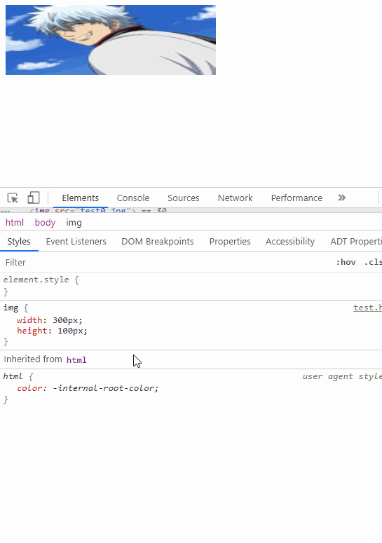

实现代码是这样的

```html
<style>
  img {
    width: 300px;
    height: 100px;
    /* 保持图片的宽高比例不变化 */
    object-fit: contain;
  }
</style>

```

### 22.【鼠标状态】🍒 按钮禁用时，不要忘了设置鼠标状态

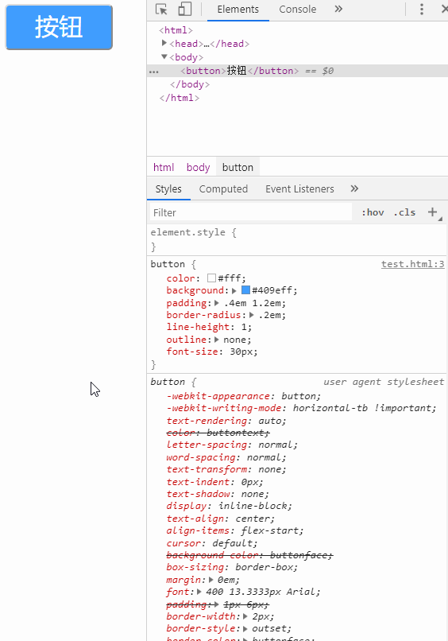

实现代码是这样的

```html
<style>
  button {
    border: none;
    border-radius: 5px;
    color: #fff;
    background-color: aqua;
    line-height: 1;
    outline: none;
    padding: 10px 30px;
    font-size: 20px;
  }

  /* 设置禁用按钮状态下的样式 */
  button:disabled {
    background-color: lightcyan;
    cursor: not-allowed;
  }
</style>
<button disabled>按钮</button>
```

### 23.【背景虚化】🍑 使用 CSS 滤镜实现背景虚化, 体验近视小伙伴所看到的场景~

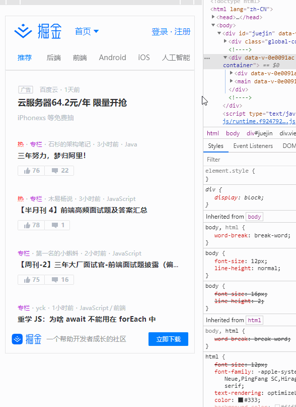

实现代码是这样的

```html
<style>
  body {
    filter: blur(2px);
  }
</style>
<div>
  你是看不清楚我的啦
</div>
```

### 24. 【fill-available】🍏 设置宽度为 fill-available，可以使 inline-block 像 block 那样填充整个空间

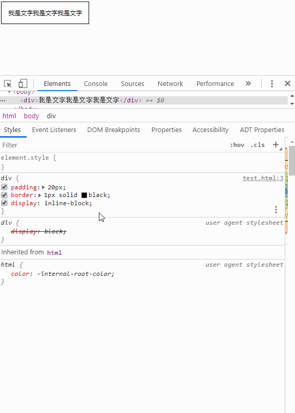

实现代码是这样的

```html
<style>
  div {
    display: inline-block;
    /* -webkit-fill-available: 可以使inline-block像block那样填充整个空间 */
    width: -webkit-fill-available;
    margin: auto;
    padding: 10px;
    border: 1px solid black;
  }
</style>
<div>
  我是文字我是文字我是文字
</div>
```

### 25.【fit-content】🍎 设置宽度为 fit-content，可以使 block 像 inline-block 那样实现收缩宽度包裹内容的效果

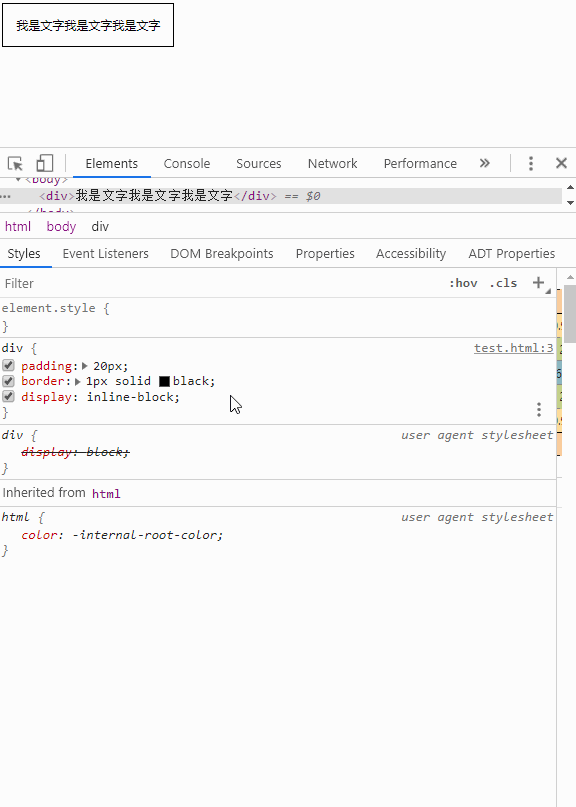

实现代码是这样的

```html
<style>
  div {
    display: block;
    /* fit-content 可以使block像inline-block那样填充整个空间 */
    width: fit-content;
    margin: auto;
    padding: 10px;
    border: 1px solid black;
  }
</style>
<div>
  我是文字我是文字我是文字
</div>
```

### 26.【自定义属性】🍋CSS 自定义属性的简单使用

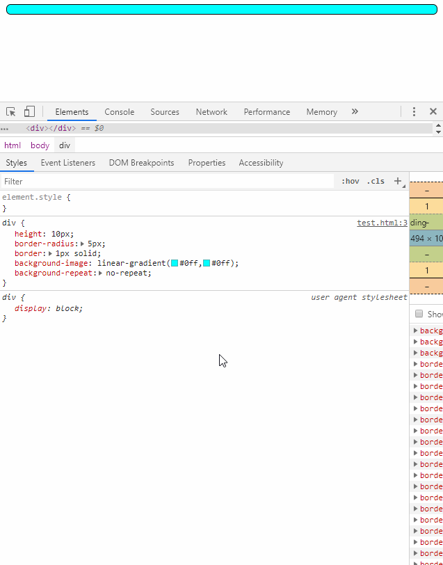

实现代码是这样的

```html
<style>
  div.progress {
    height: 10px;
    border-radius: 5px;
    border: 1px solid;
    --percent: 27;
    background-image: linear-gradient(#0ff, #0ff);
    background-repeat: no-repeat;
    background-size: calc(var(--percent) * 1%);
  }
</style>
<div class="progress"></div>
```

### 27.【min-content/max-content】🍍 可以设置宽度为 min-content 和 max-content，前者让内容尽可能地收缩，后者让内容尽可能地展开

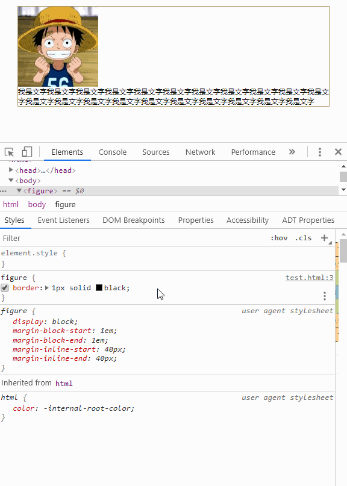

实现代码是这样的

```html
<style>
  figure {
    border: 1px solid black;
    width: min-content;
  }
</style>
<div>
  <figure>
    
    <p>
      我是文字我是文字我是文字我是文字我是文字我是文字我是文字我是文字我是文字我是文字我是文字我是文字我是文字我是文字我是文字
    </p>
  </figure>
</div>
```

### 28.【进度条】🍊 使用渐变，一个 div 打造专业的进度条

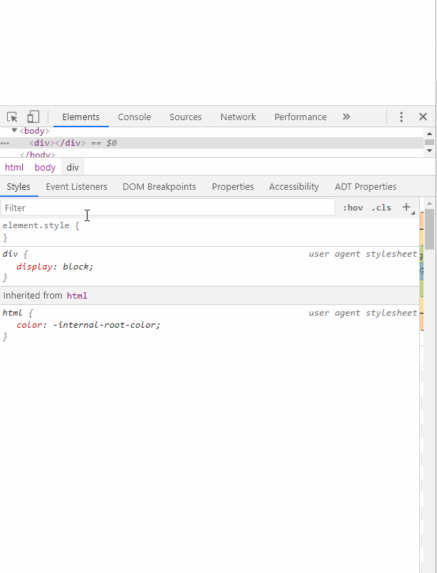

实现代码是这样的

```html
<style>
  .progress {
    --c: aqua;
    --p: 54%;
    height: 20px;
    width: 80%;
    margin: auto;
    border-radius: 30px;
    background-repeat: no-repeat;
    background-size: 100%, var(--p);
    background-color: grey;
    background-image: radial-gradient(
        closest-side circle at var(--p),
        var(--c),
        var(--c) 100%,
        transparent
      ), linear-gradient(var(--c), var(--c));
  }
</style>
<div class="progress"></div>
```

### 29.【逐帧动画】🍌 利用 CSS 精灵实现逐帧动画

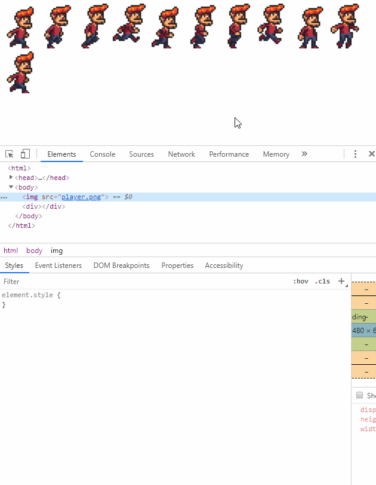

实现代码是这样的

```html
<style>
  div {
    width: 184px;
    height: 325px;
    background: url('./knowledge/player.jpg') no-repeat;
    animation: 1s move steps(8) infinite;
  }

  @keyframes move {
    100% {
      background-position: -1472px 0;
    }
  }
</style>

<div></div>
```

### 30【resize】🍐 普通元素也可以像 textarea 那样 resize

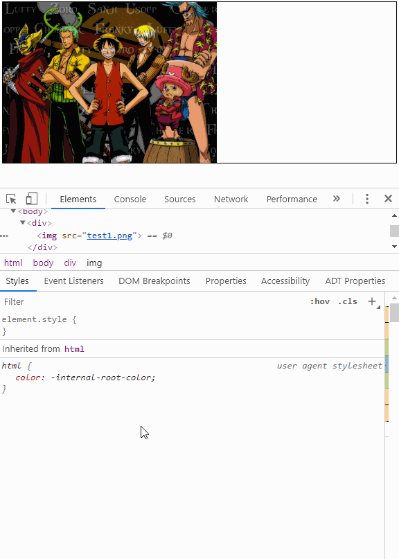

实现代码是这样的

```html
<style>
  div {
    border: 1px solid;
    overflow: hidden;
    resize: auto;
  }
</style>
<div>
  
</div>
```

### 31.【面包屑】🍇 使用 before 伪元素实现面包屑

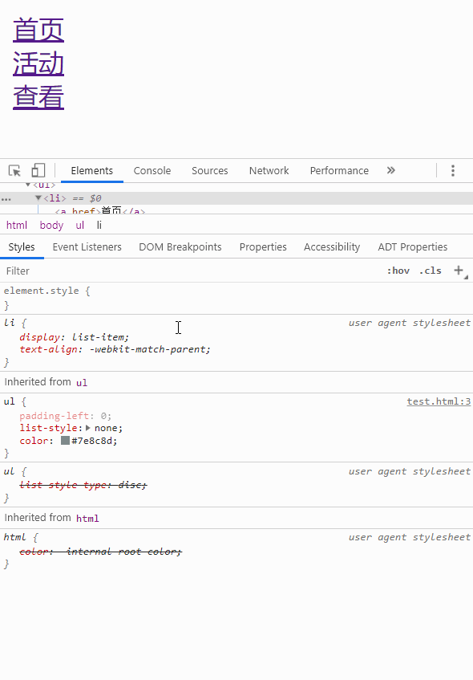

实现代码是这样的

```html
<style>
  ul,
  li {
    list-style: none;
    margin: 0;
    padding: 0;
  }

  li {
    display: inline-block;
  }

  li:before {
    content: '\27a5';
  }

  li:first-of-type:before {
    content: '';
  }
</style>
<ul>
  <li>首页</li>
  <li>活动</li>
  <li>查看</li>
</ul>
```

### 32【sticky footer】🍈 使用 grid 布局实现 sticky footer

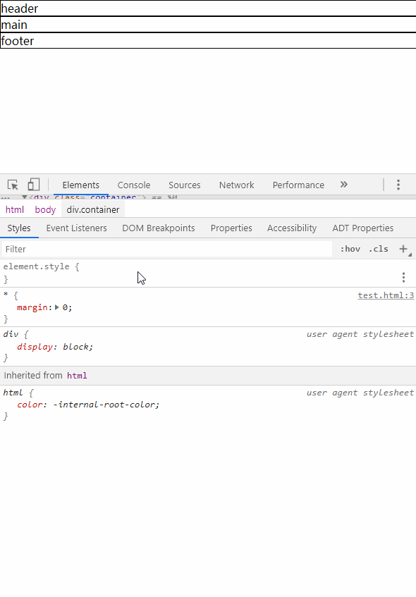

实现代码是这样的

```html
<style>
  .container {
    min-height: 100vh;
    display: grid;
    grid-template-rows: auto 1fr auto;
  }

  header,
  main,
  footer {
    border: 1px solid;
  }

  header,
  main {
    border-bottom: none;
  }
</style>
<div class="container">
  <header>header</header>
  <main>main</main>
  <footer>footer</footer>
</div>
```

### 33.【动画填充状态】🍅CSS 可以设置动画开始前和结束时所保持的状态

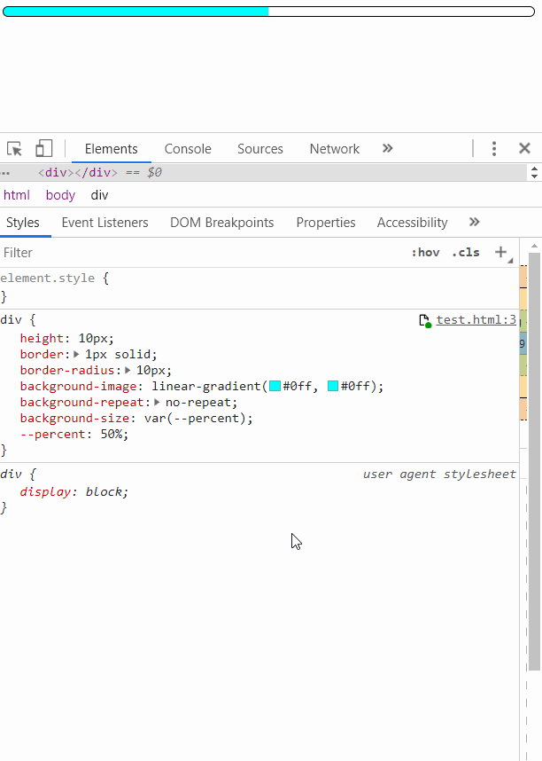

实现代码是这样的

```html
<style>
  .percent {
    --percent: 90%;
    height: 10px;
    border: 1px solid;
    border-radius: 10px;
    background-repeat: no-repeat;
    background-size: 0;
    background-image: linear-gradient(aqua, aqua);
    animation: move 1.5s linear;
    animation-fill-mode: forwards;
  }

  @keyframes move {
    to {
      background-size: var(--percent);
    }
  }
</style>
<div class="percent"></div>
```

### 34.【动画负延迟】🥑CSS 动画可以设置延迟时间为负数，表示动画仿佛开始前就已经运行过了那么长时间

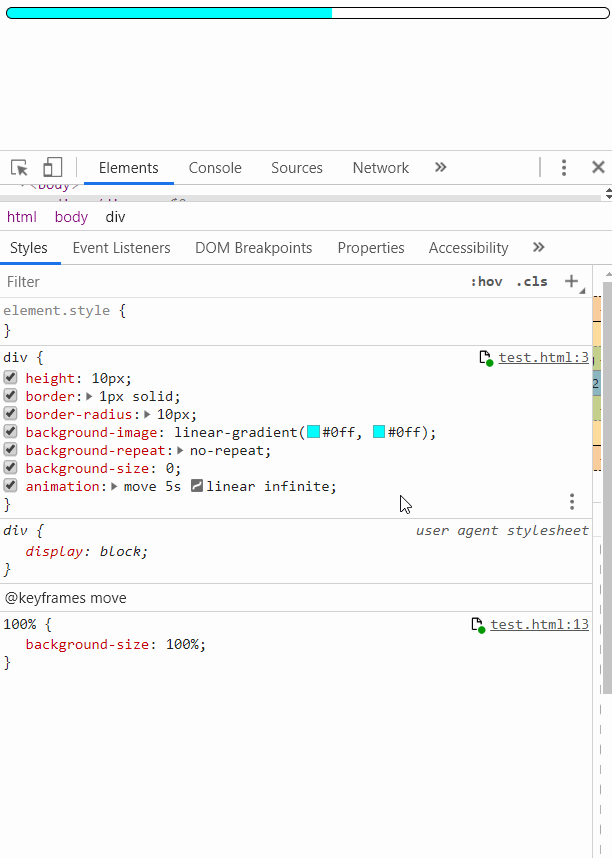

实现代码是这样的

```html
<style>
  .percent {
    --percent: 100%;
    height: 10px;
    border: 1px solid;
    border-radius: 10px;
    background-repeat: no-repeat;
    background-size: 0;
    background-image: linear-gradient(aqua, aqua);
    animation: move 5s linear infinite;
    /* 表示开始动画前就已经到了2秒后的状态 */
    animation-delay: -2s;
  }

  @keyframes move {
    to {
      background-size: var(--percent);
    }
  }
</style>
<div class="percent"></div>
```

### 35【过渡】🍆 爱的魔力转圈圈

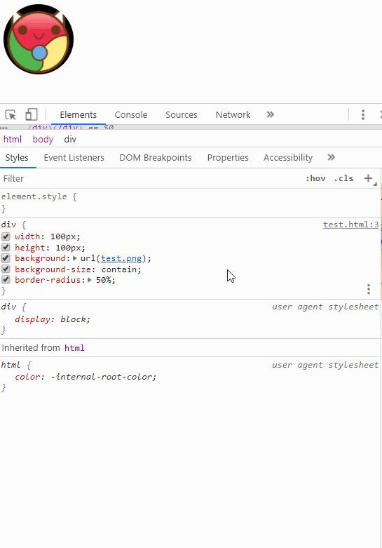

实现代码是这样的

```html
<style>
  .circle {
    width: 200px;
    height: 200px;
    margin: auto;
    border-radius: 50%;
    background: url('./knowledge/circle.jpg') no-repeat center/contain;
    transition: all 10s;
  }

  .circle:hover {
    transform: rotate(10turn);
  }
</style>
<div class="circle"></div>
```

### 36.【动画案例】🍬 水波效果原理

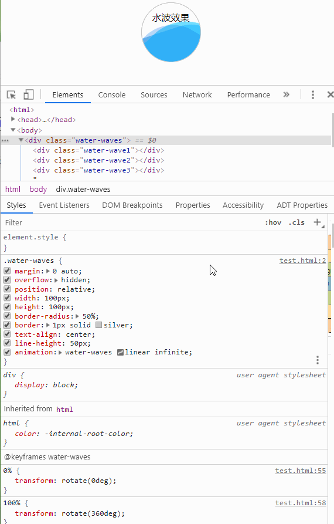

实现代码是这样的

```html
<style>
  .water-waves {
    position: relative;
    width: 100px;
    height: 100px;
    margin: auto;
    border-radius: 50%;
    border: 1px solid silver;
    line-height: 50px;
    text-align: center;
    overflow: hidden;
  }

  .water-wave1,
  .water-wave2,
  .water-wave3 {
    top: 45%;
    left: -25%;
    position: absolute;
    opacity: 0.6;
    border-radius: calc(100% / 3);
    width: 200%;
    height: 200%;
  }

  .water-wave1 {
    background-color: lightblue;
    animation: water-waves 6s linear infinite;
  }

  .water-wave2 {
    background-color: lightskyblue;
    animation: water-waves 6s linear infinite;
    animation-delay: 1s;
  }

  .water-wave3 {
    background-color: blue;
    opacity: 0.1;
    animation: water-waves 6s linear infinite;
    animation-delay: 2s;
  }

  @keyframes water-waves {
    0% {
      transform: rotate(0);
    }

    100% {
      transform: rotate(360deg);
    }
  }
</style>
<div class="water-waves">
  水波效果
  <div class="water-wave1"></div>
  <div class="water-wave2"></div>
  <div class="water-wave3"></div>
</div>
```

### 37.【动画案例】🌸CSS 弹球动画效果的原理

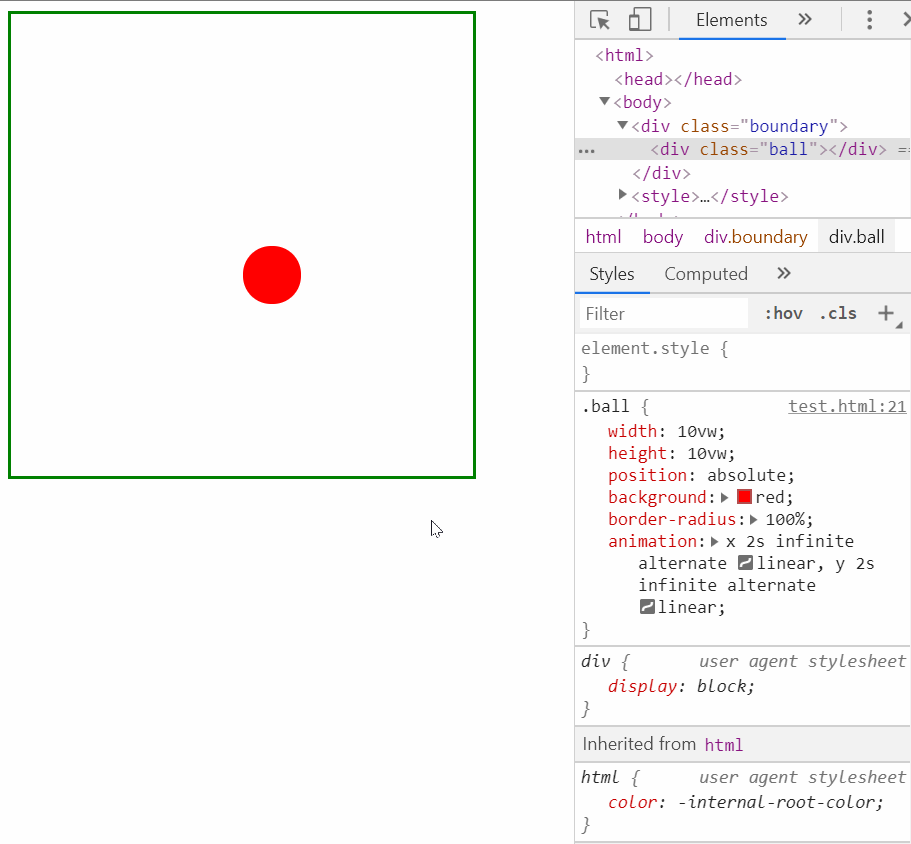

实现代码是这样的

```html
<style>
  .boundary {
    position: relative;
    width: 50vw;
    height: 50vw;
    margin: auto;
    /* background-color: aqua; */
    border: 1px solid green;
  }

  .ball {
    position: absolute;
    top: 0;
    left: 0;
    width: 50px;
    height: 50px;
    border-radius: 50%;
    background-color: crimson;
    /* 控制x坐标轴和y坐标轴的动画时间，也对应动画速度，就可以算出动画方向 */
    animation: x 2s infinite alternate linear, y 2.2s infinite alternate linear;
  }

  @keyframes x {
    0% {
      left: 0%;
    }

    100% {
      left: calc(100% - 10vw);
    }
  }

  @keyframes y {
    0% {
      top: 0;
    }

    100% {
      top: calc(100% - 10vw);
    }
  }
</style>
<div class="boundary">
  <div class="ball"></div>
</div>
```

### 38.【outline】🌻outline 属性的妙用

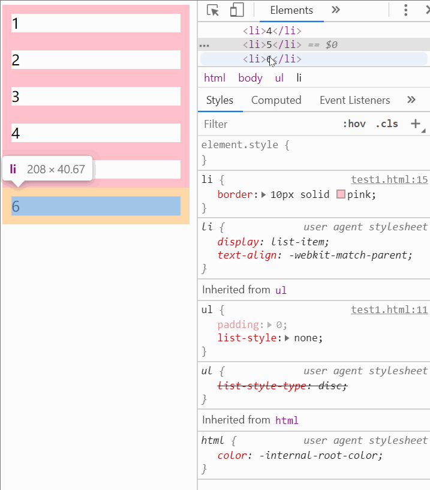

实现代码是这样的

```html
<style>
  ul,
  li {
    list-style: none;
    margin: 0;
    padding: 0;
  }

  li {
    border: 10px solid pink;
  }

  li + li {
    margin-top: 10px;
  }

  li:hover {
    outline: 10px solid purple;
    outline-offset: -10px;
  }
</style>
<ul>
  <li>1</li>
  <li>2</li>
  <li>3</li>
  <li>4</li>
  <li>5</li>
  <li>6</li>
</ul>
```
