# 你未必知道的 49 个 CSS 知识点二~

> 下边列举的每一条都是亲测有效的~

## 知识点篇

### 01.🍧focus-within 是为数不多的一个，可以由子操作父选择器

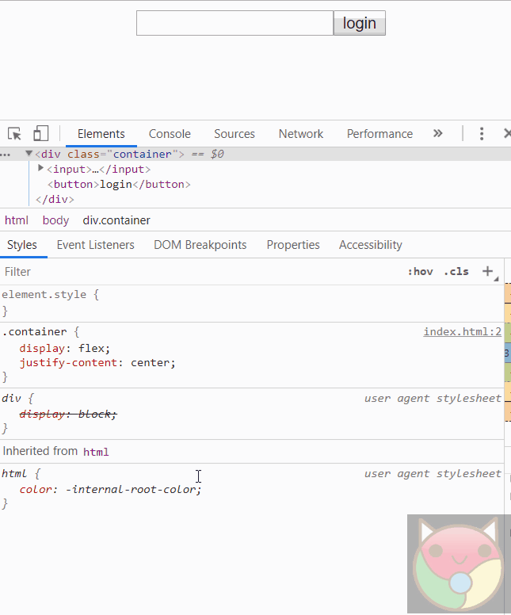

实现代码是这样的：

```html
<style>
  .container {
    display: flex;
    justify-content: center;
  }
  .container:focus-within {
    transform: scale(1.5);
  }
  .container:focus-within button {
    transform: rotate(1turn);
    transition: 1.5s cubic-bezier(0.24, 1.82, 0.53, 1.65);
  }
</style>
<div class="container">
  <input />
  <button>login</button>
</div>
```

### 02.♐ 容易被忽视的 target 选择器

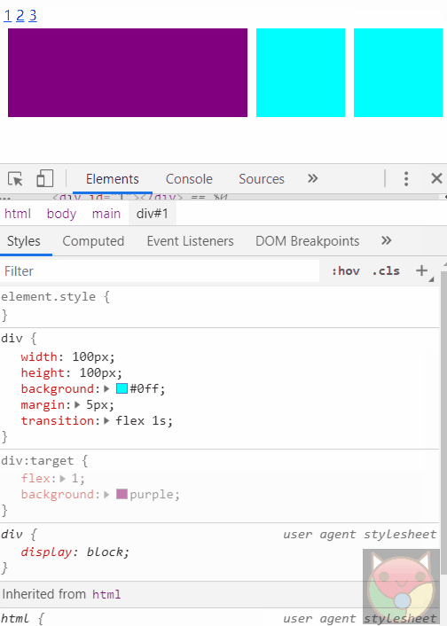

实现代码是这样的

```html
<style>
  .container {
    width: 80%;
    margin: auto;
  }

  .container div {
    width: 100px;
    height: 100px;
    margin: 5px;
    background-color: aqua;
    transition: flex 1s;
  }

  .container main {
    display: flex;
  }

  .container div:target {
    flex: 1;
    background-color: purple;
  }
</style>
<div class="container">
  <a href="#1">1</a>
  <a href="#2">2</a>
  <a href="#3">3</a>
  <main>
    <div id="1"></div>
    <div id="2"></div>
    <div id="3"></div>
  </main>
</div>
```

### 03.👓 只用 background 就能实现简单滤镜效果

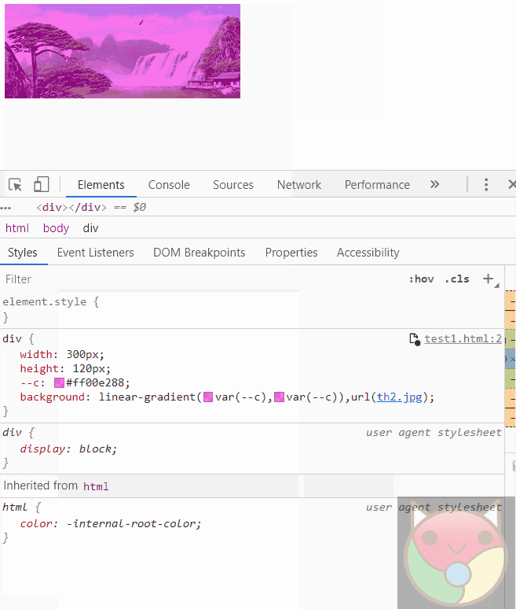

实现代码是这样的

```html
<style>
  .container {
    width: 300px;
    height: 120px;
    --c: aqua;
    background: linear-gradient(var(--c), var(--c)),
      url('./knowledge2/fengjing.jpg') no-repeat center/cover;
  }
</style>
<div class="container"></div>
```

### 04.👔 滚动条样式美化

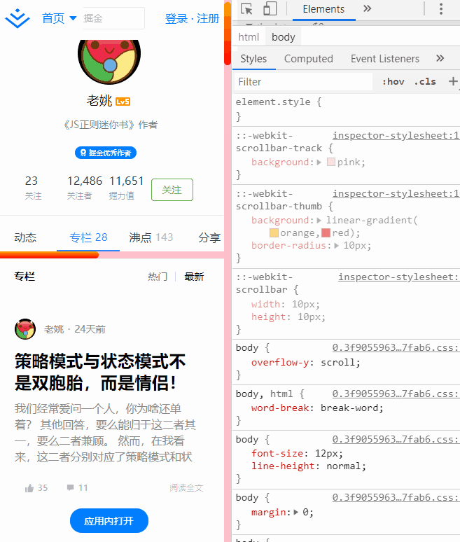

实现代码是这样的

```html
<style>
  .container {
    width: 200px;
    height: 300px;
    margin: auto;
    background-color: aqua;
    overflow: scroll;
  }

  /*【style】自定义滚动条样式，目前只支持webkit内核浏览器，比如chrome、salary浏览器, 火狐和IE浏览器不支持... */
  .container::-webkit-scrollbar {
    /*滚动条整体样式*/
    width: 10px;
    /*高宽分别对应横竖滚动条的尺寸*/
    height: 1px;
  }

  /*定义滑块 内阴影+圆角*/
  .container::-webkit-scrollbar-thumb {
    --c: blueviolet;
    /*滚动条里面小方块*/
    border-radius: 10px;
    /*滚动条的圆角*/
    background-color: var(--c);
    /*滚动条的背景颜色*/
    background-image: -webkit-linear-gradient(
      45deg,
      rgba(255, 255, 255, 0.2) 25%,
      transparent 25%,
      transparent 50%,
      rgba(255, 255, 255, 0.2) 50%,
      rgba(255, 255, 255, 0.2) 75%,
      transparent 75%,
      transparent
    );
  }

  /*定义滚动条轨道 内阴影+圆角*/
  .container::-webkit-scrollbar-track {
    /*滚动条里面轨道*/
    box-shadow: inset 0 0 5px rgba(0, 0, 0, 0.2);
    background: #ededed;
    /*滚动条的背景颜色*/
    border-radius: 10px;
    /*滚动条的背景区域的圆角*/
  }

  .content {
    width: 500px;
    height: 1000px;
  }
</style>
<div class="container">
  <div class="content"></div>
</div>
```

### 05.🐠 使用 selection 选择器自定义文本选区的高亮样式

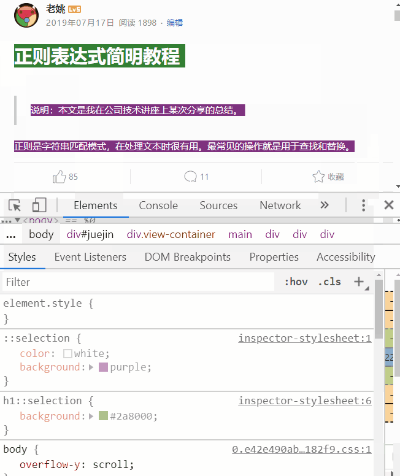

实现代码是这样的

```html
<style>
  .container {
    height: 300px;
    margin: auto;
    background-color: aqua;
  }

  ::selection {
    color: brown;
    background-color: palevioletred;
  }
</style>
<div class="container">
  <div class="content">
    contentcontentcontentcontentcontentcontentcontentcontentcontentcontent
  </div>
</div>
```

### 06.🏩grid-template 设置网格模板，实现三列两行布局

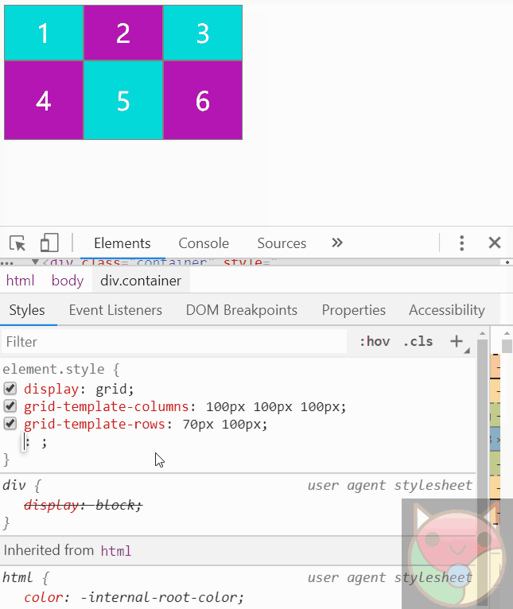

### 07.🏠grid-gap 设置网格间隙，包括行和列

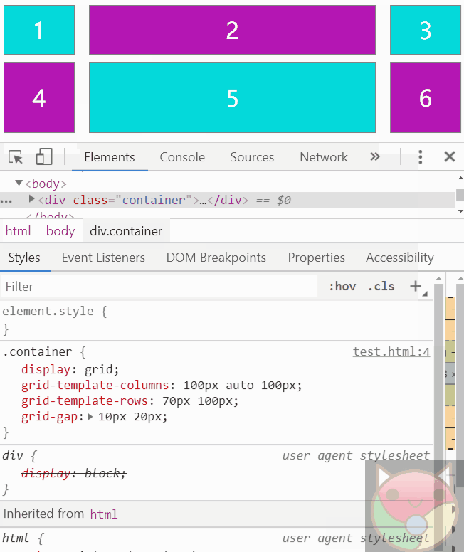

### 08.🏡grid 布局，使用 fr 单位实现等比例分配空间。fr 是分数（fraction）的缩写

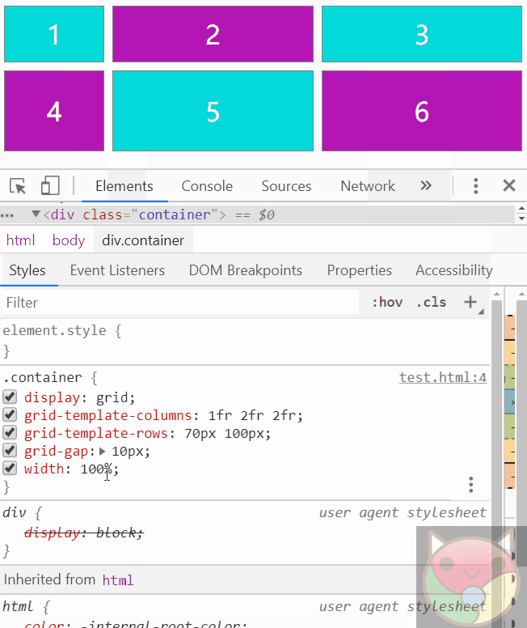

### 09.🏢grid 布局使用 repeat 函数，可以少写些代码

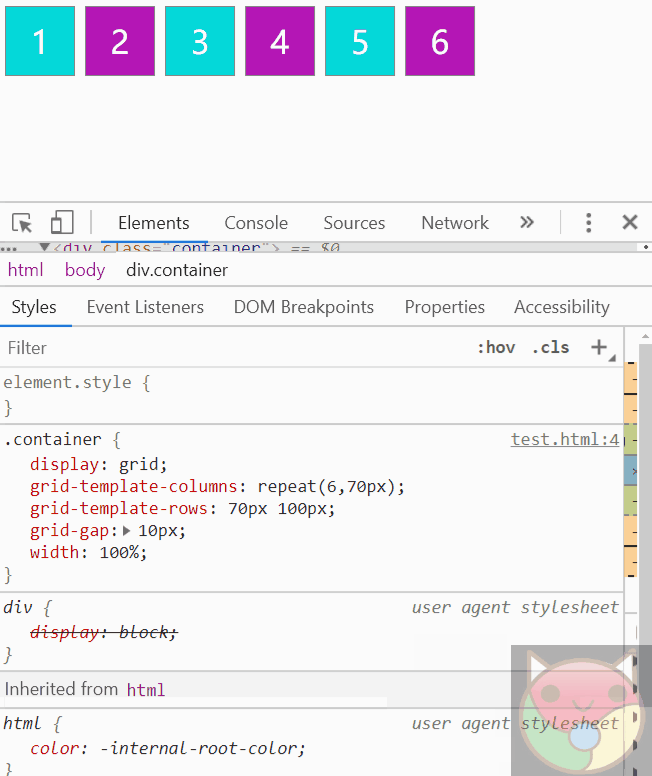

### 09.📖 美化表格常用技巧。等比、定宽、错色等

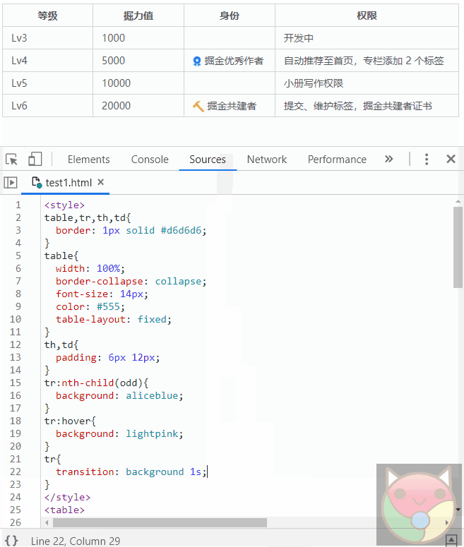

实现代码是这样的

```html
<style>
  table,tr,th,td{
  border: 1px solid #d6d6d6;
}
table{
  border-collapse: collapse;
  width: 100%;
  color: #555;
  font-size: 14px;
  table-layout: fixed;
}
th,td{
  padding: 6px 12px;
}
tr:nth-child(2n+1){
  background: aliceblue;
}
tr{
  transition: background-color 1s;
}
tr:hover{
  background: lightpink;
}
</style>
<table>
  <colgroup>
    <col span="3"></col>
    <col style="width:260px;"></col>
  </colgroup>
  <tr>
    <th>等级</th>
    <th>掘力值</th>
    <th>身份</th>
    <th>权限</th>
  </tr>
  <tr>
    <td>Lv3</td>
    <td>1000</td>
    <td></td>
    <td>开发中</td>
    </tr>
  <tr>
    <td>Lv4</td>
    <td>5000</td>
    <td>
      掘金优秀作者</td>
    <td>自动推荐至首页，专栏添加 2 个标签</td>
  </tr>
  <tr>
    <td>Lv5</td>
    <td>10000</td>
    <td></td>
    <td>小册写作权限</td>
  </tr>
  <tr>
    <td>Lv6</td>
    <td>20000</td>
    <td>
      掘金共建者</td>
    <td>提交、维护标签，掘金共建者证书</td>
  </tr>
</table>
```

## 特效原理篇

### 10.🐍 蛇形边框特效原理

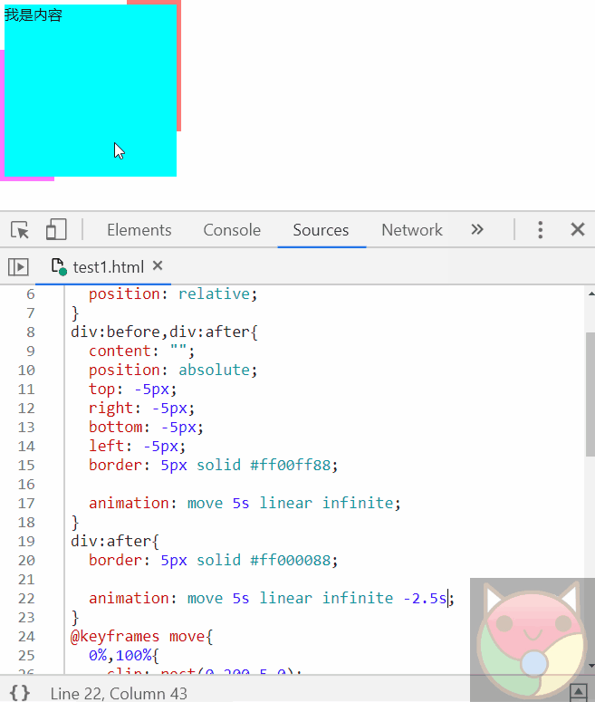

实现代码是这样的

```html
<style>
  div {
    width: 190px;
    height: 190px;
    background: aqua;
    position: relative;
  }

  div:before

    /* ,div:after  */
 {
    position: absolute;
    content: '';
    left: -5px;
    right: -5px;
    top: -5px;
    bottom: -5px;
    border: 5px solid #ff00ff88;
  }

  div:before {
    animation: move 5s linear infinite;
  }

  /* div:after {
      border-color: #ff000088;
      animation: move 3s linear infinite alternate -2.5s;
    } */

  @keyframes move {
    0%,
    100% {
      clip: rect(0, 200px, 5px, 0);
    }

    25% {
      clip: rect(0, 200px, 200px, 195px);
    }

    50% {
      border-color: #00ff0088;
      clip: rect(195px, 200px, 200px, 0);
    }

    75% {
      clip: rect(0, 5px, 200px, 0px);
    }
  }
</style>
<div>content</div>
```

### 11.🗿 立体感按钮

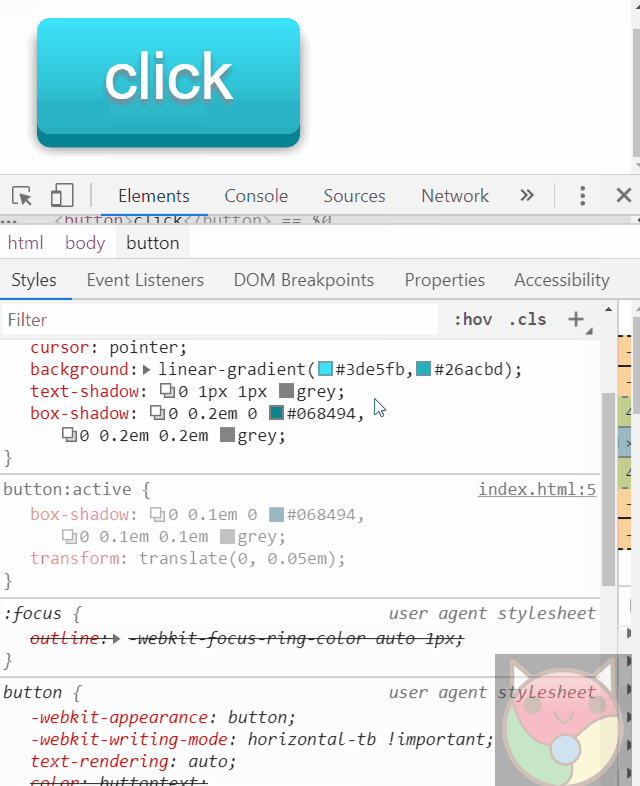

实现代码是这样的

```html
<style>
  button {
    font-size: 80px;
    outline: none;
    border: none;
    color: white;
    padding: 0.3em 1em;
    border-radius: 0.2em;
    cursor: pointer;
    background: linear-gradient(#3de5fb, #26acbd);
    text-shadow: 0 2px 2px grey;
    box-shadow: 0 0.2em 0 #068494, 0 0.2em 0.2em grey;
  }

  button:active {
    box-shadow: 0 0.1em 0 #068494, 0 0.1em 0.1em grey;
    transform: translate(0, 0.1em);
  }
</style>
<button>click</button>
```

### 12.🔄 实现一个混沌动态背景


实现代码是这样的

```html
<style>
  .loading {
    background: pink;
    position: relative;
    width: 200px;
    height: 200px;
    border-radius: 50%;
    overflow: hidden;
  }

  .loading:after {
    content: 'loading...';
    display: block;
    text-align: center;
    font-size: 30px;
    line-height: 200px;
    color: white;
    filter: drop-shadow(2px 4px 6px black);
  }

  .loading div {
    width: 100px;
    height: 100px;
    position: absolute;
    background: green;
    animation: move 2s infinite linear;
    border-radius: 50%;
    filter: blur(36px);
  }

  .loading div:nth-child(1) {
    animation-delay: 0s;
    background: red;
  }

  .loading div:nth-child(2) {
    animation-delay: -0.5s;
    background: green;
  }

  .loading div:nth-child(3) {
    animation-delay: -1s;
    background: yellow;
  }

  .loading div:nth-child(4) {
    animation-delay: -1.5s;
    background: blue;
  }

  @keyframes move {
    0%,
    100% {
      transform: translate(0, 0);
    }

    25% {
      transform: translate(100%, 0);
    }

    50% {
      transform: translate(100%, 100%);
    }

    75% {
      transform: translate(0, 100%);
    }
  }
</style>
<div class="loading">
  <div></div>
  <div></div>
  <div></div>
  <div></div>
</div>
```

### 13.🃏 切牌特效原理

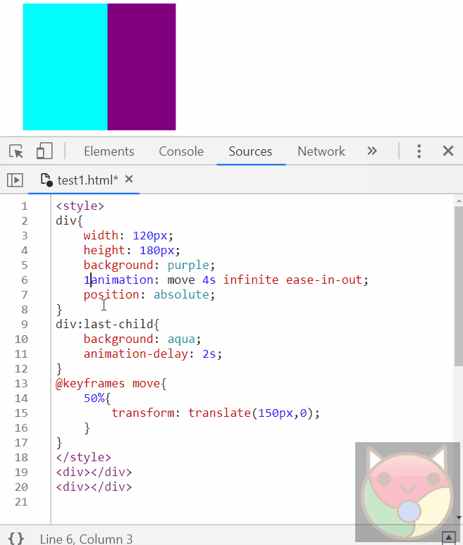

实现代码是这样的

```html
<style>
  div {
    width: 200px;
    height: 300px;
    position: absolute;
    animation: move 5s infinite ease-in-out;
  }

  div:first-child {
    background: purple;
  }

  div:last-child {
    background: aqua;
    animation-delay: 2.5s;
  }

  @keyframes move {
    0% {
      z-index: 1;
    }

    12.5% {
      transform: translate(250px);
    }

    25% {
      z-index: -1;
      transform: translate(0px);
    }

    100% {
      z-index: 0;
      transform: translate(0px);
    }
  }
</style>
<div class="container">
  <div></div>
  <div></div>
</div>
```

### 14.✂ 给 clip-path 应用动画

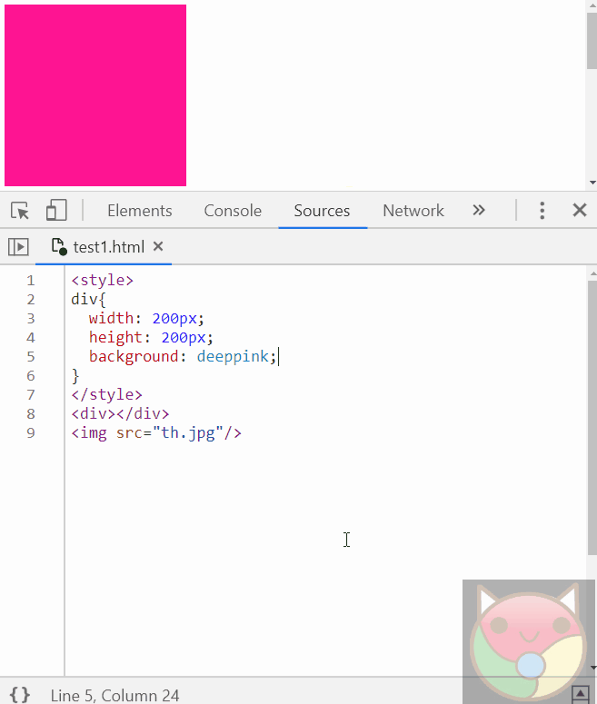

实现代码是这样的

```html
<style>
  img {
    width: 200px;
    /* height: 200px; */
    background: deeppink;
    clip-path: polygon(0 0, 0 0, 0 100%, 0 100%);
    animation: change 2s cubic-bezier(0.13, 1.29, 0.96, 2.2) infinite alternate;
  }

  @keyframes change {
    50% {
      clip-path: polygon(0 0, 100% 0, 100% 100%, 0 100%);
    }
  }
</style>
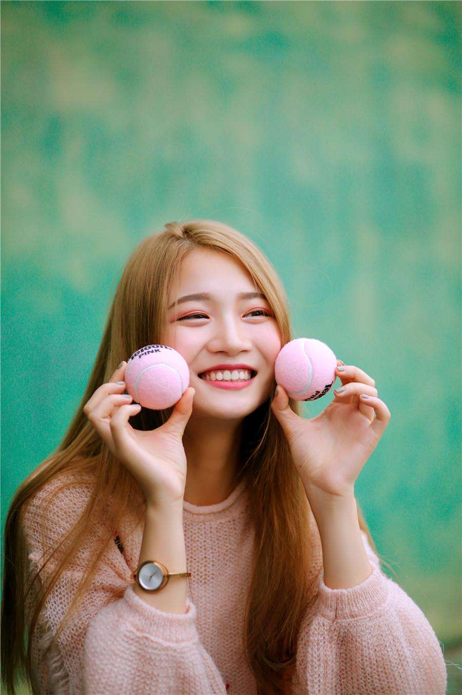
```

### 15.🙅 人脸识别时用到的扫描图，之前我司的一个需求

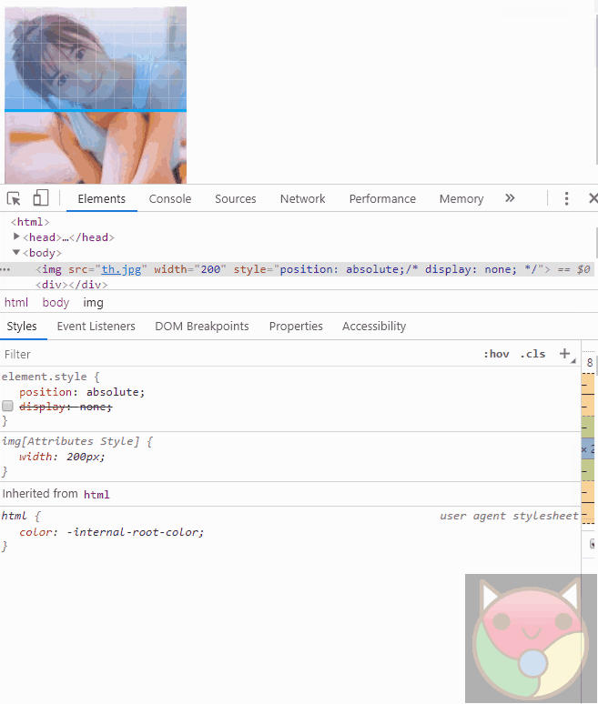

实现代码是这样的

```html
<style>
  .container {
    position: relative;
  }

  .container img {
    position: absolute;
    width: 200px;
    height: 200px;
  }

  .container div {
    position: absolute;
    top: 0;
    left: 0;
    width: 200px;
    height: 200px;
    background: linear-gradient(#03a9f4, #03a9f4), linear-gradient(
        90deg,
        #ffffff33 1px,
        transparent 0,
        transparent 19px
      ), linear-gradient(#ffffff33 1px, transparent 0, transparent 19px), linear-gradient(transparent, #2196f387);
    background-size: 100% 1.5%, 10% 100%, 100% 10%, 100% 100%;
    background-repeat: no-repeat, repeat, repeat, no-repeat;
    background-position: 0 0, 0 0, 0 0, 0 0;
    clip-path: polygon(0% 0%, 100% 0%, 100% 1.5%, 0% 1.5%);
    animation: move 2s infinite linear;
  }

  @keyframes move {
    to {
      background-position: 0 100%, 0 0, 0 0, 0 0;
      clip-path: polygon(0% 0%, 100% 0%, 100% 100%, 0% 100%);
    }
  }
</style>
<div class="container">
  
  <div></div>
</div>
```

最后来个骚一点的~

### 16.🎁 让你的女朋友动起来

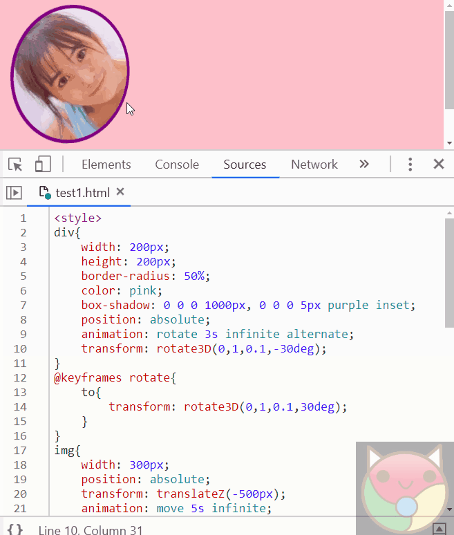

```html
<style>
  body {
    transform-style: preserve-3d;
    perspective: 1000px;
    perspective-origin: 0 0;
    background: purple;
    overflow: hidden;
  }

  div {
    margin: 0 auto;
    position: absolute;
    width: 200px;
    height: 200px;
    border-radius: 50%;
    color: purple;
    box-shadow: 0 0 0 1000px, 0 0 0 5px #352f2f inset;
    animation: rotate 3s infinite alternate;
    transform: rotate3D(0, 1, 0.1, -30deg);
  }

  @keyframes rotate {
    to {
      transform: rotate3D(0, 1, 0.1, 30deg);
    }
  }

  img {
    width: 300px;
    position: absolute;
    animation: move 5s infinite;
    transform: translateZ(-500px);
  }

  @keyframes move {
    40% {
      transform: translateZ(-100px);
    }
  }
</style>

<div></div>
```

## 工具篇

### 17.🚀vscode 里是可以使用 Emmet 语法的，敲 tab 键结束命令，^表示返回上一层级

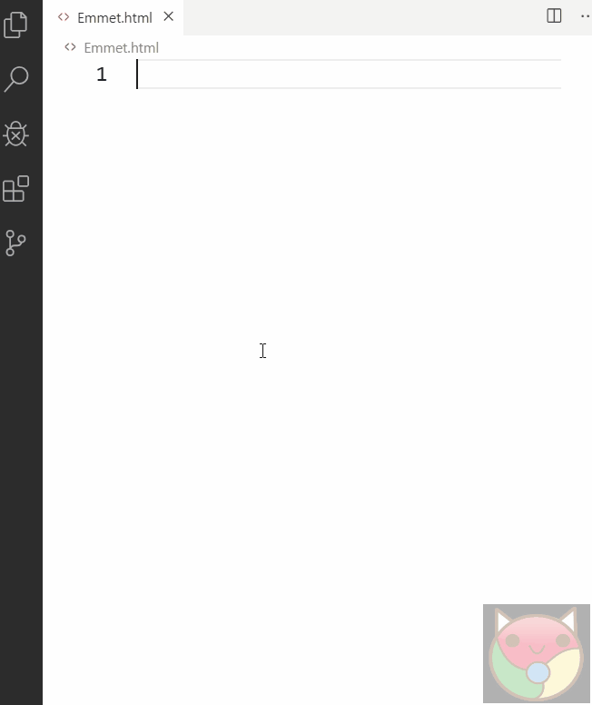

比如输入这样的语法

```html
div>(header>ul>li*2>a)+footer>p
```

按下回车，即可直接生成这样的 html 结构

```html
<div>
  <header>
    <ul>
      <li><a href=""></a></li>
      <li><a href=""></a></li>
    </ul>
  </header>
  <footer>
    <p></p>
  </footer>
</div>
```

[语法说明传送门](https://docs.emmet.io/abbreviations/syntax/)

## 最后

文中若有不准确或错误的地方，欢迎指出，有兴趣可以的关注下[Github](https://github.com/GolderBrother)~
