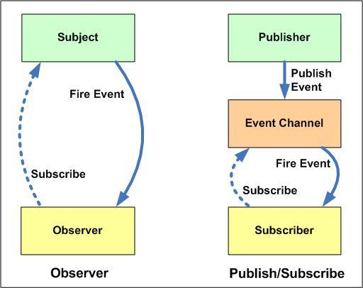
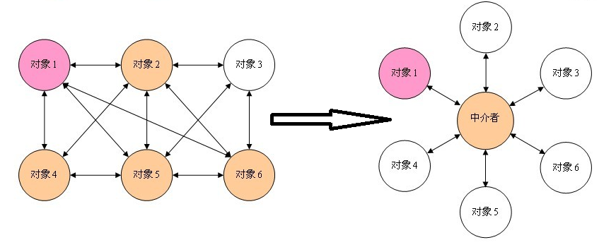

# 前端需要了解的 9 种设计模式(详细篇)

## 一、设计原则

### 什么是设计模式？

设计模式是对软件设计开发过程中反复出现的某类问题的通用解决方案。设计模式更多的是指导思想和方法论，而不是现成的代码，当然每种设计模式都有每种语言中的具体实现方式。学习设计模式更多的是理解各种模式的内在思想和解决的问题，毕竟这是前人无数经验总结成的最佳实践，而代码实现则是对加深理解的辅助。

- 按哪一种思路或者标准来实现功能
- 功能相同，可以有不同设计的方式
- 需求如果不断变化，设计的作用才能体现出来

### SOLID 五大设计原则

| 首字母 | 指代         | 概念                                                                                            |
| ------ | ------------ | ----------------------------------------------------------------------------------------------- |
| S      | 单一职责原则 | 单一功能原则认为对象应该仅具有一种单一功能的概念                                                |
| O      | 开放封闭原则 | 开闭原则认为软件体应该是对于扩展开放的，但是对于修改封闭的的概念                                |
| L      | 里氏替换原则 | 里氏替换原则认为程序中的对象应该是可以在不改变程序正确性的前提下被它的子类所替换的的概念        |
| I      | 接口隔离原则 | 接口隔离原则认为多个特定客户端接口要好于一个宽泛用途的接口的概念                                |
| D      | 依赖反转原则 | 依赖反转原则认为一个方法应该遵从依赖于抽象而不是一个实例的概念,依赖注入是该原则的一种实现方式。 |

#### O 开放封闭原则

Open Closed Principle

- 对扩展开放，对修改关闭
- 增加需求时，扩展新代码，而非修改已有代码
- 开闭原则是设计模式中的总原则
- 对近期可能会变化并且如果有变化但改动量巨大的地方要增加扩展点,扩展点过多会降低可读性

```ts
class Customer {
  constructor(public rank: string) {}
}
class Product {
  constructor(public name: string, public price: number) {}
  cost(customer: Customer) {
    switch (customer.rank) {
      case 'member':
        return this.price * 0.8;
      case 'vip':
        return this.price * 0.6;
      default:
        return this.price;
    }
  }
}
let p1 = new Product('笔记本电脑', 1000);
let member = new Customer('member');
let vip = new Customer('vip');
let guest = new Customer('guest');
console.log(p1.cost(member));
console.log(p1.cost(vip));
console.log(p1.cost(guest));
```

现在我们来改下代码

```ts
class Customer {
  constructor(public rank: string, public discount: number = 1) {}
  getDiscount() {
    return this.discount;
  }
}
class Product {
  constructor(public name: string, public price: number) {}
  cost(customer: Customer) {
    /*  switch (customer.rank) {
         case 'member':
             return this.price * .8;
         case 'vip':
             return this.price * .6;
         default:
             return this.price;
     } */
    return this.price * customer.getDiscount();
  }
}
let p1 = new Product('笔记本电脑', 1000);
let member = new Customer('member', 0.8);
let vip = new Customer('vip', 0.6);
let guest = new Customer('guest');
console.log(p1.cost(member));
console.log(p1.cost(vip));
console.log(p1.cost(guest));
```

比如我们日常开发中使用过的基于`promise`的请求库`axios`, 也用到了设计模式

```ts
import axios, { AxiosInstance, AxiosRequestConfig } from 'axios';
let instance: AxiosInstance = axios.create();
instance.interceptors.request.use((config: AxiosRequestConfig) => {
  config.url = 'http://localhost:8080' + config.url;
  return config;
});

instance.interceptors.response.use(response => {
  if (response.status !== 200 || response.data.code != 0) {
    return Promise.reject(response);
  } else {
    return response.data.data;
  }
});
/**
 * {code:0,data:{id:1,name:'golderbrother'}}
 */
instance({
  url: '/api/users'
}).then(
  result => {
    console.log(result);
  },
  error => {
    console.error(error);
  }
);
```

#### S 单一职责原则

Single responsibility principle

- 一个类或者模块只负责完成一个职责，如果功能特别复杂就进行**拆分**
- 单一职责可以降低类的复杂性，提高代码可读性、可维护性
- 当类代码行数过多、方法过多、功能太多、职责太杂的时候就要对类进行**拆分**了
- **拆分**不能过度，如果**拆分**过度会损失`内聚性`和`维护性`

可以参考下以下两个工具库源码

- [lodashjs](https://www.lodashjs.com/docs/latest)
- [jquery](https://api.jquery.com/)


#### L 里氏替换原则

Liskov Substitution Principle

- 所有引用基类的地方必须能透明地使用其子类的对象
- 子类能替换掉父类，使用者可能根本就不需要知道是父类还是子类，反之则不行
- `里氏替换原则`是开闭原则的实现基础，程序设计的时候尽量使用**基类定义及引用**，运行时再决定使用哪个子类
- `里氏替换原则`可以提高代码的复用性，提高代码的可扩展性，也增加了耦合性
- 相对于多态，这个原则是讲的是类如何设计，子类如果违反了父类的功能则表示违反了`里氏替换原则`


```ts
abstract class AbstractDrink {
  abstract getName(): string;
}
class CocaCola extends AbstractDrink {
  getName(): string {
    return '可乐';
  }
}
class Sprite extends AbstractDrink {
  getName(): string {
    return '雪碧';
  }
}
class Fanta extends AbstractDrink {
  getName(): string {
    return '芬达';
  }
}
class Customer {
  drink(drink: AbstractDrink) {
    console.log('喝' + drink.getName());
  }
}
let customer = new Customer();
let cocaCola = new CocaCola();
let sprite = new Sprite();
let fanta = new Fanta();
customer.drink(cocaCola);
customer.drink(sprite);
customer.drink(fanta);
```

```js
import React from 'react';
import ReactDOM from 'react-dom';
class App extends React.Component {
  render() {
    return <div>App </div>;
  }
}
let element = React.createElement(App);
ReactDOM.render(element, document.getElementById('root'));
```

```ts
abstract class AbstractDrink {
  abstract getName(): any;
}
class CocaCola extends AbstractDrink {
  getName(): any {
    return 100;
  }
}
```

#### D 依赖倒置原则

Dependence Inversion Principle

- 面向**接口**编程，依赖于抽象而不依赖于具体实现
- 要求我们在程序代码中传递参数时或在关联关系中，尽量引用层次高的抽象层类
- 使用方只关注**接口**而不关注具体类的实现


比如 `SingleDog` 自己 `new` 个 `GirlFriend`

```ts
abstract class GirlFriend {
  public age: number;
  public height: number;
  public abstract cook(): void;
}
class LinZhiLing extends GirlFriend {
  public cook(): void {}
}
class HanMeiMei extends GirlFriend {
  public cook(): void {}
}
class SingleDog {
  constructor(public girlFriend: GirlFriend) {}
}
let s1 = new SingleDog(new LinZhiLing());
let s2 = new SingleDog(new HanMeiMei());
```

```ts
import { createStore } from 'redux';
let store = createStore(state => state);
export interface Action<T = any> {
  type: T;
}
export interface AnyAction extends Action {
  // Allows any extra properties to be defined in an action.
  [extraProps: string]: any;
}
let action: AnyAction = { type: 'increment', payload: 5 };
store.dispatch(action);
```

#### I 接口隔离原则

Interface Segregation Principle

- 保持接口的单一独立，避免出现胖接口
- 客户端不应该依赖它不需要的接口，类间的依赖关系应该建立在最小的接口上
- 接口尽量细化，而且接口中的方法尽量的少
- 类似于单一职责原则，更关注接口

```ts
interface IUserManager {
  updateUserInfo(): void;
  updatePassword(): void;
}
interface IProductManager {
  updateProduct(): void;
  updatePrice(): void;
}
```

比如如果想让飞机(`Flying`)在水里(`Swimming`)运行(`Running`)，怎么实现？


遵循**接口隔离**原则，我们可以这样做

伪代码如下：

```ts
interface Running {
  run(): void;
}
interface Flying {
  fly(): void;
}
interface Swimming {
  swim(): void;
}
class Automobile implements Running, Flying, Swimming {
  run() {}
  fly() {}
  swim() {}
}
```

#### 迪米特法则

Law of Demeter，LOD

- 有时候也叫做**最少知识**原则
- 一个软件实体应当尽可能少地与其它实体发生相互作用
- 迪米特法则的初衷在于**降低类之间的耦合**
- 类定义时尽量要实现**内聚**，少使用 `public` 修饰符，尽量使用 `private`、`protected` 等

比如我们看下产品销售关联职位关系的流程


```ts
// 销售员
class Salesman {
  constructor(public name: string) {}
  sale() {
    console.log(this.name + ' 销售中....');
  }
}
// 销售经理
class SaleManager {
  private salesmen: Array<Salesman> = [new Salesman('张三'), new Salesman('李四')];
  sale() {
    this.salesmen.forEach(salesman => salesman.sale());
  }
}
// 大老板
class CEO {
  private saleManager: SaleManager = new SaleManager();
  sale() {
    this.saleManager.sale();
  }
}
let ceo = new CEO();
ceo.sale();
```

#### 合成复用原则

#### 类的关系

- 类之间有三种基本关系，分别是**关联(聚合和组合)、泛化和依赖**
- 如果一个类单向依赖另一个类，那么它们之间就是单向关联。如果彼此依赖，则为相互依赖，即双向关联
- 关联关系包括两种特例：聚合和组合
  - 聚合，用来表示整体与部分的关系或者拥有关系，代表部分的对象可能会被整体拥有，但并不定定会随着整体的消亡而销毁,比如班级和学生
  - 合成，合成或者说组合要比聚合关系强的多，部分和整体的生命周期是一致的比如人和器官之间


#### 合成复用

- 合成复用原则是通过将已有的对象纳入新对象中，作为新对象的成员对象来实现的
- 新对象可以调用已有对象的功能，从而达到复用
- 原则是尽量首先使用**组合/聚合**的方式，而不是使用继承
- 专业人做专业事

比如我们不会做饭，就请专业的厨师来做饭

```ts
class Cooker {
  cook() {}
}
class Person {
  private cooker: Cooker = new Cooker();
  cook() {
    this.cooker.cook();
  }
}
```

总结

- **开闭原则**是核心，对修改关闭对扩展开放是软件设计的基石
- 单一职责要求我们设计接口和模块功能的时候尽量保证**单一性**和**原子性**，修改一条不影响全局和其它模块
- **里氏替换原则**和**依赖倒置原则**要求**面向接口和抽象**编程，不要依赖具体实现，否则实现一改，上层调用者就要对应修改

### 如何写出好代码?

可以遵循一下几条原则来编写

- 可维护性 BUG 是否好改?
- 可读性 是否容易看懂?
- 可扩展性 是否可以添加新功能?
- 灵活性 添加新功能是否容易?老方法和接口是否容易复用?
- 简洁性 代码是否简单清晰?
- 可复用性 相同的代码不要写 2 遍?
- 可测试性 是否方便写单元测试和集成测试?

## 二、设计模式的类型和具体实现

设计模式可以分为三大类：

### 结构型模式（Structural Patterns）

通过识别系统中组件间的简单关系来简化系统的设计。

具体实现：

- 重要: 代理模式、桥接模式、装饰器模式、适配器模式
- 不重要: 外观模式、组合模式、享元模式

### 创建型模式（Creational Patterns）

处理对象的创建，根据实际情况使用合适的方式创建对象。常规的对象创建方式可能会导致设计上的问题，或增加设计的复杂度。创建型模式通过以某种方式控制对象的创建来解决问题。

具体实现：

- 重要: 工厂模式(工厂方法模式、抽象工厂模式、简单工厂模式)、建造者模式、单例模式
- 不重要: 原型模式

### 行为型模式（Behavioral Patterns）

用于识别对象之间常见的交互模式并加以实现，如此，增加了这些交互的灵活性。

具体实现：

- 重要: 观察者模式(发布订阅模式)、模版方法模式、策略模式、职责链模式、迭代器模式、状态模式
- 不重要: 访问者模式、备忘录模式、命令模式、解释器模式、中介者模式


## 一. 结构型模式（Structural Patterns）

### 1. 外观模式（Facade Pattern）

外观模式是最常见的设计模式之一，它为子系统中的一组接口提供一个统一的高层接口，使子系统更容易使用。简而言之外观设计模式就是把多个子系统中复杂逻辑进行抽象，从而提供一个更统一、更简洁、更易用的 API。很多我们常用的框架和库基本都遵循了外观设计模式，比如 JQuery 就把复杂的原生 DOM 操作进行了抽象和封装，并消除了浏览器之间的兼容问题，从而提供了一个更高级更易用的版本。其实在平时工作中我们也会经常用到外观模式进行开发，只是我们不自知而已。

比如，我们可以应用外观模式封装一个统一的 DOM 元素事件绑定/取消方法，用于兼容不同版本的浏览器和更方便的调用：


```js
// 绑定事件
function addEvent(element, event, handler) {
  if (element.addEventListener) {
    element.addEventListener(event, handler, false);
  } else if (element.attachEvent) {
    element.attachEvent('on' + event, handler);
  } else {
    element['on' + event] = fn;
  }
}

// 取消绑定
function removeEvent(element, event, handler) {
  if (element.removeEventListener) {
    element.removeEventListener(event, handler, false);
  } else if (element.detachEvent) {
    element.detachEvent('on' + event, handler);
  } else {
    element['on' + event] = null;
  }
}
```

### 2. 代理模式（Proxy Pattern）

首先，一切皆可代理，不管是在实现世界还是计算机世界。现实世界中买房有中介、打官司有律师、投资有经纪人，他们都是代理，由他们帮你处理由于你缺少时间或者专业技能而无法完成的事务。类比到计算机领域，代理也是一样的作用，当访问一个对象本身的代价太高（比如太占内存、初始化时间太长等）或者需要增加额外的逻辑又不修改对象本身时便可以使用代理。ES6 中也增加了 Proxy 的功能。

归纳一下，代理模式可以解决以下的问题：

1. 增加对一个对象的访问控制

2. 当访问一个对象的过程中需要增加额外的逻辑

要实现代理模式需要三部分：

1. `Real Subject`：真实对象

2. `Proxy`：代理对象

3. `Subject`接口：Real Subject 和 Proxy 都需要实现的接口，这样 Proxy 才能被当成 Real Subject 的“替身”使用

#### 类图

`Target` 目标对象，也就是被代理的对象，是具体业务的执行者
`Proxy` 代理对象，里面会包含一个目标对象的引用，可以实现对访问的扩展和额外处理


#### 代码

```ts
abstract class Star {
  abstract answerPhone(): void;
}

// Target 目标对象
class Angelababy extends Star {
  public available: boolean = true;
  answerPhone(): void {
    console.log('你好,我是Angelababy.');
  }
}
// 代理对象
class AngelababyAgent extends Star {
  // 包含一个目标对象的引用(angelababy)，可以实现对访问的扩展和额外处理
  constructor(private angelababy: Angelababy) {
    super();
  }
  answerPhone(): void {
    console.log('你好,我是Angelababy的经纪人.');
    if (this.angelababy.available) {
      this.angelababy.answerPhone();
    }
  }
}
let angelababyAgent = new AngelababyAgent(new Angelababy());
angelababyAgent.answerPhone();
```

#### 使用场景

##### 事件委托代理

- 事件捕获指的是从 document 到触发事件的那个节点，即自上而下的去触发事件
- 事件冒泡是自下而上的去触发事件
- 绑定事件方法的第三个参数，就是控制事件触发顺序是否为事件捕获。true 为事件捕获；false 为事件冒泡,默认 false。


```html
<body>
  <ul id="list">
    <li>1</li>
    <li>2</li>
    <li>3</li>
  </ul>
  <script>
    // list -> 代理对象
    let list = document.querySelector('#list');
    list.addEventListener('click', event => {
      // event.target -> 目标对象
      alert(event.target.innerHTML);
    });
  </script>
</body>
```

##### 缓存代理

比如有一个股票价格查询接口，调用这个接口需要比较久的时间（用 setTimeout 模拟 2s 的调用时间）：

StockPriceAPI：

```js
function StockPriceAPI() {
  // Subject Interface实现
  this.getValue = function(stock, callback) {
    console.log('Calling external API ... ');
    setTimeout(() => {
      switch (stock) {
        case 'GOOGL':
          callback('$1265.23');
          break;
        case 'AAPL':
          callback('$287.05');
          break;
        case 'MSFT':
          callback('$173.70');
          break;
        default:
          callback('');
      }
    }, 2000);
  };
}
```

我们不希望每次都去请求远程接口，而是增加缓存机制，当有缓存的时候就直接从缓存中获取，否则再去请求远程接口。我们可以通过一个 proxy 来实现：

StockPriceAPIProxy：

```js
function StockPriceAPIProxy() {
  // 缓存对象
  this.cache = {};
  // 真实API对象
  this.realAPI = new StockPriceAPI();
  // Subject Interface实现
  this.getValue = function(stock, callback) {
    // 缓存代理：有缓存就直接取，没有重新去请求远程接口
    const cachedPrice = this.cache[stock];
    if (cachedPrice) {
      console.log('Got price from cache');
      callback(cachedPrice);
    } else {
      this.realAPI.getValue(stock, price => {
        this.cache[stock] = price;
        callback(price);
      });
    }
  };
}
```

注意，Proxy 需要和真实对象一样实现 getValue() 方法，getValue()就属于 Subject 接口。

测试一下：

```js
const api = new StockPriceAPIProxy();
api.getValue('GOOGL', price => {
  console.log(price);
});
api.getValue('AAPL', price => {
  console.log(price);
});
api.getValue('MSFT', price => {
  console.log(price);
});

setTimeout(() => {
  api.getValue('GOOGL', price => {
    console.log(price);
  });
  api.getValue('AAPL', price => {
    console.log(price);
  });
  api.getValue('MSFT', price => {
    console.log(price);
  });
}, 3000);
```

输出：

```
Calling external API ...
Calling external API ...
Calling external API ...
$1265.23
$287.05
$173.70
Got price from cache
$1265.23
Got price from cache
$287.05
Got price from cache
$173.70
```

### 3. 装饰器模式（Decorator Pattern）

- 在**不改变其原有的结构和功能**为对象**添加新功能**的模式其实就叫做装饰器模式
- 最直观地就是我们买房后的装修
- 装饰比继承更加灵活,可以实现装饰者和被装饰者之间松耦合
- 被装饰者可以使用装饰者动态地增加和撤销功能


```ts
abstract class Shape {
  abstract draw(): void;
}
class Circle extends Shape {
  draw() {
    console.log('绘制圆形');
  }
}
class Rectangle extends Shape {
  draw() {
    console.log('绘制矩形');
  }
}

abstract class ColorfulShape extends Shape {
  public constructor(public shape: Shape) {
    super();
  }
  abstract draw(): void;
}

class RedColorfulShape extends ColorfulShape {
  draw() {
    this.shape.draw();
    console.log('把边框涂成红色');
  }
}
class GreenColorfulShape extends ColorfulShape {
  draw() {
    this.shape.draw();
    console.log('把边框涂成绿色');
  }
}

let circle = new Circle();
let redColorfulShape = new RedColorfulShape(circle);
redColorfulShape.draw();

let rectangle = new Rectangle();
let greenColorfulShape = new GreenColorfulShape(rectangle);
greenColorfulShape.draw();
```

#### 应用场景

##### 装饰器

- 装饰器是一种特殊类型的声明，它能够被附加到类声明、方法、属性或参数上，可以修改类的行为
- 常见的装饰器有类装饰器、属性装饰器、方法装饰器和参数装饰器
- 装饰器的写法分为普通装饰器和装饰器工厂

1. 类装饰器

- 类装饰器在类声明之前声明，用来监控、修改或替换类定义
- 参数是类的定义或者说构造函数
- [babel-plugin-proposal-decorators](https://babeljs.io/docs/en/babel-plugin-proposal-decorators)

decorator

```ts
export {};
namespace decorator {
  interface Animal {
    swings: string;
    fly: any;
  }
  function flyable(target: any) {
    console.log(target);

    target.prototype.swings = 2;
    target.prototype.fly = function() {
      console.log('I can fly');
    };
  }
  @flyable
  class Animal {
    constructor() {}
  }
  let animal: Animal = new Animal();
  console.log(animal.swings);
  animal.fly();
}
```

decorator_factory

```ts
namespace decorator_factory {
  interface Animal {
    swings: string;
    fly: any;
  }
  function flyable(swings: number) {
    return function flyable(target: any) {
      console.log(target);

      target.prototype.swings = swings;
      target.prototype.fly = function() {
        console.log('I can fly');
      };
    };
  }

  @flyable(2)
  class Animal {
    constructor() {}
  }
  let animal: Animal = new Animal();
  console.log(animal.swings);
  animal.fly();
}
```

2. 属性装饰器

- 属性装饰器表达式会在运行时当作**函数**被调用
- 属性分为实例属性和类属性
- 方法分为实例方法和类方法

```ts
namespace property_namespace {
  //实例属性target是类的原型对象,key是属性名称
  function instancePropertyDecorator(target: any, key: string) {}
  //类属性target是的构造函数
  function classPropertyDecorator(target: any, key: string) {}
  //实例方法装饰器target是原型对象,key方法名,descriptor是方法描述符
  function instanceMethodDecorator(target: any, key: string, descriptor: PropertyDescriptor) {}
  //类方法装饰器target是类的构造函数
  function classMethodDecorator(target: any, key: string, descriptor: PropertyDescriptor) {}
  class Person {
    @instancePropertyDecorator
    instanceProperty: string;
    @classPropertyDecorator
    public static classProperty: string;
    @instanceMethodDecorator
    instanceMethod() {
      console.log('instanceMethod');
    }
    @classMethodDecorator
    classMethod() {
      console.log('classMethod');
    }
  }
}
```

3. core-decorator

- core-decorator
- deprecate-alias-deprecated

```ts
let { readonly } = require('core-decorators');
function deprecate(msg: string, options: any) {
  return function(target: any, attr: any, descriptor: any) {
    //DEPRECATION Calculator#add: This function will be removed in future versions.
    let oldVal = descriptor.value;
    descriptor.value = function(...args: any[]) {
      let message = msg
        ? msg
        : `DEPRECATION ${target.constructor.name}#${attr}: This function will be removed in future versions.`;
      let see = options && options.url ? `see ${options.url}` : ``;
      console.warn(message + '\r\n' + see);
      return oldVal(...args);
    };
  };
}
class Calculator {
  @deprecate('stop using this', { url: 'http://www.baidu.com' })
  add(a: number, b: number) {
    return a + b;
  }
}
let calculator = new Calculator();
calculator.add(1, 2);
```

##### AOP 概念

在软件业，`AOP` 为 `Aspect Oriented Programming` 的缩写,意为**面向切面编程**
可以通过预编译方式和运行期动态代理实现在不修改源代码的情况下给程序动态统一添加功能的一种技术


##### 埋点

- 埋点分析: 是网站分析的一种常用的数据采集方法
- 无痕埋点: 通过技术手段，完成对用户行为数据无差别的统计上传的工作,后期数据分析处理的时候通过技术手段筛选出合适的数据进行统计分析

项目配置

1. 创建项目

```bash
create-react-app james_tract
yarn add customize-cra react-app-rewired --dev
```

2. config-overrides.js

```js
const { override, addDecoratorsLegacy } = require('customize-cra');
module.exports = override(addDecoratorsLegacy());
```

3. jsconfig.json

```json
{
  "compilerOptions": {
    "experimentalDecorators": true
  }
}
```

index.js

```js
import React from 'react';
import { render } from 'react-dom';
import { before, after } from './track';

class App extends React.Component {
  @before(() => console.log('点击方法执行前'))
  onClickBeforeButton() {
    console.log('beforeClick');
  }

  @after(() => console.log('点击方法执行后'))
  onClickAfterButton() {
    console.log('afterClick');
  }

  @after(() => fetch('/api/report'))
  onClickAjaxButton() {
    console.log('ajaxClick');
  }

  render() {
    return (
      <div>
        <button onClick={this.onClickBeforeButton}>beforeClick</button>
        <button onClick={this.onClickAfterButton}>afterClick</button>
        <button onClick={this.onClickAjaxButton}>ajaxClick</button>
      </div>
    );
  }
}
render(<App />, document.getElementById('root'));
```

track.js

```js
export const before = function(beforeFn) {
  return function(target, methodName, descriptor) {
    let oldMethod = descriptor.value;
    descriptor.value = function() {
      beforeFn.apply(this, arguments);
      return oldMethod.apply(this, arguments);
    };
  };
};

export const after = function(afterFn) {
  return function(target, methodName, descriptor) {
    let oldMethod = descriptor.value;
    descriptor.value = function() {
      oldMethod.apply(this, arguments);
      afterFn.apply(this, arguments);
    };
  };
};
```

表单校验

```js
<!DOCTYPE html>
<html lang="en">

<head>
  <meta charset="UTF-8">
  <meta name="viewport" content="width=device-width, initial-scale=1.0">
  <meta http-equiv="X-UA-Compatible" content="ie=edge">
  <title>用户注册</title>
</head>

<body>
  <form action="">
      用户名<input type="text" name="username" id="username">
      密码<input type="text" name="password" id="password">
      <button id="submit-btn">注册</button>
  </form>
  <script>
      Function.prototype.before = function (beforeFn) {
          let _this = this;
          return function () {
              let ret = beforeFn.apply(this, arguments);
              if (ret)
                  _this.apply(this, arguments);
          }
      }
      function submit() {
          alert('提交表单');
      }
      submit = submit.before(function () {
          let username = document.getElementById('username').value;
          if (username.length < 6) {
              return alert('用户名不能少于6位');
          }
          return true;
      });
      submit = submit.before(function () {
          let username = document.getElementById('username').value;
          if (!username) {
              return alert('用户名不能为空');
          }
          return true;
      });
      document.getElementById('submit-btn').addEventListener('click', submit);
  </script>
</body>
</html>
```

、

### 4. 适配器模式（Adapter Pattern）

- 适配器模式又称包装器模式,将一个类的接口转化为用户需要的另一个接口,解决类(对象)之间接口不兼容的问题
- 旧的接口和使用者不兼容
- 中间加一个适配器转换接口


#### 实现代码如下

```ts
class Socket {
  output() {
    return '输出220V';
  }
}

abstract class Power {
  abstract charge(): string;
}
class PowerAdapter extends Power {
  constructor(public socket: Socket) {
    super();
  }
  //转换后的接口和转换前不一样
  charge() {
    return this.socket.output() + ' 经过转换 输出24V';
  }
}
let powerAdapter = new PowerAdapter(new Socket());
console.log(powerAdapter.charge());
```

#### 使用场景

1. axios

- Axios
- dispatchRequest
- defaults
- xhr
- http

这些适配器的入参都是 config,返回的都是 promise

```js
//let axios = require('axios');
let url = require('url');
function axios(config: any): any {
  let adaptor = getDefaultAdapter();
  return adaptor(config);
}
axios({
  method: 'GET',
  url: 'http://localhost:8080/api/user?id=1'
}).then(
  function(response: any) {
    console.log(response);
  },
  function(error: any) {
    console.log(error);
  }
);

function xhr(config: any) {
  return new Promise(function(resolve, reject) {
    var request = new XMLHttpRequest();
    request.open(config.method, config.url, true);
    request.onreadystatechange = function() {
      if (request.readyState == 4) {
        if (request.status == 200) {
          resolve(request.response);
        } else {
          reject('请求失败');
        }
      }
    };
  });
}
function http(config: any) {
  let http = require('http');
  let urlObject = url.parse(config.url);
  return new Promise(function(resolve, reject) {
    const options = {
      hostname: urlObject.hostname,
      port: urlObject.port,
      path: urlObject.pathname,
      method: config.method
    };
    var req = http.request(options, function(res: any) {
      let chunks: any[] = [];
      res.on('data', (chunk: any) => {
        chunks.push(chunk);
      });
      res.on('end', () => {
        resolve(Buffer.concat(chunks).toString());
      });
    });
    req.on('error', (err: any) => {
      reject(err);
    });
    req.end();
  });
}
function getDefaultAdapter(): any {
  var adapter;
  if (typeof XMLHttpRequest !== 'undefined') {
    adapter = xhr;
  } else if (typeof process !== 'undefined') {
    adapter = http;
  }
  return adapter;
}
```

server.js

```js
let express = require('express');
let app = express();
app.get('/api/user', (req, res) => {
  res.json({ id: req.query.id, name: 'golderbrother' });
});
app.listen(8080);
```

2. toAxiosAdapter

```js
function toAxiosAdapter(options: any) {
  return axios({
    url: options.url,
    method: options.type
  })
    .then(options.success)
    .catch(options.error);
}

$.ajax = function(options: any) {
  return toAxiosAdapter(options);
};

$.ajax({
  url: '/api/user',
  type: 'GET',
  success: function(data: any) {
    console.log(data);
  },
  error: function(err: any) {
    console.error(err);
  }
});
```

3. promisify

```js
let fs = require('fs');
let Bluebird = require('bluebird');
let readFile = Bluebird.promisify(fs.readFile);

(async function() {
  let content = await readFile('./1.txt', 'utf8');
  console.log(content);
})();
```

```ts
function promisify(readFile: any) {
  return function(filename: any, encoding: any) {
    return new Promise(function(resolve, reject) {
      readFile(filename, encoding, function(err: any, data: any) {
        if (err) reject(err);
        else resolve(data);
      });
    });
  };
}
```

4. Vue 的 `computed`

```html
<!DOCTYPE html>
<html lang="en">
  <head>
    <meta charset="UTF-8" />
    <meta name="viewport" content="width=device-width, initial-scale=1.0" />
    <meta http-equiv="X-UA-Compatible" content="ie=edge" />
    <script src="https://cdn.bootcss.com/vue/2.5.17/vue.js"></script>
    <title>vue</title>
  </head>
  <body>
    <div id="root">
      <p>{{name}}</p>
      <p>{{upperName}}</p>
    </div>
    <script>
      let vm = new Vue({
        el: '#root',
        data: {
          name: 'golderbrother'
        },
        computed: {
          upperName() {
            return this.name.toUpperCase();
          }
        }
      });
    </script>
  </body>
</html>
```

5. tree

树型结构数据在下拉框中显示

```html
<!DOCTYPE html>
<html lang="en">
  <head>
    <meta charset="UTF-8" />
    <meta name="viewport" content="width=device-width, initial-scale=1.0" />
    <meta http-equiv="X-UA-Compatible" content="ie=edge" />
    <title>Document</title>
  </head>

  <body>
    <select id="users"></select>
    <script>
      let tree = [
        {
          name: '父亲',
          key: '1',
          children: [
            {
              name: '儿子',
              key: '1-1',
              children: [
                {
                  name: '孙子',
                  key: '1-1-1'
                }
              ]
            }
          ]
        }
      ];
      function flattenAdapter(tree, flattenArray) {
        tree.forEach(item => {
          if (item.children) {
            flattenAdapter(item.children, flattenArray);
          }
          flattenArray.push({ name: item.name, key: item.key });
        });
        return flattenArray;
      }
      let array = [];
      flattenAdapter(tree, array);
      array.reverse();
      let users = document.getElementById('users');
      let options = array.map(item => `<option value="${item.key}">${item.name}</option>`).join('');
      users.innerHTML = options;
    </script>
  </body>
</html>
```

6. Sequelize

[`sequelize`](https://github.com/demopark/sequelize-docs-Zh-CN/tree/master)

```js
//cnpm i sequelize sqlite3 -S
const { Sequelize, Model, DataTypes } = require('sequelize');
const sequelize = new Sequelize('sqlite::memory:');

class User extends Model {}
User.init(
  {
    username: DataTypes.STRING
  },
  { sequelize, modelName: 'user' }
);

sequelize
  .sync()
  .then(() =>
    User.create({
      username: 'golderbrother'
    })
  )
  .then(result => {
    console.log(result.toJSON());
  });
```

## 二. 创建型模式（Creational Patterns）

### 1. 工厂模式（Factory Pattern）

现实生活中的工厂按照既定程序制造产品，随着生产原料和流程不同生产出来的产品也会有区别。应用到软件工程的领域，工厂可以看成是一个制造其他对象的对象，制造出的对象也会随着传入工厂对象参数的不同而有所区别。

什么场景适合应用工厂模式而不是直接 new 一个对象呢？当构造函数过多不方便管理，且需要创建的对象之间存在某些关联（有同一个父类、实现同一个接口等）时，不妨使用工厂模式。工厂模式提供一种**集中化、统一化**的方式，避免了分散创建对象导致的代码重复、灵活性差的问题。

#### 简单工厂模式

简单工厂模式是由一个工厂对象决定创建出哪一种产品类的实例


以上图为例，我们构造一个简单的咖啡工厂来生产咖啡：

```ts
abstract class Coffee {
  constructor(public name: string) {}
}
class AmericanoCoffee extends Coffee {
  constructor(public name: string) {
    super(name);
  }
}
class LatteCoffee extends Coffee {
  constructor(public name: string) {
    super(name);
  }
}
class CappuccinoCoffee extends Coffee {
  constructor(public name: string) {
    super(name);
  }
}

class Cafe {
  static order(name: string) {
    switch (name) {
      case 'Americano':
        return new AmericanoCoffee('美式咖啡');
      case 'Latte':
        return new LatteCoffee('拿铁咖啡');
      case 'Cappuccino':
        return new LatteCoffee('卡布奇诺');
      default:
        return null;
    }
  }
}
console.log(Cafe.order('Americano'));
console.log(Cafe.order('Latte'));
console.log(Cafe.order('Cappuccino'));
```

缺点

- 如果产品的种类非常多 switch case 的判断会变得非常多
- 不符合开放—封闭原则,如果要增加或删除一个产品种类，就要修改 switch case 的判断代码

#### 工厂方法模式

- 工厂方法模式`Factory Method`,又称多态性工厂模式。
- 在工厂方法模式中,核心的工厂类不再负责所有的产品的创建，而是将具体创建的工作交给**工厂子类**去做。


实现代码如下：

```ts
export {};
abstract class Coffee {
  constructor(public name: string) {}
}
abstract class Factory {
  abstract createCoffee(): Coffee;
}
class AmericanoCoffee extends Coffee {
  constructor(public name: string) {
    super(name);
  }
}

class AmericanoCoffeeFactory extends Factory {
  createCoffee() {
    return new AmericanoCoffee('美式咖啡');
  }
}

class LatteCoffee extends Coffee {
  constructor(public name: string) {
    super(name);
  }
}
class LatteCoffeeFactory extends Factory {
  createCoffee() {
    return new LatteCoffee('拿铁咖啡');
  }
}
class CappuccinoCoffee extends Coffee {
  constructor(public name: string) {
    super(name);
  }
}
class CappuccinoFactory extends Factory {
  createCoffee() {
    return new CappuccinoCoffee('卡布奇诺');
  }
}
class Cafe {
  static order(name: string) {
    switch (name) {
      case 'Americano':
        return new AmericanoCoffeeFactory().createCoffee();
      case 'Latte':
        return new LatteCoffeeFactory().createCoffee();
      case 'Cappuccino':
        return new CappuccinoFactory().createCoffee();
      default:
        return null;
    }
  }
}
console.log(Cafe.order('Americano'));
console.log(Cafe.order('Latte'));
console.log(Cafe.order('Cappuccino'));
```

#### 抽象工厂模式(终极解决方案)

- 抽象工厂模式可以向客户端提供一个接口，使客户端在不必指定产品的具体的情况下，创建多个产品族中的产品对象
- 工厂方法模式针对的是同一类或同等级产品,而抽象工厂模式针对的是多种类的产品设计
- 系统中有多个产品族，每个具体工厂负责创建同一族但属于不同产品等级(产品种类)的产品
- 产品族是一组相关或相互依赖的对象
- 系统一次只能消费某一族产品，即相同产品族的产品是一起被使用的
- 当系统需要新增一个产品族时，只需要增加新的工厂类即可，无需修改源代码；但是如果需要产品族中增加一个新种类的产品时，则所有的工厂类都需要修改

组成角色

- 抽象工厂: 提供了创建产品的接口,包含多个创建产品的方法,即包含多个类似创建产品的方法
- 具体工厂: 实现抽象工厂定义的接口,完成某个具体产品的创建
- 抽象产品: 抽象产品定义,一般有多少抽象产品,抽象工厂中就包含多少个创建产品的方法
- 具体产品: 抽象产品的实现类


实现代码如下

```ts
export {};
abstract class AmericanoCoffee {}
abstract class LatteCoffee {}
abstract class CappuccinoCoffee {}

class StarbucksAmericanoCoffee extends AmericanoCoffee {}
class StarbucksLatteCoffee extends LatteCoffee {}
class StarbucksCappuccinoCoffee extends CappuccinoCoffee {}

class LuckinAmericanoCoffee extends AmericanoCoffee {}
class LuckinLatteCoffee extends LatteCoffee {}
class LuckinCappuccinoCoffee extends CappuccinoCoffee {}

abstract class CafeFactory {
  abstract createAmericanoCoffee(): AmericanoCoffee;
  abstract createLatteCoffee(): LatteCoffee;
  abstract createCappuccinoCoffee(): CappuccinoCoffee;
}
class StarbucksCafeFactory extends CafeFactory {
  createAmericanoCoffee() {
    return new StarbucksAmericanoCoffee();
  }
  createLatteCoffee() {
    return new StarbucksLatteCoffee();
  }
  createCappuccinoCoffee() {
    return new StarbucksCappuccinoCoffee();
  }
}
class LuckinCafeFactory extends CafeFactory {
  createAmericanoCoffee() {
    return new LuckinAmericanoCoffee();
  }
  createLatteCoffee() {
    return new LuckinLatteCoffee();
  }
  createCappuccinoCoffee() {
    return new LuckinCappuccinoCoffee();
  }
}

let starbucksCafeFactory = new StarbucksCafeFactory();
console.log(starbucksCafeFactory.createAmericanoCoffee());
console.log(starbucksCafeFactory.createCappuccinoCoffee());
console.log(starbucksCafeFactory.createLatteCoffee());

let luckinCafeFactory = new LuckinCafeFactory();
console.log(luckinCafeFactory.createAmericanoCoffee());
console.log(luckinCafeFactory.createCappuccinoCoffee());
console.log(luckinCafeFactory.createLatteCoffee());
```

#### 2. 单例模式（Singleton Pattern）


顾名思义，单例模式中 Class 的实例个数最多为 1。当需要一个对象去贯穿整个系统执行某些任务时，单例模式就派上了用场。而除此之外的场景尽量避免单例模式的使用，因为单例模式会引入全局状态，而一个健康的系统应该避免引入过多的全局状态。

实现单例模式需要解决以下几个问题：

1. 如何确定 Class 只有一个实例？

2. 如何简便的访问 Class 的唯一实例？

3. Class 如何控制实例化的过程？

4. 如何将 Class 的实例个数限制为 1？

我们一般通过实现以下两点来解决上述问题：

1. 隐藏 Class 的构造函数，避免多次实例化

2. 通过暴露一个 getInstance() 方法来创建/获取唯一实例

Javascript 中单例模式可以通过以下方式实现：

```js
// 单例构造器
const FooServiceSingleton = (function() {
  // 隐藏的Class的构造函数
  function FooService() {}

  // 未初始化的单例对象
  let fooService;

  return {
    // 创建/获取单例对象的函数
    getInstance: function() {
      if (!fooService) {
        fooService = new FooService();
      }
      return fooService;
    }
  };
})();
```

实现的关键点有：

1. 使用 IIFE 创建局部作用域并即时执行；
2. getInstance() 为一个闭包，使用闭包保存局部作用域中的单例对象并返回。

我们可以验证下单例对象是否创建成功：

```js
const fooService1 = FooServiceSingleton.getInstance();
const fooService2 = FooServiceSingleton.getInstance();

console.log(fooService1 === fooService2); // true
```

## 三. 行为型模式（Behavioral Patterns）

### 1. 策略模式（Strategy Pattern）

策略模式简单描述就是：对象有某个行为，但是在不同的场景中，该行为有不同的实现算法。比如每个人都要“交个人所得税”，但是“在美国交个人所得税”和“在中国交个人所得税”就有不同的算税方法。最常见的使用策略模式的场景如登录鉴权，鉴权算法取决于用户的登录方式是手机、邮箱或者第三方的微信登录等等，而且登录方式也只有在运行时才能获取，获取到登录方式后再动态的配置鉴权策略。所有这些策略应该实现统一的接口，或者说有统一的行为模式。Node 生态里著名的鉴权库 Passport.js API 的设计就应用了策略模式。

还是以登录鉴权的例子我们仿照 `passport.js` 的思路通过代码来理解策略模式：

```js
/**
 * 登录控制器
 */
function LoginController() {
  this.strategy = undefined;
  this.setStrategy = function(strategy) {
    this.strategy = strategy;
    this.login = this.strategy.login;
  };
}

/**
 * 用户名、密码登录策略
 */
function LocalStragegy() {
  this.login = ({ username, password }) => {
    console.log(username, password);
    // authenticating with username and password...
  };
}

/**
 * 手机号、验证码登录策略
 */
function PhoneStragety() {
  this.login = ({ phone, verifyCode }) => {
    console.log(phone, verifyCode);
    // authenticating with phone and verifyCode...
  };
}

/**
 * 第三方社交登录策略
 */
function SocialStragety() {
  this.login = ({ id, secret }) => {
    console.log(id, secret);
    // authenticating with id and secret...
  };
}

const loginController = new LoginController();

// 调用用户名、密码登录接口，使用LocalStrategy
app.use('/login/local', function(req, res) {
  loginController.setStrategy(new LocalStragegy());
  loginController.login(req.body);
});

// 调用手机、验证码登录接口，使用PhoneStrategy
app.use('/login/phone', function(req, res) {
  loginController.setStrategy(new PhoneStragety());
  loginController.login(req.body);
});

// 调用社交登录接口，使用SocialStrategy
app.use('/login/social', function(req, res) {
  loginController.setStrategy(new SocialStragety());
  loginController.login(req.body);
});
```

从以上示例可以得出使用策略模式有以下优势：

1. 方便在运行时切换算法和策略
2. 代码更简洁，避免使用大量的条件判断
3. 关注分离，每个 strategy 类控制自己的算法逻辑，strategy 和其使用者之间也相互独立

#### 2. 迭代器模式（Iterator Pattern）

迭代器模式(Iterator Pattern)用于顺序地访问聚合对象内部的元素，又无需知道对象内部结构。使用了迭代器之后，使用者不需要关心对象的内部构造，就可以按序访问其中的每个元素。


使用场景

1. `Iterator`

ES6 中的迭代器 `Iterator` 相信大家都不陌生，迭代器用于遍历容器（集合）并访问容器中的元素，而且无论容器的数据结构是什么（Array、Set、Map 等），迭代器的接口都应该是一样的，都需要遵循 迭代器协议。

迭代器模式解决了以下问题：

1. 提供一致的遍历各种数据结构的方式，而不用了解数据的内部结构

2. 提供遍历容器（集合）的能力而无需改变容器的接口

一个迭代器通常需要实现以下接口：

- `hasNext()`：判断迭代是否结束，返回 `Boolean`

- `next()`：查找并返回下一个元素

为 Javascript 的数组实现一个迭代器可以这么写：

```js
const item = [1, 'red', false, 3.14];

function Iterator(items) {
  this.items = items;
  this.index = 0;
}

Iterator.prototype = {
  hasNext: function() {
    return this.index < this.items.length;
  },
  next: function() {
    return this.items[this.index++];
  }
};
```

验证一下迭代器是否工作：

```js
const iterator = new Iterator(item);

while (iterator.hasNext()) {
  console.log(iterator.next());
}
```

输出：

```
1, red, false, 3.14
```

ES6 提供了更简单的迭代循环语法 for...of，使用该语法的前提是操作对象需要实现 可迭代协议（The iterable protocol），简单说就是该对象有个 Key 为 Symbol.iterator 的方法，该方法返回一个 iterator 对象。

比如我们实现一个 `Range` 类用于在某个数字区间进行迭代：

```js
function Range(start, end) {
  return {
    // 部署迭代器方法
    [Symbol.iterator]: function() {
      return {
        next() {
          if (start < end) {
            return { value: start++, done: false };
          }
          return { done: true, value: end };
        }
      };
    }
  };
}
```

验证一下：

```js
for (num of Range(1, 5)) {
  console.log(num);
}
```

输出：

```
1, 2, 3, 4
```

2. `forEach`

可以使用 `for` 循环自己实现一个 `forEach`

```js
Array.prototype.forEach = function(cb) {
  for (var i = 0; i < this.length; i++) {
    cb.call(this, this[i], i, arr);
  }
};
let arr = [1, 2, 3];
arr.forEach(item => {
  console.log(item);
});
```

`each`

- [jquery](https://github.com/jquery/jquery/blob/3.4.1/src/core.js#L246-L265)
- [underscore](https://github.com/jashkenas/underscore/blob/1.9.1/underscore.js#L181-L195)

```html
<script src="http://libs.baidu.com/jquery/2.0.0/jquery.min.js"></script>
<script>
  $.each(['1', '2', '3'], function(index, item) {
    console.log(index, item);
  })
  $.each({
    name: 'golderbrother',
    age: 10
  }, function(index, item) {
    console.log(index, item);
  })

  function each(obj, callback) {
    if (Array.isArray(obj)) {
      let length = obj.length;
      for (let i = 0; i < length; i++) {
        if (callback.call(obj[i], i, obj[i]) === false) {
          break;
        }
      }
    } else {
      for (let i in obj) {
        if (callback.call(obj[i], i, obj[i]) === false) {
          break;
        }
      }
    }

    return obj;
  }
</script>

</body>
```

3. `yield*`

`yield*`后面跟的是一个可遍历的结构，它会调用该结构的遍历器接口

```js
let generator = function*() {
  yield 1;
  yield* [2, 3];
  yield 4;
};

var iterator = generator();

console.log(iterator.next()); // { value: 1, done: false }
console.log(iterator.next()); // { value: 2, done: false }
console.log(iterator.next()); // { value: 3, done: false }
console.log(iterator.next()); // { value: 4, done: false }
console.log(iterator.next()); // { value: undefined, done: true }
```

4. 二叉树遍历

- 二叉树是每个结点最多有两个子树的树结构。通常子树被称作左子树和右子树
- 根据根据根节点的顺序可以把遍历分为三种前序、中序、后序
  - 先序遍历：根节点->左子树->右子树
  - 中序遍历：左子树->根节点->右子树
  - 后序遍历：左子树->右子树->根节点


```ts
class Tree {
  constructor(public left, public value, public right) {}
}
//['A', 'B', 'D','E', 'C', 'F','G']
function* leftOrder(tree) {
  if (tree) {
    yield tree.value;
    yield* leftOrder(tree.left);
    yield* leftOrder(tree.right);
  }
}

//['D', 'B', 'E','A', 'F', 'C','G']
function* inOrder(tree) {
  if (tree) {
    yield* inOrder(tree.left);
    yield tree.value;
    yield* inOrder(tree.right);
  }
}
//['D', 'E', 'B','F', 'G', 'C','A']
function* rightOrder(tree) {
  if (tree) {
    yield* rightOrder(tree.left);
    yield* rightOrder(tree.right);
    yield tree.value;
  }
}

function make(array) {
  if (array.length === 1) return new Tree(null, array[0], null);
  return new Tree(make(array[0]), array[1], make(array[2]));
}
let tree = make([[['D'], 'B', ['E']], 'A', [['F'], 'C', ['G']]]);
var result: any[] = [];
for (let node of rightOrder(tree)) {
  result.push(node);
}
console.log(result);
```

### 2. 观察者模式（Observer Pattern）

<!--  -->


观察者模式又称发布订阅模式（`Publish/Subscribe Pattern`），是我们经常接触到的设计模式，日常生活中的应用也比比皆是，比如你订阅了某个博主的频道，当有内容更新时会收到推送；又比如 JavaScript 中的事件订阅响应机制。观察者模式的思想用一句话描述就是：**被观察对象（subject）内部维护一组观察者（observer），当被观察对象状态改变时，通过调用观察者的某个方法将这些变化通知到观察者**。

那他跟`发布订阅模式`的区别在哪呢？

- 观察者模式：被观察者(`Subject`)中存放了观察者`Observer`，两者有关系
- 发布订阅模式：发布者(`publish`)和订阅者(`subscribe`)是通过中间方`调度中心`来通信的，两者没有关系

比如给 DOM 元素绑定事件的 `addEventListener()` 方法：

```js
target.addEventListener(type, listener [, options]);
```

用 `Typescript` 手动实现观察者模式：

```ts
abstract class Student {
  constructor(public teacher: Teacher) {}
  public abstract update();
}
class Xueba extends Student {
  public update() {
    console.log(this.teacher.getState() + ',学霸抬头举手');
  }
}
class Xuezha extends Student {
  public update() {
    console.log(this.teacher.getState() + ',学渣低头祈祷');
  }
}

class Teacher {
  private students: Student[] = new Array<Student>();
  public state: string = '老师讲课';
  getState() {
    return this.state;
  }
  public askQuestion() {
    this.state = '老师提问';
    this.notifyAllStudents();
  }
  attach(student: Student) {
    this.students.push(student);
  }
  notifyAllStudents() {
    this.students.forEach(student => student.update());
  }
}
abstract class GlobalObserver {
  constructor(public subject: Subject) {}
  public abstract update();
}

class ObserverA extends GlobalObserver {
  public update() {
    console.log(this.subject.getState() + ' 喝不起');
  }
}
class ObserverB extends GlobalObserver {
  public update() {
    console.log(this.subject.getState() + ' 走 来一杯');
  }
}
class Subject {
  private observers: GlobalObserver[] = new Array<GlobalObserver>();
  public state: string = '叮~ 明天小鹿茶上新品哦!';
  // 获取最新状态消息
  getState() {
    return this.state;
  }
  // 订阅
  subscribe(observer: GlobalObserver): void {
    this.observers.push(observer);
  }
  // 取消订阅
  unsubscribe(observerToRemove: GlobalObserver): void {
    this.observers = this.observers.filter((observer: GlobalObserver) => {
      return observer !== observerToRemove;
    });
  }
  // 事件触发
  notify(): void {
    this.observers.forEach((observer: GlobalObserver) => {
      observer.update && observer.update();
    });
  }
}
```

验证一下订阅是否成功

```ts
const subject = new Subject();
// 叮~ 明天小鹿茶上新品哦!, 喝不起
// 叮~ 明天小鹿茶上新品哦!, 走 来一杯
subject.subscribe(new ObserverA(subject));
subject.subscribe(new ObserverB(subject));
subject.notify();
```

#### 使用场景

1. DOM 事件绑定

```html
<!DOCTYPE html>
<html lang="en">
  <head>
    <meta charset="UTF-8" />
    <meta name="viewport" content="width=device-width, initial-scale=1.0" />
    <meta http-equiv="X-UA-Compatible" content="ie=edge" />
    <title>观察者模式</title>
  </head>

  <body>
    <button id="btn">click</button>
    <script>
      let btn = document.getElementById('btn');
      const handler1 = () => {
        console.log(1);
      };
      const handler2 = () => {
        console.log(2);
      };
      const handler3 = () => {
        console.log(3);
      };
      btn.addEventListener('click', handler1);
      btn.addEventListener('click', handler2);
      btn.addEventListener('click', handler3);
    </script>
  </body>
</html>
```

2. `Promise`

```ts
class Promise {
  private callbacks: Array<Function> = [];
  constructor(fn) {
    let resolve = () => {
      this.callbacks.forEach(callback => callback());
    };
    fn(resolve);
  }
  then(callback) {
    this.callbacks.push(callback);
  }
}
let promise = new Promise(function(resolve) {
  setTimeout(function() {
    resolve(100);
  }, 1000);
});
promise.then(() => console.log(1));
promise.then(() => console.log(2));
```

3. `callbacks`

```js
function Callbacks() {
  let observers = [];
  function add(observer) {
    observers.push(observer);
  }
  function remove(observer) {
    let index = observers.indexOf(observer);
    if (index != -1) observers.splice(index, 1);
  }
  function fire() {
    observers.forEach(observer => observer());
  }
  return {
    add,
    remove,
    fire
  };
}
```

4. `EventEmitter`

自定义事件

```js
const EventEmitter = require('events');
let subject = new EventEmitter();
subject.on('click', function(name) {
  console.log(1, name);
});
subject.on('click', function(name) {
  console.log(2, name);
});
subject.emit('click', 'golderbrother');
```

events.js

```js
class EventEmitter {
  constructor() {
    this._events = {};
  }
  on(type, listener) {
    let listeners = this._events[type];
    if (listeners) {
      listeners.push(listener);
    } else {
      this._events[type] = [listener];
    }
  }
  emit(type) {
    let listeners = this._events[type];
    let args = Array.from(arguments).slice(1);
    listeners.forEach(listener => listener(...args));
  }
}
module.exports = EventEmitter;
```

5. 流

```js
let fs = require('fs');
let rs = fs.createReadStream('./1.txt', { highWaterMark: 3 });
rs.on('data', function(data) {
  console.log(data.toString());
});
rs.on('end', function() {
  console.log('end');
});
```

6. `http` 服务器

```js
let http = require('http');
let server = http.createServer();
server.on('request', (req, res) => {
  res.end('golderbrother');
});
server.listen(3000);
```

7. 生命周期函数

react


vue


8. EventBus

- 如果你觉得使用$on、$emit 不方便,而你又不愿意引入 vuex,可以使用 EventBus
- 在要相互通信的兄弟组件之中，都引入一个新的 vue 实例，然后通过分别调用这个实例的事件触发和监听来实现通信和参数传递

EventBus.js

```js
import Vue from 'vue';
export default new Vue();
```

组件 A

```js
import EventBus from './EventBus';
EventBus.$on('customEvent', name => {
  console.log(name);
});
```

组件 B

```js
import EventBus from './EventBus';
EventBus.$emit('customEvent', 'golderbrother');
```

```html
<body>
  <script src="https://cdn.bootcss.com/vue/2.5.17/vue.js"></script>
  <script>
    let EventBus = new Vue();
    EventBus.$on('customEvent', name => {
      console.log(name);
    });
    EventBus.$emit('customEvent', 'golderbrother');
  </script>
</body>
```

9. Vue 响应式原理

在 Vue 中，每个组件实例都有相应的 watcher 实例对象，它会在组件渲染的过程中把属性记录为依赖，之后当依赖项的 setter 被调用时，会通知 watcher 重新计算，从而致使它关联的组件得以更新


```html
<!DOCTYPE html>
<html lang="en">
  <head>
    <meta charset="UTF-8" />
    <meta name="viewport" content="width=device-width, initial-scale=1.0" />
    <meta http-equiv="X-UA-Compatible" content="ie=edge" />
    <title>vue</title>
  </head>

  <body>
    <div id="name"></div>
    <div id="age"></div>
    <script>
      let name = document.getElementById('name');
      let age = document.getElementById('age');
      class Dep {
        subs = [];
        addSub(sub) {
          this.subs.push(sub);
        }
        notify() {
          this.subs.forEach(sub => sub());
        }
      }
      function observe(target) {
        Object.keys(target).forEach(key => {
          let val = target[key];
          const dep = new Dep();
          if (key == 'name') {
            name.innerHTML = val;
            dep.addSub(() => {
              name.innerHTML = val;
            });
          } else if (key == 'age') {
            age.innerHTML = val;
            dep.addSub(() => {
              age.innerHTML = val;
            });
          }
          Object.defineProperty(target, key, {
            get: function() {
              return val;
            },
            set: function(value) {
              val = value;
              dep.notify();
            }
          });
        });
      }

      let obj = { name: '名称', age: '年龄' };
      observe(obj);
      setTimeout(() => {
        obj.name = '新名称';
      }, 3000);
      setTimeout(() => {
        obj.age = '新年龄';
      }, 6000);
    </script>
  </body>
</html>
```

10. redux

- [createStore](https://github.com/reduxjs/redux/blob/master/src/createStore.js)

```js
export default function createStore(reducer, preloadedState, enhancer) {
  if (enhancer) {
    return enhancer(createStore)(reducer, preloadedState);
  }
  let state = preloadedState;
  let listeners = [];
  function getState() {
    return state;
  }
  function subscribe(listener) {
    listeners.push(listener);
    return function() {
      const index = listeners.indexOf(listener);
      listeners.splice(index, 1);
    };
  }
  function dispatch(action) {
    state = reducer(state, action);
    listeners.forEach(listener => listener());
  }
  dispatch({ type: '@@redux/INIT' });
  return {
    dispatch,
    subscribe,
    getState
  };
}
```

### 3. 发布订阅模式（Publish/Subscribe Pattern）

#### 区别

- 订阅者把自己想订阅的事件注册到**调度中心**
- 当该事件触发时候，发布者发布该事件到**调度中心**,由**调度中心**统一调度订阅者注册到**调度中心**的处理代码。
- 虽然两种模式都存在订阅者和发布者（`观察者可认为是订阅者、被观察者可认为是发布者`）
- 但是观察者模式是由被观察者调度的，而发布/订阅模式是统一由**调度中心**管理的
- 所以观察者模式的订阅者与发布者之间是**存在依赖的**，而发布/订阅模式则不会。



#### 类图


实现代码如下：

```ts
class Agency {
  _topics = {};
  subscribe(topic, listener) {
    let listeners = this._topics[topic];
    if (listeners) {
      listeners.push(listener);
    } else {
      this._topics[topic] = [listener];
    }
  }
  publish(topic, ...args) {
    let listeners = this._topics[topic] || [];
    listeners.forEach(listener => listener(...args));
  }
}
class Landlord {
  constructor(public agent: Agency) {}
  lend(topic, area, money) {
    this.agent.publish(topic, area, money);
  }
}

class Tenant {
  constructor(public agent: Agency, public name: string) {}
  order(topic) {
    this.agent.subscribe(topic, (area, money) => {
      console.log(this.name, `${area}平米, ${money}元`);
    });
  }
}
let agent = new Agency();
let rich = new Tenant(agent, '大款');
let poor = new Tenant(agent, '北漂');
let landlord = new Landlord(agent);
rich.order('豪宅');
poor.order('单间');
// 1环豪宅 每平方100万
landlord.lend('豪宅', 1, 1000000);
// 5环单间 每个月1000
landlord.lend('单间', 5, 1000);
```

#### 使用场景

1. `Redis` 发布订阅

`Redis` 发布订阅是一种消息通信模式：发送者发送消息，订阅者接收消息，客户端可以订阅任意数量的频道。


```bash
SUBSCRIBE channel_a
PUBLISH channel_a golderbrother
```

```js
let redis = require('redis');
let client1 = redis.createClient(6379, '127.0.0.1');
let client2 = redis.createClient(6379, '127.0.0.1');

client1.subscribe('channel_a');
client1.subscribe('channel_b');
client1.on('message', (channel, message) => {
  console.log('client1', channel, message);
  client1.unsubscribe('channel_a');
});
client2.publish('channel_a', 'a_hello');
client2.publish('channel_b', 'b_hello');

setTimeout(() => {
  client2.publish('channel_a', 'a_world');
  client2.publish('channel_b', 'b_world');
}, 3000);
```

### 4. 中介者模式（Mediator Pattern）



在中介者模式中，中介者（Mediator）包装了一系列对象相互作用的方式，使得这些对象不必直接相互作用，而是由中介者协调它们之间的交互，从而使它们可以松散偶合。当某些对象之间的作用发生改变时，不会立即影响其他的一些对象之间的作用，保证这些作用可以彼此独立的变化。

中介者模式和观察者模式有一定的相似性，都是一对多的关系，也都是集中式通信，不同的是中介者模式是处理同级对象之间的交互，而观察者模式是处理 Observer 和 Subject 之间(**不同级**)的交互。中介者模式有些像婚恋中介，相亲对象刚开始并不能直接交流，而是要通过中介去筛选匹配再决定谁和谁见面。中介者模式比较常见的应用比如聊天室，聊天室里面的人之间并不能直接对话，而是通过聊天室这一媒介进行转发。一个简易的聊天室模型可以实现如下：

聊天室成员类：

```ts

class Member {
  name: string;
  chatroom: Chatroom;
  constructor(name: string) {
    this.name = name;
    this.chatroom = null;
  }
  // 发送消息
  send(message: string, toMember: Member) {
    this.chatroom.send(message, this, toMember);
  }
  // 接收消息
  receive(message: string, fromMember: Member) {
    console.log(`${fromMember.name} to ${this.name}: ${message}`);
  }
}
```

聊天室类：

```ts

class Chatroom {
  public members: any;
  constructor() {
    this.members = {};
  }
  // 增加成员
  addMember(member: Member): void {
    this.members[member.name] = member;
    member.chatroom = this;
  }
  // 发送消息
  send(message: string, fromMember: Member, toMember: Member): void {
    toMember.receive(message, fromMember);
  }
}
```

测试一下：

```ts
const chatroom: Chatroom = new Chatroom();
const bruce: Member = new Member('bruce');
const frank: Member = new Member('frank');

chatroom.addMember(bruce);
chatroom.addMember(frank);

bruce.send('Hey frank', frank);
```

输出：

```
bruce to frank: Hey frank
```

这只是一个最简单的聊天室模型，真正的聊天室还可以加入更多的功能，比如敏感信息拦截、一对多聊天、广播等。得益于中介者模式，Member 不需要处理和聊天相关的复杂逻辑，而是全部交给 Chatroom，有效的实现了关注分离。

## 最后

文中若有不准确或错误的地方，欢迎指出，有兴趣可以的关注下[Github](https://github.com/GolderBrother)~

 <comment/>
