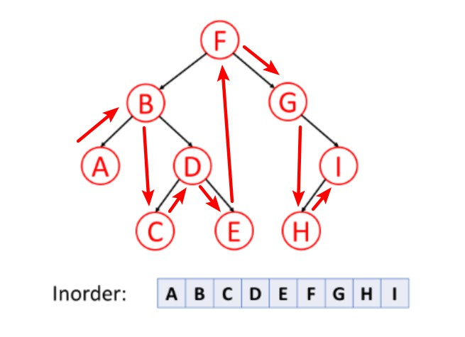
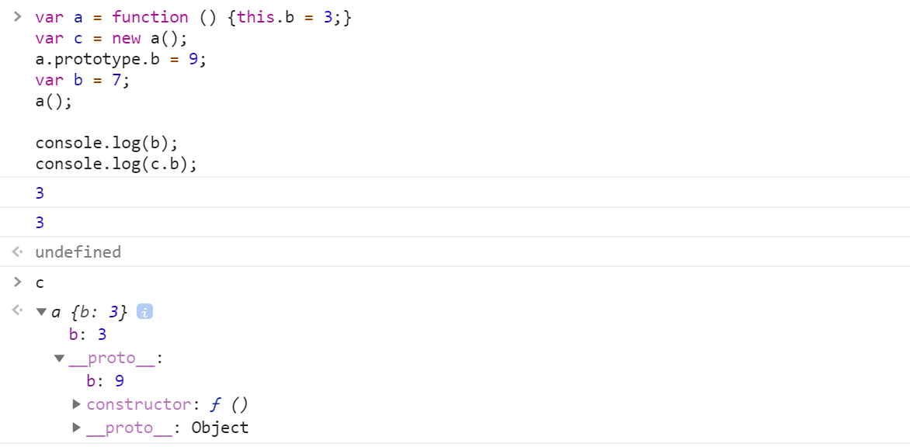

# 字节跳动面试题

如果需要了解了解算法以及没有很大把握的同学，建议把面试时间约在一周或者两周后，期间好好准备

另外面试时间可以调整，至少提前一天修改时间

面试可以现场可以视频，如果时间不方便可以约视频面试

面试共计四轮：
第一轮笔试或直接面试，重基础，细节
第二轮面试技术问题更深入一些
第三轮着重项目经验和技术广都和深度
第四轮 HR 面试，看稳定性，意向性，性价比，了解薪资
最后是 offer 沟通，定级、出薪资方案、入职时间等等
技术面试要知其然并知其所以然，每一轮面试或多或少都有算法，请做一些准备

[刷题网站](https://leetcode-cn.com/explore/featured/card/bytedance/)

[最齐全前端进阶汇总（学习 5）](https://blog.csdn.net/SuperxApple/article/details/106259765)

前端题库：仅做参考，不同的面试官有不同的面试风格和提问方式、内容
笔试：

## 1、换行字符串格式化

## 2、屏幕占满和未占满的情况下，使 footer 固定在底部，尽量多种方法。

### 考虑兼容性

```html
<style>
  .container  {
      box-sizing: border-box;
      min-height: 100vh;
      padding-bottom: 100px;
  }
  header,
   footer  {
      height: 100px;
  }
  footer  {
      margin-top: -100px;
  }
</style>
<div class="container">
  <header></header>
  <main></main>
</div>
<footer></footer>
```

### flex 布局

```html
<style>
  .container {
    display: flex;
    height: 100%;
    flex-direction: column;
  }

  header,
  footer {
    min-height: 100px;
  }

  main {
    flex: 1;
  }
</style>
<div class="container">
  <header></header>
  <main>
    <div>...</div>
  </main>
  <footer></footer>
</div>
```

## 3、日期转化为 2 小时前，1 分钟前等

```js
const minute = 1000 * 60;
const hour = minute * 60;
const day = hour * 24;
const week = day * 7;
const month = day * 30;

function getTimer(stringTime) {
  const time1 = new Date().getTime(); //当前的时间戳
  console.log(time1);
  const time2 = Date.parse(new Date(stringTime)); //指定时间的时间戳
  console.log(time2);
  const time = time1 - time2;

  let result = null;
  if (time < 0) {
    alert('设置的时间不能早于当前时间！');
  } else if (time / month >= 1) {
    result = '发布于' + parseInt(time / month) + '月前！';
  } else if (time / week >= 1) {
    result = '发布于' + parseInt(time / week) + '周前！';
  } else if (time / day >= 1) {
    result = '发布于' + parseInt(time / day) + '天前！';
  } else if (time / hour >= 1) {
    result = '发布于' + parseInt(time / hour) + '小时前！';
  } else if (time / minute >= 1) {
    result = '发布于' + parseInt(time / minute) + '分钟前！';
  } else {
    result = '刚刚发布！';
  }
  console.log(result);
}
getTimer('2020-05-23 10:11:12'); // 发布于1小时前！
```

## 4、多个 bind 连接后输出的值

bind 的多次绑定只有第一次是有效的, 在 Javascript 中，多次 bind() 是无效的。更深层次的原因， bind() 的实现，相当于使用函数在内部包了一个 call / apply ，第二次 bind() 相当于再包住第一次 bind() ,故第二次以后的 bind 是无法生效的

## 5、原码，补码，反码

[原码、反码、补码 详解](https://cloud.tencent.com/developer/article/1353672)

### 1. 原码

原码就是符号位加上真值的绝对值，即用第一位表示符号，其余位表示值。比如：如果是 8 位二进制：

- [+1]原 = 0000 0001
- [-1]原 = 1000 0001

原码是人脑最容易理解和计算的表示方式。

### 2. 反码

反码的表示方法是：
正数的反码是其本身；
负数的反码是在其原码的基础上，符号位不变，其余各个位取反。

- [+1] = [0000 0001]原 = [0000 0001]反
- [-1] = [1000 0001]原 = [1111 1110]反

可见如果一个反码表示的是负数，人脑无法直观的看出来它的数值。通常要将其转换成原码再计算。

### 3. 补码

补码的表示方法是：
正数的补码就是其本身；
负数的补码是在其原码的基础上，符号位不变，其余各位取反，最后+1。(也即在反码的基础上+1)

- [+1] = [0000 0001]原 = [0000 0001]反 = [0000 0001]补
- [-1] = [1000 0001]原 = [1111 1110]反 = [1111 1111]补

对于负数，补码表示方式也是人脑无法直观看出其数值的。通常也需要转换成原码再计算其数值。

## 6、事件委托

就是事件代理

[3 个使用场景助你用好 DOM 事件](https://kaiwu.lagou.com/course/courseInfo.htm?courseId=180#/detail/pc?id=3173)

## 7、输入一个日期 返回几秒前 几天前或者几月前；

```js
const seconds = 1000;
const minute = seconds * 60;
const hour = minute * 60;
const day = hour * 24;
const week = day * 7;
const month = day * 30;

function getTimer(stringTime) {
  const time1 = new Date().getTime(); //当前的时间戳
  console.log(time1);
  const time2 = Date.parse(new Date(stringTime)); //指定时间的时间戳
  console.log(time2);
  const time = time1 - time2;

  let result = null;
  if (time < 0) {
    alert('设置的时间不能早于当前时间！');
  } else if (time / month >= 1) {
    result = parseInt(time / month) + '月前！';
  } else if (time / week >= 1) {
    result = parseInt(time / week) + '周前！';
  } else if (time / day >= 1) {
    result = parseInt(time / day) + '天前！';
  } else if (time / hour >= 1) {
    result = parseInt(time / hour) + '小时前！';
  } else if (time / minute > 1) {
    result = parseInt(time / minute) + '分钟前！';
  } else if (time / seconds >= 1 && time / seconds <= 60) {
    result = parseInt(time / seconds) + '秒前！';
  } else {
    result = '刚刚发布！';
  }
  console.log(result);
}
getTimer('2020-05-23 11:27:12'); // 24秒前！
```

## 8、153812.7 转化 153,812.7

字符串原生方法

```js
function thousandsSplit(num = 0) {
  if (num !== null) {
    return num.toLocaleString();
  } else {
    return '-';
  }
}

console.log(thousandsSplit(153812.7)); // 153,812.7
```

正则

```js
function micrometerLevel(value) {
  if (typeof value === 'undefined' || value === null || isNaN(value)) {
    return value;
  }
  const stringValue = value.toString();
  const [integer, decimal] = stringValue.split('.');
  if (integer.length <= 3) {
    return stringValue;
  }
  let total = '';
  for (let i = integer.length - 1, j = 1; i > -1; i--, j++) {
    const num = j % 3 === 0 ? `,${integer[i]}` : integer[i];
    total = num + total;
  }
  total = total.replace(/^,/, '') + (decimal ? `.${decimal}` : '');
  return total;
}

console.log(micrometerLevel(153812.7));
```

## 11、实现一个 Promise.all

```js
// Promise.all 表示全部成功才成功 有任意一个失败 都会失败
Promise.all = function(promises) {
  return new Promise((resolve, reject) => {
    let arr = [],
      currentIndex = 0;

    function processData(index, value) {
      arr[index] = value;
      currentIndex++;
      if (currentIndex === promises.length) {
        resolve(arr);
      }
    }
    for (let i in promises) {
      promises[i].then(data => {
        processData(i, data);
      }, reject);
    }
  });
};
```

## 12.手写代码

给定一个数组，形如 [1, 1, 2 , 3, 3, 3, 3, 4, 6, 6]，给定一个数 n，例如 3，找出给定的数 n 在数组内出现的次数，要求时间复杂度小于 O(n)

```js
const countOccurrences = (arr, value) => arr.reduce((a, v) => (v === value ? a + 1 : a + 0), 0);
console.log(countOccurrences([1, 1, 2, 3, 3, 3, 3, 4, 6, 6], 3)); // 4
```

## 一轮

### 1.dom react 原理

[【React 深入】深入分析虚拟 DOM 的渲染原理和特性](https://segmentfault.com/a/1190000018891454)

### 2.css 布局

实际上我们在讨论布局的时候，会把网页上特定的区域进行分列操作。按照分列数目，可以大致分为 3 类，即单列布局、2 列布局、3 列布局。

[掌握 CSS 精髓：布局](https://kaiwu.lagou.com/course/courseInfo.htm?courseId=180#/detail/pc?id=3174)

### 3.js 原型链继承


每个函数都有 prototype 属性，除了 Function.prototype.bind()，该属性指向原型。

每个对象都有 `__proto__` 属性，指向了创建该对象的构造函数的原型。其实这个属性指向了 [[prototype]]，但是 [[prototype]] 是内部属性，我们并不能访问到，所以使用 _proto_ 来访问。

对象可以通过 `__proto__` 来寻找不属于该对象的属性，`__proto__` 将对象连接起来组成了原型链。

如果你想更进一步的了解原型，可以仔细阅读 [深度解析原型中的各个难点](https://github.com/KieSun/Dream/issues/2)。

总结

- `Object` 是所有对象的爸爸，所有对象都可以通过 `__proto__` 找到它
- `Function` 是所有函数的爸爸，所有函数都可以通过 `__proto__` 找到它
- `Function.prototype` 和 `Object.prototype` 是两个特殊的对象，他们由**引擎**来创建
- 除了以上两个特殊对象，其他对象都是通过构造器 `new` 出来的
- 函数的 `prototype` 是一个对象，也就是原型
- 对象的 `__proto__` 指向原型， `__proto__` 将对象和原型**连接起来**组成了原型链

### 4.fetch 取消

[如何取消 Fetch 请求？](http://www.fly63.com/article/detial/8426)

JavaScript 的 promise 一直是该语言的一大胜利——它们引发了异步编程的革命，极大地改善了 Web 性能。原生 promise 的一个缺点是，到目前为止，还没有可以取消 fetch 的真正方法。 JavaScript 规范中添加了新的 AbortController，允许开发人员使用信号中止一个或多个 fetch 调用。

以下是取消 fetch 调用的工作流程：

1. 创建一个 AbortController 实例
2. 该实例具有 signal 属性
3. 将 signal 传递给 fetch option 的 signal
4. 调用 AbortController 的 abort 属性来取消所有使用该信号的 fetch。

### 5.eventloop

[浏览器](https://golderbrother.github.io/blog/views/fe-interview/browser-eventLoop.html#async-await-%E6%89%A7%E8%A1%8C%E9%A1%BA%E5%BA%8F)

[node](https://golderbrother.github.io/blog/views/fe-interview/node-eventLoop.html#node-%E5%92%8C-%E6%B5%8F%E8%A7%88%E5%99%A8-eventloop%E7%9A%84%E4%B8%BB%E8%A6%81%E5%8C%BA%E5%88%AB)

### 6.instanceof

`instanceof` 可以正确的判断对象的类型，因为内部机制是通过判断对象的原型链中是不是能找到类型的 prototype。

我们也可以试着实现一下 `instanceof`

```js
function instanceof(left, right) {
  // 获得类型的原型
  let prototype = right.prototype;
  // 获得对象的原型
  left = left.__proto__;
  // 判断对象的类型是否等于类型的原型
  while (true) {
    if (left === null) return false;
    if (prototype === left) return true;
    left = left.__proto__;
  }
}
```

### 7.promise 封装 setstate

很多时候业务需要，在 setState 后再进行操作，比如改变下拉框的 state 值需要刷新 table 列表。这时候不可避免的需要使用 setState 中自带的 callback 方式。callback 方式缺点是不好定位错误，很容易就进入了回调地狱。
所以想到了可以将 setState 进行 promise 化，用.then 的方式取代回调。

```js
/**
 * 将setState方法promise化，用promise的方式去取代回调。
 * @param state
 * @returns {Promise}
 */
const setStateP = function(state) {
  return new Promise(resolve => this.setState(state, resolve));
};
```

### 8.redux 基本组成和设计单向数据流

- [Redux 数据流](https://www.jianshu.com/p/faee4de8e092)
- [Redux 管理 React 数据流要点浅析](https://segmentfault.com/a/1190000022279239)
- [Redux 入门教程（一）：基本用法](http://www.ruanyifeng.com/blog/2016/09/redux_tutorial_part_one_basic_usages.html)
- [8k 字 | Redux/react-redux/redux 中间件设计实现剖析](https://juejin.im/post/5def4831e51d45584b585000)

### 9.https 协议的过程

- [HTTP 灵魂之问，巩固你的 HTTP 知识体系](https://golderbrother.github.io/blog/views/network/http-interview.html#_001-http-%E6%8A%A5%E6%96%87%E7%BB%93%E6%9E%84%E6%98%AF%E6%80%8E%E6%A0%B7%E7%9A%84%EF%BC%9F)
- [https](http://www.zhufengpeixun.cn/2020/html/21.https.html)

### 10.https 获取加密密钥的过程

[HTTPS 简介](http://www.zhufengpeixun.cn/2020/html/94.6.https.html)
同上

### 11.http 的方法有哪几种

[如何理解 HTTP 的请求方法](https://golderbrother.github.io/blog/views/network/http-interview.html#_002-%E5%A6%82%E4%BD%95%E7%90%86%E8%A7%A3-http-%E7%9A%84%E8%AF%B7%E6%B1%82%E6%96%B9%E6%B3%95%EF%BC%9F)

### 12.类式继承的方案

### 13.prototype 继承的实现

- [JavaScript 中类式继承和原型式继承的实现方法和区别](https://www.cnblogs.com/langzs/p/6758992.html)
- [JavaScript 常用八种继承方案](https://www.jianshu.com/p/5b7a2a6711f1)

### 14.数字千分位处理，正则和非正则都要实现

同上 - 153812.7 转化 153,812.7

### 15.借用构造继承，几种组合继承方式

- [js 继承之组合继承（结合原型链继承 和 借用构造函数继承）](https://www.cnblogs.com/sarahwang/p/9098044.html)
- [javascript 实现继承 3 种方式： 原型继承、借用构造函数继承、组合继承，模拟 extends 方法继承](https://www.cnblogs.com/Lin-Yi/p/7446841.html)

### 16.看编程代码说出运行结果

Process.nextTick，setImmediate 和 promise.then 的优先级

- [解读 setTimeout, promise.then, process.nextTick, setImmediate 的执行顺序](https://www.cnblogs.com/jesse131/p/11708233.html)
- [promise.then,process.nextTick, setTimeout 以及 setImmediate 的执行顺序](https://blog.csdn.net/roamingcode/article/details/81737275)

### 17.实现一个 bind 函数

`bind` 和`call、apply`两个方法作用也是一致的，只是该方法会返回一个函数。并且我们可以通过 `bind` 实现柯里化。

同样的，也来模拟实现下 `bind`

```js
Function.prototype.myBind = function(context) {
  if (typeof this !== 'function') {
    throw new TypeError('Error');
  }
  var _this = this;
  var args = [...arguments].slice(1);
  // 返回一个函数
  return function F() {
    // 因为返回了一个函数，我们可以 new F()，所以需要判断
    if (this instanceof F) {
      return new _this(...args, ...arguments);
    }
    return _this.apply(context, args.concat(...arguments));
  };
};
```

### 18.千位加逗号

同上 - 153812.7 转化 153,812.7

### 19.三个继承方式的优缺点

看上面的继承

### 20.nodejs 的事件循环

[node](https://golderbrother.github.io/blog/views/fe-interview/node-eventLoop.html#node-%E5%92%8C-%E6%B5%8F%E8%A7%88%E5%99%A8-eventloop%E7%9A%84%E4%B8%BB%E8%A6%81%E5%8C%BA%E5%88%AB)

### 21.bfc

- [CSS 中的 BFC 详解](https://www.cnblogs.com/chen-cong/p/7862832.html)
- [CSS-BFC](https://www.cnblogs.com/chen-cong/p/7862832.html)
- [CSS 中重要的 BFC](https://segmentfault.com/a/1190000013023485)

### 22.css 实现正方形 div 水平垂直居中

实现居中的方案有很多，这里介绍下纯 CSS 使用 absolute 配合 margin 的方案。

#### 1. div 宽高固定

```css
.box {
  width: 400px;
  height: 200px;
  position: absolute;
  top: 50%;
  left: 50%;
  margin-top: -100px;
  margin-left: -200px;
}
```

margin-top 为-(height / 2)，margin-left 为-(width / 2)。当然也可以不用 margin，即 top 为 calc(100% - height) / 2，left 为 calc(100% - width) / 2，但是建议可以不用 calc()就不要用。

#### 2. div 宽高不固定

五马分尸式

```css
.box {
  width: 50%;
  height: 50%;
  position: absolute;
  top: 0;
  right: 0;
  bottom: 0;
  left: 0;
  margin: auto;
}
```

注意，这适用于宽高需指定的情况，比如使用百分比或者用 js 动态修改，不然可能被当成 100%处理。

也可以不用 `margin` 用 `translate()`，如下：

```css
.box {
  width: 50%;
  height: 50%;
  position: absolute;
  top: 50%;
  left: 50%;
  transform: translateX(-50%) translateY(-50%);
}
```

#### 3. CSS3 不定宽高水平垂直居中

```css
.box {
  justify-content: center; /* 子元素水平居中 */
  align-items: center; /* 子元素垂直居中 */
  display: -webkit-flex;
}
```

在父级元素上添加，即可实现子元素水平垂直居中。

### 23.koa1 的原理,继承

### 24.最后是一个写代码, 处理有依赖的异步任务 加重试

### 25.自己实现 bind 函数

同上, 17.实现一个 bind 函数

### 26.什么是闭包

闭包是指有权访问另外一个函数作用域中的变量的函数

关键在于下面两点：

- 是一个函数
- 能访问另外一个函数作用域中的变量

[深入浅出图解作用域链和闭包](https://muyiy.cn/blog/2/2.1.html#%E4%BD%9C%E7%94%A8%E5%9F%9F%E9%93%BE)

### 27.最长子序列

```js
/**
 * @param {number[]} nums
 * @return {number}
 */
var lengthOfLIS = function(nums) {
  let n = nums.length;
  if (n == 0) {
    return 0;
  }
  let dp = new Array(n).fill(1);
  let max = 0;
  for (let i = 0; i < n; i++) {
    for (let j = 0; j < i; j++) {
      if (nums[j] < nums[i]) {
        dp[i] = Math.max(dp[i], dp[j] + 1);
      }
    }
    max = Math.max(max, dp[i]);
  }
  return max;
};
```

[leetcode - 最长上升子序列](https://leetcode-cn.com/problems/longest-increasing-subsequence/solution/300-zui-chang-shang-sheng-zi-xu-lie-by-alexer-660/)

### 28.二叉树中序遍历

如果 left 节点存在, 就入栈, 然后跳 left
如果 left 和 right 都不存在, 则保存当前节点, 然后出栈, 并让 left 等于 null
如果 right 节点存在, 并且 left 为 null, 则保存当前节点, 然后跳 right



```js
const inorderTraversal = root => {
  // 用来保存节点
  let res = [],
    // 存放根节点
    stack = [];
  while (root || stack.length) {
    if (root.left) {
      // 如果 left 节点存在, 就入栈
      stack.push(root);
      // 跳到 left
      root = root.left;
    } else if (!root.left && !root.right) {
      // 如果 left 和 right 都不存在, 则保存当前节点
      res.push(root.val);
      // 出栈
      root = stack.pop();
      // 让 left 等于 null
      root && (root.left = null);
    } else if (root.right) {
      // 如果 right 节点存在, 并且 left 为 null, 则保存当前节点
      res.push(root.val);
      // 跳 right
      root = root.right;
    }
  }
  return res;
};
```

### http 握手原理

[卧槽！牛皮了，头一次见有大佬把 TCP 三次握手四次挥手解释的这么明白](卧槽！牛皮了，头一次见有大佬把TCP三次握手四次挥手解释的这么明白)

### 29.react 新版本的特性

- [React 中文官网](https://reactjs.bootcss.com/docs/hooks-state.html)
- [React 新特性实例详解（memo、lazy、suspense、hooks）](http://react-china.org/t/react-memo-lazy-suspense-hooks/28789)
- [渲染原生组件](http://www.zhufengpeixun.cn/2020/html/96.1.react16.html#t337.1%20getDerivedStateFromProps)
- [React.js 小书](http://huziketang.mangojuice.top/books/react/)

### 35.上中下三栏布局

flex

```html
<style>
  .container  {
      display: flex;
      height: 100%;
      flex-direction: column;
  }
  header,
   footer  {
      min-height: 100px;
  }
  main  {
      flex: 1;
  }
</style>
<div class="container">
  <header></header>
  <main>
    <div></div>
  </main>
  <footer></footer>
</div>
```

考虑兼容性

```html
<style>
  .container  {
      box-sizing: border-box;
      min-height: 100vh;
      padding-bottom: 100px;
  }
  header,
   footer  {
      height: 100px;
  }
  footer  {
      margin-top: -100px;
  }
</style>
<div class="container">
  <header></header>
  <main></main>
</div>
<footer></footer>
```

### 37.实现一个子类实例可以继承父类的所有方法

### 38.实现 sum(1)(2)(3).valueOf()，实现这么一个 sum 函数，返回 6

```js
function sum() {
  // 类数组转换成真正的数组，也可以用 [...arguments] or Array.from(arguments)
  // 接受第一次传入的参数
  const args = [].slice.call(arguments);

  const fn = function() {
    // 接受后面调用传入的参数
    const args2 = [].slice.call(arguments);
    return sum.apply(null, args.concat(args2));
  };

  fn.valueOf = function() {
    return args.reduce((a, b) => a + b);
  };
  return fn;
}

console.log(sum(1)(2)(3).valueOf()); // 6
```

### 串行异步任务

```
taskSum(1000,()=>{console.log(1)}).task(1200,()=>{console.log(2)}).task(1300,()=>{console.log(3)})，这里等待 1s，打印 1，之后等待 1.2s，打印 2，之后打印 1.3s，打印 3
```

```js
class Queue {
  constructor() {
    this.q = [];
  }
  task(f, ms) {
    this.q.push({ f, ms });
    return this;
  }
  async run() {
    while (this.q.length > 0) {
      let { f, ms } = this.q.shift();
      // 等待promise成功，阻塞后面的同步代码执行
      await sleep(f, ms);
    }
  }
}
// 睡眠ms后让promise状态转为成功态
const sleep = (f, ms) =>
  new Promise((resolve, reject) => {
    setTimeout(() => {
      f();
      resolve();
    }, ms);
  });
const start = () => {
  new Queue()
    .task(() => {
      console.log(1);
    }, 1000)
    .task(() => {
      console.log(2);
    }, 2000)
    .task(() => {
      console.log(3);
    }, 3000)
    .run();
};
start();
```

### 31.Jsonp 跨域

- [JSONP](https://golderbrother.github.io/blog/views/cors/corssOrigin-pro.html#_4-jsonp)
- [10 种跨域解决方案（附终极方案）](https://golderbrother.github.io/blog/views/cors/corssOrigin-pro.html)

### 32.js 原型继承 & 原型链

[重新认识构造函数、原型和原型链](https://muyiy.cn/blog/5/5.1.html#%E5%BC%95%E8%A8%80)

### 33.promise

- [Promise](http://www.zhufengpeixun.cn/2020/html/2.Promise.html#t84.3%20%20es6%E6%A8%A1%E6%8B%9FPromise)
- [手写 Promise](https://github.com/GolderBrother/my-promise-all)

### 34.二叉树搜寻算法(另外一篇文章中)

### 35.算法：前端做并发请求控制(另外一篇文章中)

### 38. express ctx 中间件代码实现

- [express 中间件实现原理和源码分析](https://blog.csdn.net/qdmoment/article/details/102564231)
- [学习 koa 源码的整体架构，浅析 koa 洋葱模型原理和 co 原理](https://www.lxchuan12.cn/koa/#%E5%89%8D%E8%A8%80)
- [redux, koa, express 中间件实现对比解析](https://www.ctolib.com/topics-134893.html)

### 39.. vue 发布订阅和虚拟 dom 代码实现

### 40. 请实现如下的函数，可以批量请求数据，所有的 URL 地址在 urls 参数中，同时可以通过 max 参数控制请求的并发度，当所有请求结束之后，需要执行 callback 回调函数。发请求的函数可以直接使用 fetch 即可

### 41.二叉树遍历

[从上到下打印二叉树](https://golderbrother.github.io/blog/views/algorithms/interview.html#_32-i-%E4%BB%8E%E4%B8%8A%E5%88%B0%E4%B8%8B%E6%89%93%E5%8D%B0%E4%BA%8C%E5%8F%89%E6%A0%91)

### 42.并发请求最大值是 10，怎么处理队列

同上

### 43.css 画出一个三角形

```css
#div1 {
  border-style: solid;
  border-width: 100px 100px 100px 100px;
  border-color: transparent transparent blue transparent;
  width: 0px;
  height: 0px;
}
```

### 44.node 网关

当您希望在 API 网关中执行简单的操作，比如将请求路由到特定服务，您可以使用像 nginx 这样的反向代理。但在某些时候，您可能需要实现一般代理不支持的逻辑。在这种情况下，您可以在 Node.js 中实现自己的 API 网关。

在 Node.js 中，您可以使用 http-proxy 软件包简单地代理对特定服务的请求，也可以使用更多丰富功能的 express-gateway 来创建 API 网关。

在我们的第一个 API 网关示例中，我们在将代码委托给 user 服务之前验证请求。

```js
const express = require('express');
const httpProxy = require('express-http-proxy');
const app = express();

const userServiceProxy = httpProxy('https://user-service');

// 身份认证
app.use((req, res, next) => {
  // TODO: 身份认证逻辑
  next();
});

// 代理请求
app.get('/users/:userId', (req, res, next) => {
  userServiceProxy(req, res, next);
});
```

另一种示例可能是在您的 API 网关中发出新的请求，并将响应返回给客户端：

```js
const express = require('express');
const request = require('request-promise-native');
const app = express();

// 解决: GET /users/me
app.get('/users/me', async (req, res) => {
  const userId = req.session.userId;
  const uri = `https://user-service/users/${userId}`;
  const user = await request(uri);
  res.json(user);
});
```

Node.js API 网关总结

API 网关提供了一个共享层，以通过微服务架构来满足客户需求。它有助于保持您的服务小而专注。您可以将不同的通用逻辑放入您的 API 网关，但是您应该避免 API 网关的过度使用，因为很多逻辑可以从服务团队中获得控制。

### 45.csrf/xss 攻击原理(前端攻击有哪些)

[谈谈 web 安全问题及解决方案](https://golderbrother.github.io/blog/views/fe-interview/web-safe.html#%E5%90%8C%E6%BA%90%E7%AD%96%E7%95%A5)

### 46.react diff 原理

[react-DOM-DIFF](http://www.zhufengpeixun.cn/2020/html/96.1.react16.html#t449.%20DOM-DIFF)

### 47.事件循环

- [EventLoop](http://www.zhufengpeixun.cn/2020/html/94.4.EventLoop.html)
- [事件循环(浏览器/node/版本差异)](https://mp.weixin.qq.com/s/QgfE5Km1xiEkQqADMLmj-Q)

### 48.react diff 算法，key 的作用，setData 的机制，事件合成

- [react fiber 的实现原理](https://juejin.im/post/5dadc6045188255a270a0f85#comment)
- [【React 深入】React 事件机制](https://juejin.im/post/5c7df2e7f265da2d8a55d49d)
- [【React 深入】setState 的执行机制](https://segmentfault.com/a/1190000018260218)
- [【React 深入】深入分析虚拟 DOM 的渲染原理和特性](https://segmentfault.com/a/1190000018891454)
- [【React 深入】从 Mixin 到 HOC 再到 Hook](https://segmentfault.com/a/1190000018811476)

### vue 相关面试题

[Vue 面试题汇总](https://golderbrother.github.io/blog/views/vue/vue-interview/part-one/note.html#_16-%E7%AE%80%E8%BF%B0vue%E4%B8%ADdiff%E7%AE%97%E6%B3%95%E5%8E%9F%E7%90%86)

### wepack-dev-server 热更新功能实现原理

[开始一个 React 项目(二) 彻底弄懂 webpack-dev-server 的热更新](https://www.jianshu.com/p/bcad129a1c69)

### 59.[1,2,3].map(parseInt) 执行结果

- `parseInt('1', 0);` // radix 为 0 时，使用默认的 10 进制。
- `parseInt('2', 1);` // radix 值在 2-36，无法解析，返回 NaN
- `parseInt('3', 2);` // 基数为 2，2 进制数表示的数中，最大值小于 3，无法解析，返回 NaN

### 67.hybrid 实现 bridge 的方法

[Hybrid APP 基础篇(四)->JSBridge 的原理](https://www.cnblogs.com/dailc/p/5931324.html)
[Hybrid APP 基础篇(五)->JSBridge 实现示例](https://www.cnblogs.com/dailc/p/5931324.html)

### 69.小程序框架的实现原理

[小程序底层框架实现原理解析](http://www.360doc.com/content/17/0407/09/40156408_643535157.shtml)

### 78.vue-router 路由监听的原理

[VueRouter 源码解析](https://yuchengkai.cn/docs/frontend/vue.html#vuerouter-%E6%BA%90%E7%A0%81%E8%A7%A3%E6%9E%90)

### 79.webpack 打包的原理，webpack 有没有针对打包过程做一些优化提升打包速度

- [说说 webpack 打包的原理](https://golderbrother.github.io/blog/views/fe-interview/webpack-principle.html#%E7%AE%80%E4%BB%8B)
- [Webpack 性能优化你知道哪些](https://golderbrother.github.io/blog/views/fe-interview/webpack-performance-optimization.html#webpack-%E6%80%A7%E8%83%BD%E4%BC%98%E5%8C%96%E4%BD%A0%E7%9F%A5%E9%81%93%E5%93%AA%E4%BA%9B)

### 85.小程序架构优化

[小程序性能和体验优化方法](https://www.jianshu.com/p/7f92ac231d47)

### 86.写一个 eventBus

[EventBus 事件车](http://www.zhufengpeixun.cn/2020/html/66-9.vuex-apply.html#t1EventBus%E4%BA%8B%E4%BB%B6%E8%BD%A6)

### 88.vuex mobx

- [vue 中的状态管理](http://www.zhufengpeixun.cn/2020/html/66-9.vuex-apply.html)
- [mobx](http://www.zhufengpeixun.cn/2020/html/62.7.react-mobx.html)

### 91.CSS 栅格布局

很多 UI 框架都提供了栅格系统来帮助页面实现等分或等比布局，比如 Bootstrap 提供了 12 列栅格，elment ui 和 ant design 提供了 24 列栅格。

那么你思考过栅格系统设定这些列数背后的原因吗？

首先从 12 列说起，12 这个数字，从数学上来说它具有很多约数 1、2、3、4、6、12，也就是说可以轻松实现 1 等分、2 等分、3 等分、4 等分、6 等分、12 等分，比例方面可以实现 1:11、1:5、1:3、1:2、1:1、1:10:1、1:4:1 等。如果换成 10 或 8，则可实现的等分比例就会少很多，而更大的 16 似乎是个不错的选择，但对于常用的 3 等分就难以实现。

至于使用 24 列不使用 12 列，可能是考虑宽屏幕（PC 端屏幕宽度不断增加）下对 12 列难以满足等分比例需求，比如 8 等分。同时又能够保证兼容 12 列情况下的等分比例（方便项目迁移和替换）。

### 92. CSS 伪类和伪元素

- css 伪类
  css 伪类用于向某些选择器添加特殊的效果。
  锚伪类：`:link, :visited, :hover, :focus, :active, :lang`
  css3 新增的伪类：
  `:first-child, :last-child, :only-child, :first-of-type, :last-of-type, :only-of-type, :nth-child(n), :nth-last-child(n), :nth-of-type(n), :nth-last-of-type(n), :root, :empty, :target, :enabled, :disabled, :checked, :not(selector),`

- css 伪元素
  css 伪元素用于向某些选择器设置特殊效果。
  `::first-letter, ::first-line, ::before, ::after`
  css3 新增的伪元素
  `::selection`

- css 伪类和伪元素的区别

  1. 为了避免大家混淆伪类和伪元素，css3 中的标准规定伪类使用单冒号“:” ，伪元素使用双冒号“::”，但在此之前都使用的单冒号“:”，所以为了保证兼容伪元素两种使用方法都是可以的。
  2. 伪类可以叠加使用，而伪元素在一个选择器中只能出现一次，并且只能出现在末尾。

  ```css
  .box:first-child:hover {
    color: #000;
  } //使用伪类
  .box:first-letter {
    color: #000;
  } //使用伪元素
  .box:first-letter:hover {
    color: #000;
  } //错误写法
  ```

  [CSS 伪类 (Pseudo-classes)](https://www.w3school.com.cn/css/css_pseudo_classes.asp)

  3. 伪类与类优先级相同，伪元素与标签优先级相同。顺便说一下优先级怎么判断，一般是 !important > 行内样式> ID 选择器 > 类选择器 > 标签 > 通配符 > 继承 > 浏览器默认属性。还有一个简单的计算方法，内联样式表的权值为 1000，ID 选择器的权值为 100，Class 类选择器的权值为 10，HTML 标签选择器的权值为 1，权值实际并不是按十进制计算的，用数字表示只是说明思想，我们可以把选择器中规则对应做加法，比较权值大小，权值越大优先级越高，如果权值相同前面的样式会被后面的覆盖。

### 93.根据条件获取递归树中过的某一节点

```js
const orgTreeData = {
  nodeId: '19A5B',
  nodeName: '预分析用户：1313.85万人',
  nodeType: 'root',
  expand: true,
  dataCnt: 13138494,
  children: [
    {
      nodeId: '19A5B_19A5C',
      nodeName: '客户状态',
      nodeType: 'tag',
      children: [{}]
    }
  ]
};
const findParentNodeById = (data, nodeId) => {
  //设置结果
  let result;
  if (!data) return; //如果data传空，直接返回
  for (let i = 0; i < data.children.length; i++) {
    let item = data.children[i];
    //找到id相等的则返回父节点
    if (item.nodeId == nodeId) return (result = data);
    else if (item.children && item.children.length > 0) {
      //如果有子集，则把子集作为参数重新执行本方法
      result = findParentNodeById(item, nodeId);
      //关键，千万不要直接return本方法，不然即使没有返回值也会将返回return，导致最外层循环中断，直接返回undefined,要有返回值才return才对
      if (result) return result;
    }
  }
  //如果执行循环中都没有return，则在此return
  return result;
};
```

### 94.JavaScript this 的指向；箭头函数的 this 指向

[JavaScript 深入之史上最全--5 种 this 绑定全面解析](https://muyiy.cn/blog/3/3.1.html)

### 95.Promise / setTimeout 的执行顺序；实际考察知识点：对「事件队列 / 宏任务 / 微任务」的了解

Promise 是微任务，会优先于 setTimeout 执行

### 96.执行代码求输出，并说明为什么，严格模式下输出有变化吗，为什么

```js
var a = function() {
  this.b = 3;
};
var c = new a();
a.prototype.b = 9;
var b = 7;
a();

console.log(b);
console.log(c.b);
```



解析

1. 执行`a();`, 没有显式指定调用方式，在非严格模式下，则指向 `windows`，因此函数表达式`a`里面的`this`指向`windows`, 即 `this.b = 3 -> window.b = 3`;
2. 执行 `c = new a();`, `c` 就是 `a` 的实例，所以 `this.b = 3 -> c.b = 3`;
3. 执行 `a.prototype.b = 9;`, 根据原型链规则，就是 `a.__proto__ -> a.prototype`;

### 97.给定一个升序整型数组[0,1,2,4,5,7,13,15,16],找出其中连续出现的数字区间，输出为["0->2","4->5","7","13","15->16"]

```js
function summaryRanges(arr) {
  //TODO
}
```

### 98.请实现以下的函数，可以批量请求数据，所有的 URL 地址在 urls 参数中，同时可以通过 max 参数控制请求的并发度，当所有请求结束之后，需要执行 callback 回调函数。发请求的函数可以直接使用 fetch 即可

```js
function sendRequest(urls: sring[], max: number, callback: () => void) {
  //TODO
}
```

### 99.弹性盒子中 flex: 0 1 auto 表示什么意思

三个参数分别对应的是 flex-grow, flex-shrink 和 flex-basis，默认值为 0 1 auto。

1.flex-grow: 0; // 增长比例，子项合计宽度小于容器宽度，需要根据每个子项设置的此属性比例对剩下的长度进行分配
2.flex-shrink: 1; // 回缩比例，子项合计宽度大于容器宽度，需要根据每个子项设置的此属性比例对多出的长度进行分配
3.flex-basis 属性定义了在分配多余空间之前，项目占据的主轴空间（main size）。

### 100.Promise 相关

(1)`promise` 的链式调用怎么中断？
返回一个既不成功也不失败的 `promise`, 相当于是返回`pending`状态的 `Promise` 对象
`return new Promise(resolve,reject) => {})`;

(2)`promise` 如何取消

- `Promise.race` 竞速方法

```js
let p1 = new Promise((resolve, reject) => {
  resolve('ok1');
});

let p2 = new Promise((resolve, reject) => {
  setTimeout(() => {
    resolve('ok2');
  }, 10);
});

Promise.race([p2, p1])
  .then(result => {
    console.log(result); //ok1
  })
  .catch(error => {
    console.log(error);
  });
```

- 当 `Promise` 链中抛出一个错误时，错误信息沿着链路向后传递，直至被捕获。

利用这一特性能跳过链中被捕获前的函数的调用，直至链路终点。

```js
Promise.resolve()
  .then(() => {
    console.log('ok1');
    throw 'throw error1';
  })
  .then(
    () => {
      console.log('ok2');
    },
    err => {
      // 捕获错误
      console.log('err->', err);
    }
  )
  .then(() => {
    // 该函数将被调用
    console.log('ok3');
    throw 'throw error3';
  })
  .then(() => {
    // 错误捕获前的函数不会被调用
    console.log('ok4');
  })
  .catch(err => {
    console.log('err->', err);
  });
```

(3)`Promise.prototype.finally`的使用场景

- 隐藏 `AJAX` 请求的 `loading` 效果
- 关掉打开的文件
- 不管操作完成的状态是成功还是失败都想要记录日志

等等这些情况下，就需要用 finally

(4)[手写一个 promise 代码地址](https://github.com/GolderBrother/my-promise-all)

### 101.打开 url 后的流程

[细说浏览器输入 URL 后发生了什么](https://golderbrother.github.io/blog/views/fe-interview/browser-input-url.html#%E6%80%BB%E4%BD%93%E6%A6%82%E8%A7%88)

### 102.怎么解决内存泄漏。还有内存回收的有哪几种方式

[JavaScript 内存泄露的 4 种方式及如何避免](https://blog.csdn.net/weixin_33906657/article/details/90490743)

## 二面

### 1.实现一个字符串反转：输入：www.toutiao.com.cn 输出：cn.com.toutiao.www

要求：1.不使用字符串处理函数 2.空间复杂度尽可能小

```js
/**
 * @param {string} s
 * @return {string}
 */
var reverseWords = function(s) {
  var l = '';
  var l1 = '';
  for (var i = 0; i < s.length; i++) {
    if (s[i] != ' ') {
      l = s[i] + l;
    } else {
      l1 = l1 + l + ' ';
      l = '';
    }
  }
  return l1 + l;
  // return s.split("").reverse().join("").split(" ").reverse().join(" ")
};
```

### 2.不借助变量，交换两个数

#### 1. 算术交换

针对的是 `Number`，或者类型可以转换成数字的变量类型

```js
function swap(a, b) {
  a = a + b;
  b = a - b;
  a = a - b;
}
```

通过算术运算过程中的技巧，可以巧妙地将两个值进行互换。但是，有个缺点就是变量数据溢出。因为 `JavaScript` 能存储数字的精度范围是 `-2^53` 到 `2^53`。所以，加法运算，会存在溢出的问题。

#### 2. 异或运算

^ 按位异或 若参加运算的两个**二进制位值相同则为 0，否则为 1**

此算法能够实现是由异或运算的特点决定的，通过异或运算能够使数据中的某些位翻转，其他位不变。这就意味着任意一个数与任意一个给定的值连续异或两次，值不变.

```js
a = a ^ b;
b = a ^ b;
a = a ^ b;
```

#### 3. ES6 的解构(真香~)

```js
[a, b] = [b, a];
```

### 3.观察者模式 vs 发布-订阅模式，说说区别

#### 观察者模式的概念

观察者模式模式，属于行为型模式的一种，它定义了一种一对多的依赖关系，让多个观察者对象同时监听某一个主题对象。这个主体对象在状态变化时，会通知所有的观察者对象，使他们能够自动更新自己。

#### 发布订阅者模式的概念

发布-订阅模式，消息的发送方，叫做发布者（`publishers`），消息不会直接发送给特定的接收者，叫做订阅者。意思就是发布者和订阅者不知道对方的存在。需要一个**调度中心**媒介，叫做信息中介，它将订阅者和发布者串联起来，它过滤和分配所有输入的消息。换句话说，发布-订阅模式用来处理不同系统组件的信息交流，即使这些组件不知道对方的存在。


我们把这些差异快速总结一下：

在`观察者模式`中，观察者是知道`Subject`的，`Subject`一直保持对观察者进行记录。然而，在发布订阅模式中，发布者和订阅者不知道对方的存在。它们只有通过**消息代理**(**调度中心**)进行通信。

在发布订阅模式中，组件是松散耦合的，正好和`观察者模式`相反。

`观察者模式`大多数时候是同步的，比如当事件触发，`Subject`就会去调用观察者的方法。而`发布-订阅`模式大多数时候是异步的（使用消息队列）。

`观察者模式`需要在单个应用程序地址空间中实现，而`发布-订阅`更像交叉应用模式。

### 4. 与项目无绝对相关的问答题

- [vue 事件机制是如何实现的](https://juejin.im/post/59ca5e975188257a8908959b)
- [vue 的组件通信方式有哪些](http://golderbrother.cn/articleDetail?article_id=5da1ab2255bcb9003009ed89##toc27)
- [react fiber 的实现原理](https://juejin.im/post/5dadc6045188255a270a0f85#comment)
- [vue 响应式数据原理(vue2/vue3/依赖收集/发布订阅/watcher 消息队列控制/Vue.set 实现)](https://mp.weixin.qq.com/s/zDv_IQ36o_rRD25xN9uyuw、https://mp.weixin.qq.com/s/hTygoAan4yH3V4XV9iE1Pw)
- vue 转小程序怎么实现(ast/生命周期对齐/跨平台模块兼容/兼容细节点实现过程)（可以看看 mqvue 的实现原理）
- [性能指标，如何理解 TTI，如何统计，与 FID 有什么区别，如何实现统计，以及性能的东西](https://mp.weixin.qq.com/s/wDKKj5R8SYm-_75Zn1y30A)
- [说说你所了解的安全问题及防护方法](https://mp.weixin.qq.com/s/rU32rVM6Q-ele01ZB3RFzg)
- 说说你知道的设计模式，并举个对应的模式例子
  - [介绍几个 JavaScript 设计模式及场景应用](https://mp.weixin.qq.com/s/x3OCgS_knmM4D5zNSIVGRg)
  - [前端需要了解的 9 种设计模式](https://mp.weixin.qq.com/s/MdT9BGmgCEr6yez-1bpF2w)

### 5.http 网络协议

[HTTP 灵魂之问，巩固你的 HTTP 知识体系](https://golderbrother.github.io/blog/views/network/http-interview.html)

### 6.tcp 为什么是可靠的

[TCP 协议为什么可靠?](https://www.jianshu.com/p/ff36b6ab503e)

### 7.solid 原则

[设计模式之 SOLID 原则](https://www.cnblogs.com/suli0827/p/9515842.html)

### 8.柯里化

是把接受多个参数的函数变换成接受一个单一参数（最初函数的第一个参数）的函数，并且返回接受余下的参数而且返回结果的新函数的技术。

示例代码如下：

```js
const isType = (type, value) => Object.prototype.toString.call(value) === `[object ${type}]`;

const currying = (fn, arr = []) => {
  const len = fn.length;
  return (...args) => {
    let concatArgs = [...arr, ...args];
    if (concatArgs.length < len) {
      // 继续curry参数
      return currying(fn, concatArgs); // 递归不停的产生函数
    } else {
      return fn(...concatArgs);
    }
  };
};

const isArray = currying(isType)('Array', []);
const isString = currying(isType)('String', '');
const isNumber = currying(isType)('Number', '1');

console.log(`isArray`, isArray); // isArray true
console.log(`isString`, isString); // isString true
console.log(`isNumber`, isNumber); // isNumber false
```

### 9.css 单行和多行截断

```html
<!DOCTYPE html>
<html lang="en">
  <head>
    <meta charset="UTF-8" />
    <meta name="viewport" content="width=device-width, initial-scale=1.0" />
    <title>css处理超出文本截断问题的两种情况（多行或者单行）</title>
    <style>
      /* 单行的简单处理方式 */
      .words {
        width: 400px;

        /*超过部分不显示*/
        overflow: hidden;
        /*超过部分用点点表示*/
        text-overflow: ellipsis;
        /*不换行*/
        white-space: nowrap;
      }

      /* 规定行数的截断处理方式 */
      .words {
        width: 400px;

        text-overflow: ellipsis;
        /*有些示例里需要定义该属性，实际可省略*/
        display: -webkit-box;
        -webkit-line-clamp: 2;
        /*规定超过两行的部分截断*/
        -webkit-box-orient: vertical;
        overflow: hidden;
        word-break: break-all;
        /*在任何地方换行*/
      }
    </style>
  </head>

  <body>
    <div class="words">
      For a long time it seemed to me that life was about to begin , real life. But, there was
      always some obsacle in the way, something to be gotten through first, some unfinnished
      business, time still to be served or a debt to be paid. Then life would begin.
    </div>
  </body>
</html>
```

### 10.手写一个 redux middleware

[Redux 中间件](http://www.zhufengpeixun.cn/2020/html/63.2.redux-middleware.html#t01.%20Redux%E4%B8%AD%E9%97%B4%E4%BB%B6)

### 11.ssr(ssr csr 混合怎么处理)

[React SSR 详解【近 1W 字】+ 2 个项目实战](https://juejin.im/post/5def0816f265da33aa6aa7fe)

### 12.TS 常见问题整理（60 多个，持续更新 ing）

[TS 常见问题整理（60 多个，持续更新 ing）](https://juejin.im/post/5e33fcd06fb9a02fc767c427)

## 三轮

### 1.什么是微前端

[了解什么是微前端](https://mp.weixin.qq.com/s/zw6sNtNEvqnnGgRsPJsW4w)

### 2.浅拷贝深拷贝实现

[js 浅拷贝与深拷贝的区别和实现方式](https://www.jianshu.com/p/1c142ec2ca45)

### 3. redux 和 mobx 的区别

[redux、mobx、concent 特性大比拼, 看后生如何对局前辈](https://juejin.im/post/5e7c18d9e51d455c2343c7c4)

### 4.长列表渲染

[性能优化之长列表渲染——时间分片和虚拟列表](https://blog.csdn.net/superermiao/article/details/105426843)

### 5.redis 数据结构和实现

[Redis 数据结构底层实现](https://blog.csdn.net/Dome_/article/details/93389132)

### 其他

- js 实现依赖注入
- 接口攻击的方式和防御措施
- js 多线程如何共享大的数据
- 二叉树 ，diff 算法，
- 页面渲染原理，
- 图像算法 事件循环

## 最后

文中若有不准确或错误的地方，欢迎指出，有兴趣可以的关注下[Github](https://github.com/GolderBrother)，一起学习呀~~
