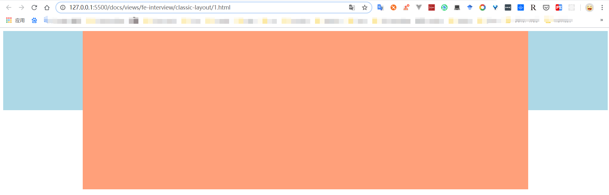

# 掌握两大经典布局方案

## 圣杯布局

浮动和负 `margin`

看看长啥样子



实现代码如下

```html
<style>
  html,
  body {
    height: 100%;
    overflow: hidden;
  }

  .container {
    height: 100%;
    padding: 0 200px;
  }

  .left,
  .right {
    width: 200px;
    min-height: 200px;
    background: lightblue;
  }

  .center {
    width: 100%;
    min-height: 400px;
    background: lightsalmon;
  }

  .left,
  .center,
  .right {
    float: left;
  }

  .left {
    margin-left: -100%;
    position: relative;
    left: -200px;
  }

  .right {
    margin-right: -200px;
  }
</style>

<div class="container clearfix">
  <div class="center"></div>
  <div class="left"></div>
  <div class="right"></div>
</div>
```

## 双飞翼布局

浮动和负 MARGIN

看看长啥样子


实现代码如下

```html
<!DOCTYPE html>
<html lang="en">
  <head>
    <meta charset="UTF-8" />
    <meta name="viewport" content="width=device-width, initial-scale=1.0" />
    <title>Document</title>
  </head>

  <style>
    html,
    body {
      height: 100%;
      overflow: hidden;
    }

    .container,
    .left,
    .right {
      float: left;
    }

    .container {
      width: 100%;
    }

    .container .center {
      margin: 0 200px;
      min-height: 400px;
      background: lightsalmon;
    }

    .left,
    .right {
      width: 200px;
      min-height: 200px;
      background: lightblue;
    }

    .left {
      margin-left: -100%;
    }

    .right {
      margin-left: -200px;
    }
  </style>

  <body class="clearfix">
    <div class="container">
      <div class="center"></div>
    </div>
    <div class="left"></div>
    <div class="right"></div>
  </body>
</html>
```

## 最后

文中若有不准确或错误的地方，欢迎指出，有兴趣可以的关注下[Github](https://github.com/GolderBrother)，一起学习呀~~
