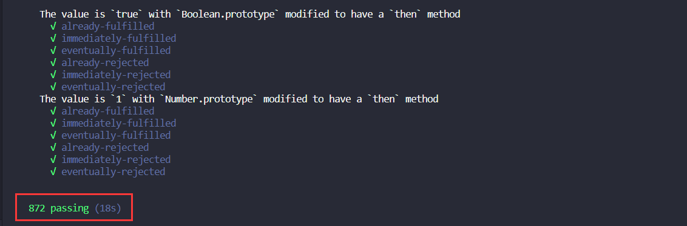

# 少年，来，手写一个 Promise 吧

## 手写实现

实现代码如下：

```js
const PENDING = 'PENDING';
const SUCCESS = 'RESOLVED';
const FAIL = 'REJECTED';
/* 
有必要来解释一波 
Promise A+ 规范：https://promisesaplus.com/
需要来个方法来处理.then方法的返回值
Promise Resolution Procedure
resolvePromise
(1)普通值表示不是Promise，也不是错误,没有返回值(undefined),也算是普通值
(2)如果返回promise，这个promise会执行，然后会采用他的状态，并返回给外层的then中
成功(resolve态)就走then方法中的成功函数(resolve)
失败(reject态 or throw new Error)就走then方法中的失败函数(reject)
(3).then方法返回的不是this，也就不是之前的promise，所以必须返回一个新的Promise
promise2是.then方法执行完返回的那个新的promise，x 是then方法中两个函数（resolve和reject）执行的结果（上一个Promise的值）

resolve和reject的区别在于，resolve会等待里面的promise执行完成，reject不会有等待效果

防止别人写了这样的恶意代码
let obj = {};
Object.defineProperty(obj, then, {
  get(){
    throw new Error('失败')
  }
})
*/
// 严谨 应该判断 别人的promise 如果失败了就不能在调用成功 如果成功了不能在调用失败
function resolvePromise(promise2, x, resolve, reject) {
  if (promise2 === x) {
    // 自己等自己，死循环
    return reject(new TypeError('TypeError: Chaining cycle detected for promise #<Promise>'));
  }
  let called; // 防止promise被调用多次
  if (typeof x === 'function' || (typeof x === 'object' && x != null)) {
    try {
      // If retrieving the property x.then results in a thrown exception e, reject promise with e as the reason
      let then = x.then;  // then 可能是getter object.defineProperty
      if (typeof then === 'function') {  // {then:null}
        // If then is a function, call it with x as this, first argument resolvePromise, and second argument rejectPromise
        // then.call => x.then()  x.then()方法会再取一次then方法，不太好
        // y => resolve(y) 这里面的y
        then.call(x, y => { // 如果是一个promise，就采用这个promise的结果, 并且使用call绑定x来保证指向返回的x这个Promise实例
          if (called) return; // 1) 为了辨别这个promise 不能调用多次
          called = true;
          // If/when resolvePromise is called with a value y, run [[Resolve]](promise, y)
          // y有可能也是个promise,需要实现递归解析，直到y为一个常量，然后直接resolve即可  
          resolvePromise(promise2, y, resolve, reject);
        }, r => { // r => reject(r),If/when rejectPromise is called with a reason r, reject promise with r.
          // 只要调用失败了，就不用管reject(r) 这里面的r值是否为promise,直接失败
          if (called) return; // 2) 为了辨别这个promise 不能调用多次
          called = true;
          reject(r);
        })
      } else {
        // 普通值不用判断，因为不会再走reject,直接resolve即可
        resolve(x);
      }
    } catch (e) {
      if (called) return; // 3) 为了辨别这个promise 不能调用多次
      called = true;
      reject(e);
    }
  } else {
    // 普通值不用判断，因为不会再走reject,直接resolve即可
    resolve(x);
  }
}

class Promise {
  constructor(executor) {
    this.status = PENDING; // Promise的初始状态'PENDING'
    this.value = undefined; // 成功态的值
    this.reason = undefined; // 失败态的原因
    this.onResolvedCallbacks = []; // 存储成功的所有的回调 只有pending的时候才存储
    this.onRejectedCallbacks = []; // 存储失败的所有的回调 只有pending的时候才存储
    const resolve = value => {
      if (value instanceof Promise) {
        // resolve的结果是一个promise
        return value.then(resolve, reject); // 那么会让这个promise执行，将执行后的结果在传递给 resolve或者reject中(递归解析resolve中的参数，直到这个值是个普通值)
      }
      // 立即执行
      if (this.status === PENDING) {
        this.value = value;
        this.status = SUCCESS;
        // 取出一个个回调依次执行
        this.onResolvedCallbacks.forEach(fn => fn());
      }
    };
    // 立即执行
    const reject = reason => {
      if (this.status === PENDING) {
        this.reason = reason;
        this.status = FAIL;
        // 取出一个个回调依次执行
        this.onRejectedCallbacks.forEach(fn => fn());
      }
    };
    try {
      executor(resolve, reject);
    } catch (e) {
      reject(e);
    }
  }
  then(onFulfilled, onRejected) {
    // .catch(function(){}) .then(null,function)
    // 可选参数，如果then方法中的两个函数(参数)有传，就用传入的，没传就用默认的
    onFulfilled = typeof onFulfilled === 'function' ? onFulfilled : val => val;
    onRejected =
      typeof onRejected === 'function'
        ? onRejected
        : err => {
          throw err;
        };
    let promise2;
    // 这边 new 的是 自己的 Promise
    promise2 = new Promise((resolve, reject) => {
      // 加定时器是为了获取 new Promise之后的 promise2 值
      if (this.status === SUCCESS) {
        setTimeout(() => {
          try {
            let x = onFulfilled(this.value);
            resolvePromise(promise2, x, resolve, reject);
          } catch (err) {
            reject(err);
          }
        });
      }
      if (this.status === FAIL) {
        setTimeout(() => {
          try {
            let x = onRejected(this.reason);
            resolvePromise(promise2, x, resolve, reject);
          } catch (err) {
            reject(err);
          }
        });
      }
      if (this.status === PENDING) {
        this.onResolvedCallbacks.push(() => {
          setTimeout(() => {
            try {
              let x = onFulfilled(this.value);
              resolvePromise(promise2, x, resolve, reject);
            } catch (err) {
              reject(err);
            }
          });
        });
        this.onRejectedCallbacks.push(() => {
          setTimeout(() => {
            try {
              let x = onRejected(this.reason);
              resolvePromise(promise2, x, resolve, reject);
            } catch (err) {
              reject(err);
            }
          });
        });
      }
    });
    return promise2;
  }
  // catch(err => err) 是 then方法的语法糖，少写了.then的resolve方法
  catch(errCallback) {
    // 用来捕获错误 ， 语法糖
    return this.then(null, errCallback);
  }
}

// Promise的相关方法(原型、静态)

// 希望测试一下这个库是否符合我们的promise A+规范
// promises-aplus-tests
// 没人用了
Promise.defer = Promise.deferred = function() {
  let defer = {};
  defer.promise = new Promise((resolve, reject) => {
    defer.resolve = resolve;
    defer.reject = reject;
  });
  return defer;
};

// Promise上的静态方法 创建了一个成功的Promise
Promise.resolve = function(value) {
  return new Promise((resolve, reject) => {
    resolve(value);
  });
};

// Promise上的静态方法 创建了一个失败的Promise
Promise.reject = function(value) {
  return new Promise((resolve, reject) => {
    reject(value);
  });
};

Promise.prototype.catch = function(errorFn) {
  // catch实际上就是特殊的then方法，只是onfulfilled函数为null，返回 errorFn 错误函数
  return this.then(null, errorFn);
};

// Promise.all 表示全部成功才成功 有任意一个失败 都会失败
Promise.all = function(promises) {
  return new Promise((resolve, reject) => {
    let arr = [],
      currentIndex = 0;

    function processData(index, value) {
      arr[index] = value;
      currentIndex++;
      if (currentIndex === promises.length) {
        resolve(arr);
      }
    }
    for (let i in promises) {
      promises[i].then(data => {
        processData(i, data);
      }, reject);
    }
  });
};

// rece赛跑
Promise.race = function(promises) {
  return new Promise((resolve, reject) => {
    for (let i in promises) {
      // 并行执行then函数里面的回调，那个先返回结果就返回这个结果
      promises[i].then(resolve, reject);
    }
  });
};

// Promise.finally() 最终的，无论如何finally中传递的回调函数 必须会执行，如果返回一个promise,会等待这个Promise执行完成
Promise.prototype.finally = function(callback) {
  return this.then(
    data => {
      // resolve才会等待promise执行完毕，reject不会
      // 如果then方法返回一个Promise, 就会等待这个方法执行完毕，所以需要包装成Promise才能等待
      return Promise.resolve(callback()).then(() => data);
      // return new Promise((resolve,reject)=>{
      //     resolve(callback()); // 如果callback是一个函数返回promise 就等待这个promise执行完毕
      // }).then(()=>data);
      // callback();
      // return data;
    },
    err => {
      return Promise.resolve(callback()).then(() => {
        throw err;
      }); // koa 原理
      // throw err;
    }
  );
};

// TODO: Promise.try() 可以捕获同步异常和异步异常
// 希望测试一下这个库是否符合我们的promise A+规范
// promises-aplus-tests
// 需要加个 defer, 因为测试的时候会调用这个方法，看这个promise是否符合规范
Promise.defer = Promise.deferred = function() {
  let dfd = {};
  dfd.promise = new Promise((resolve, reject) => {
    dfd.resolve = resolve;
    dfd.reject = reject;
  });
  return dfd;
};

module.exports = Promise;
// 全局安装
// npm i promises-aplus-tests -g

// 测试
// promises-aplus-tests myPromise.js
```

## 测试



[源码地址](https://github.com/GolderBrother/my-promise-all)，如果对你有帮助的，可以不吝啬的点个`star`哈

## 最后

文中若有不准确或错误的地方，欢迎指出，有兴趣可以的关注下[Github](https://github.com/GolderBrother)~
