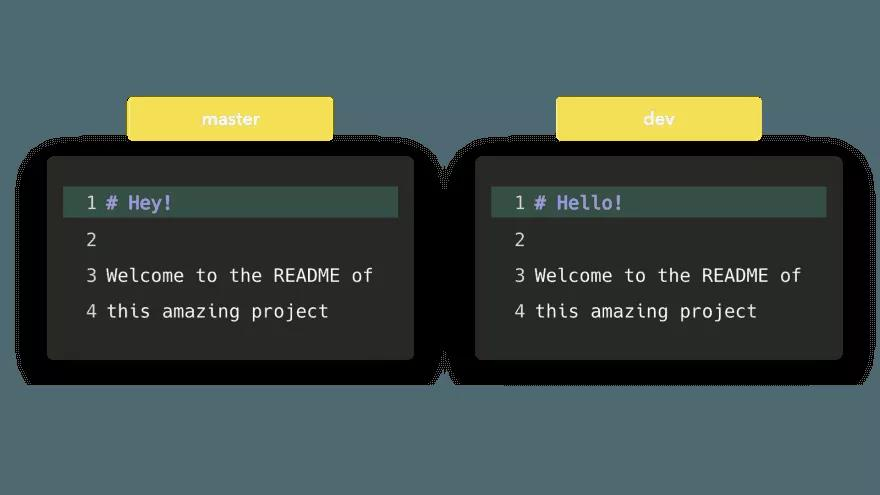
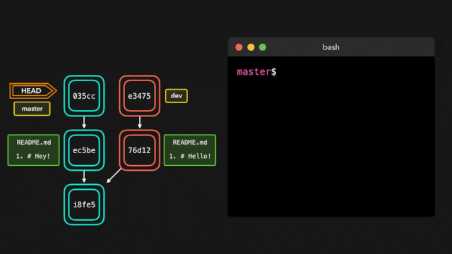
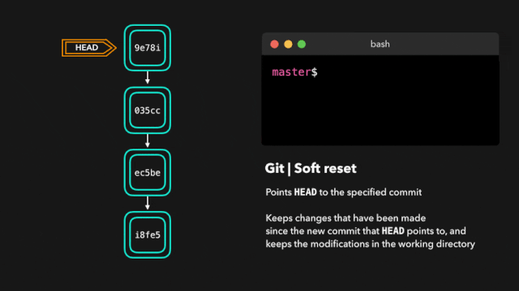
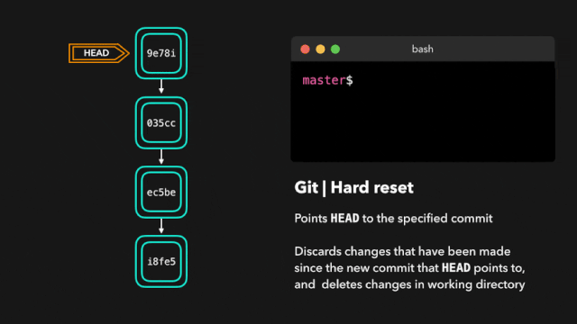
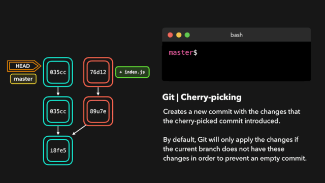

# 相见恨晚的 Git 命令动画演示，一看就懂！

虽然 `Git` 是一个强大的工具，但是我觉得大部分人都会同意我说的：它也可以是一个……噩梦！我一直觉得，使用 `Git` 的时候把操作过程在脑海里视觉化会非常有用：当我执行某个命令的时候，分支之间是如何交互的？又是如何影响提交历史的？当我在`master`分支执行`hard reset`、`force push`到 `origin`、在`.git`文件夹执行`rimraf`的时候，为什么我的同事都哭了？

我认为创建一些最常见、最实用的命令的可视化示例是最佳使用指南！接下来介绍的这些命令，很多都有可选参数，用于改变命令的行为。文中的示例只讨论命令的默认行为，不会涉及太多的配置选项。这些命令包括 `merge`，`rebase`，`reset`， `revert`，`cherry-pick`，`fetch`，`pull`，`reflog` 等。

## merge

多分支可以非常方便地将新的改动互相隔离，并确保你不会意外地将未经批准或破坏性的变更推到生产环境。一旦变更被批准，我们就能在生产分支中得到这些变更。

从一个分支获取变更到另一个分支的方式之一是执行`git merge`命令。`Git` 有两类合并操作：`fast-forward` 和 `no-fast-forward`。

这么说你可能没什么概念，我们来看看区别吧。

### fast-forward (`--ff`)

如果当前分支与即将合并过来的分支相比，没有额外的提交，这种就是`fast-forward`合并。`Git` 很会偷懒，它会首先尝试最简单的方案，即`fast-forward`。这种合并方式不会创建新的提交，只是把另一个分支的提交记录直接合并到当前分支。

fast-forward merge

没毛病！现在我们在`master`分支上有了`dev`分支上的所有变更。那么，`no-fast-forward` 又是什么呢？

### no-fast-foward (`--no-ff`)

跟即将合并过来的分支比较，当前分支如果没有额外的提交，这固然很好，但实际情况往往不是这样！如果我们在当前分支上也提交了一些改动，那么 `Git` 就会执行`no-fast-forward`合并。

对于 `no-fast-forward` 合并，`Git` 会在当前分支上创建一个新的合并提交。该提交的父提交同时指向当前分支和合并过来的分支。

no-fast-forward

也没毛病！现在`master`分支上有了我们在`dev`分支上做的所有变更。

## 合并冲突

虽然 `Git` 擅长决定如何合并分支和更改文件，但它也不是总能自己做出决定。当我们试图合并的两个分支在同一文件的同一行上都有改动时，或者一个分支删除了文件，另一个分支又修改了它，都可能发生这种情况。

这种情况下，`Git` 会要求你帮助决定要保留哪边的改动。假设在两个分支上，我们都编辑了`README.md`文件的第一行：

如果把`dev`合并到`master`，会导致合并冲突：你是要 `Hello!`呢，还是要 `Hey!`？

合并分支时，`Git` 会显示冲突的位置。我们可以手动删除不想保留的改动，然后保存，再添加改动后的文件（`git add`）并提交。

大功告成！合并冲突虽然很烦人，但也是合理的：因为 `Git` 不应该自作主张保留哪边的改动。

## rebase

刚刚我们看到了如何通过执行`git merge`将一个分支的改动应用到另一个分支。另一种方式是使用`git rebase`。

`git rebase` 命令会**复制**当前分支的提交，然后把这些提交**放到指定分支**之上。

git rebase

现在`master`分支上的所有改动都跑到`dev`分支上了！

与`merge`相比，最大的区别是 `Git` 不会去找出哪些文件需要保留，哪些文件不需要保留。我们要`rebase`的分支总是包含了我们想要保留的最新改动。这种方式不会有合并冲突，并且保持了良好的线性 `Git` 历史记录。

这个例子演示了在 `master`分支上执行`rebase`。不过，在大项目里你可能不会这么做。`git rebase`命令会修改项目历史记录，因为复制的提交会产生新的 `hash`。

当你在特性分支上开发时，`master`分支有更新的时候，`rebase` 很有用。这样你在当前分支就能拿到所有更新，避免了将来可能的合并冲突。

## 交互式 rebase

在 `rebase` 之前，我们还可以修改！这是通过交互式 `rebase` 实现的。交互式 `rebase` 也可以用于当前正在处理的分支，在希望修改某些提交的时候。
对于即将 `rebase` 的提交，可以执行 6 种操作：

- `reword`：修改提交说明
- `edit`：修改提交内容（`amend`）
- `squash`：将该提交合并到前一个提交
- `fixup`: 将该提交合并到前一个提交，不保留提交的日志消息
- `exec`: 在想要 `rebase` 的每一个提交上执行命令
- `drop`: 删除提交

666！这样，我们就能完全控制提交记录了。如果想删除某个提交，只要 `drop` 它就行了。

或者，如果我们想要把多个提交合并到一起，这样历史记录会更清晰，也没问题！

交互式 `rebase` 给了你对想要 `rebase` 的提交很多控制权，哪怕是当前的活动分支。

## reset

有时候我们提交了一些改动，后来又不想要了。有可能是`WIP`提交，也可能是某个引入了 `bug` 的提交。这种情况，我们可以执行`git reset`。

`git reset`会**丢弃**当前**所有暂存**的文件，并让我们决定 `HEAD` 应该**指向哪里**。

### soft reset

`soft reset` 将 `HEAD` **移动**到指定的提交（或者相对于`HEAD` 的位置索引），同时不会丢弃这些提交带来的改动。

假设我们不想保留添加了`style.css`文件的提交`9e78i`，也不想保留添加了`index.js`文件的提交`035cc` 。但是，我们却想要保留新增的`style.css`和`index.js` 文件。这里用 `soft reset` 就非常合适。

执行`git status`，你会看到我们依然能够查看之前提交所做的改动。这很有用，因为这样我们就能继续修改文件内容，后续再次提交了。

## hard reset

有时候，我们不想保留某些提交带来的改动。跟 `soft reset` 不一样，我们不再需要访问这些变动了。`Git` 应该简单地重置到指定的提交，并且会重置工作区和暂存区的文件。

`Git` 已经丢弃了 `9e78i` 和 `035cc` 两个提交引起的改动，并把状态*重置*到了提交`ec5be`的位置。

## revert

撤销改动的另一种方式是执行`git revert`。**复原**某个提交后，会**创建一个新的提交**，包含了恢复后的改动。

假设提交 `ec5be` 添加了一个`index.js`文件。随后，我们发现实际上不再需要这个改动了，就可以恢复`ec5be`这个提交。

提交`9e78i`恢复了`ec5be` 这个提交带来的改动。执行 `git revert` 对于**撤销**某个提交非常有用，同时又**不会修改分支的历史**。

## cherry-pick

当活动分支需要**某个分支的某个提交包含的改动**时，我们可以用`cherry-pick`命令。通过`cherry-pick`某个提交，在当前活动分支上会创建一个新提交，包含了前者带来的改动。

假设 `dev` 分支上的提交`76d12`改动了`index.js`文件，我们在`master`分支上也需要。我们不需要整个分支上的改动，只要这个提交。

Alt Text

666，`master`分支现在也包含了`76d12`这个提交的改动了。

## fetch

如果存在远程分支，远程分支可能有些提交是当前的本地分支没有的。有可能是其他分支合并过去了，或者你的同事推送了某些改动，等等。

我们可以用 `git fetch` 把这些改动获取到本地。这不会影响本地分支，`fetch`只是**下载数据**。

现在就可以看到从最近一次推送以来的所有变动。**本地**有了这些新数据，我们就可以决定如何使用了。

## pull

除了用`git fetch` 获取远程分支信息外，还可以用`git pull`。`git pull`实际上是两个命令合而为一：`git fetch`和`git merge`。当我们从 `origin` 拉取改动时，先是像`git fetch`一样**获取所有数据**，然后**最新改动**会**自动合并**到本地分支。

## reflog

每个人都会犯错误，这完全没有关系！有时候你可能觉得自己把仓库搞得一团糟，只想把它删了完事。

`git reflog`是个非常有用的命令，可以显示所有操作的日志。包括 `merge`，`reset`，`revert` 等，基本上包括了**对分支的任何更改**。

如果出错了，你可以根据`reflog`提供的信息通过重置 `HEAD` 来撤销改动。

比如，我们实际上并不想合并分支。当我们执行 `git reflog` 命令时，我们看到在合并前仓库位于 `HEAD@{1}`。我们执行下`git reset`命令，让 `HEAD` 重新指回原来的`HEAD@{1}`位置。

这里我们可以看到，最新的操作也记录到`reflog`里了！

## 最后

文中若有不准确或错误的地方，欢迎指出，有兴趣可以的关注下[Github](https://github.com/GolderBrother)~

 <comment/>

 <comment/>
