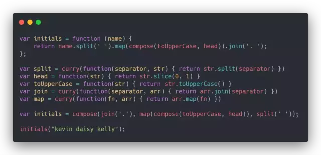

# 一个合格的中级`前端er`需要掌握的 28 个 `JavaScript` 技巧

## 1.判断对象的数据类型

```js
const isType = type => target => `[object ${type}]` === Object.prototype.toString.call(target);
const isArray = isType('Array');
const isObject = isType('Object');
console.log(isArray([])); // true
console.log(isObject([])); // false
console.log(isObject({})); // true
console.log(isObject(null)); // false
```

使用 Object.prototype.toString 配合闭包，通过传入不同的判断类型来返回不同的判断函数，一行代码，简洁优雅灵活（注意传入 type 参数时首字母大写）

不推荐将这个函数用来检测可能会产生包装类型的基本数据类型上,因为 call 始终会将第一个参数进行装箱操作，导致基本类型和包装类型无法区分

## 2. 循环实现数组 map 方法

```js
// 循环实现map
const selfMap = function(fn, context) {
  // context: 原生数组的map方法可以传入的第二个参数，可以用来改变回调函数的执行上下文
  const arr = Array.prototype.slice.call(this);
  let mappedArr = [];
  for (let index = 0; index < arr.length; index++) {
    // 对稀疏数组的处理，通过 hasOwnProperty 来判断当前下标的元素是否存在与数组中
    if (!arr.hasOwnProperty(index)) continue;
    // 思路是每个元素都添加一个对应的回调, 三个参数分别为当前项 当前项索引 数组本身
    mappedArr.push(fn.call(context, arr[index], index, this));
  }
  return mappedArr;
};
// 放到数组原型上
Array.prototype.selfMap ||
  Object.defineProperty(Array.prototype, 'selfMap', {
    value: selfMap,
    enumerable: false,
    configurable: true,
    writable: true
  });

const arr = ['a', 'b', 'c', 'd'];
const arr2 = arr.selfMap(item => item + '~');
console.log(`arr2`, arr2); // arr2 [ 'a~', 'b~', 'c~', 'd~' ]
```

## 3. reduce 实现 map

```js
// reduce实现map
const selfMap2 = function(fn, context) {
  const arr = Array.prototype.slice.call(this);
  return arr.reduce((accu, cur, index) => [...accu, fn.call(context, cur, index, this)], []);
};

Array.prototype.selfMap2 ||
  Object.defineProperty(Array.prototype, 'selfMap2', {
    value: selfMap2,
    enumerable: false,
    configurable: true,
    writable: true
  });
const arr = ['a', 'b', 'c', 'd'];
const arr3 = arr.selfMap(item => item + '~');
console.log(`arr3`, arr3); // arr3 [ 'a~', 'b~', 'c~', 'd~' ]
```

## 4. ES5 实现数组 filter 方法

```js
// ES5 实现数组 filter 方法
const selfFilter = function(fn, context) {
  const arr = Array.prototype.slice.call(this);
  const filteredArr = [];
  for (let index = 0; index < arr.length; index++) {
    if (!arr.hasOwnProperty(index)) continue;
    fn.call(context, arr[index], index, this) && filteredArr.push(arr[index]);
  }
  return filteredArr;
};

Array.prototype.selfFilter ||
  Object.defineProperty(Array.prototype, 'selfFilter', {
    value: selfFilter,
    enumerable: false,
    configurable: true,
    writable: true
  });

const arr = ['html', 'css', 'javascript'];
const arr2 = arr.selfFilter(item => item.includes('javascript'));
console.log(`arr2`, arr2); // arr2 [ 'javascript' ]
```

## 5. 使用 reduce 实现数组 filter 方法

```js
const selfFilter2 = function(fn, context) {
  const arr = this.reduce(
    (accu, cur, index) => (fn.call(context, cur, index, this) ? [...accu, cur] : [...accu]),
    []
  );
  return arr;
};

Array.prototype.selfFilter2 ||
  Object.defineProperty(Array.prototype, 'selfFilter2', {
    value: selfFilter2,
    enumerable: false,
    configurable: true,
    writable: true
  });

const arr = ['html', 'css', 'javascript'];
const arr3 = arr.selfFilter2(item => item.includes('javascript'));
console.log(`arr3`, arr3); // arr3 [ 'javascript' ]
```

## 6. ES5 实现数组的 some 方法

```js
// ES5 实现数组的 some 方法
const selfSome = function(fn, context) {
  const arr = Array.prototype.slice.call(this);
  if (!arr.length) return false;
  let flag = false;
  for (let index = 0; index < arr.length; index++) {
    if (!arr.hasOwnProperty(index)) continue;
    flag = Boolean(fn.call(context, arr[index], index, this));
    if (flag) break;
  }
  return flag;
};

Array.prototype.selfSome ||
  Object.defineProperty(Array.prototype, 'selfSome', {
    value: selfSome,
    enumerable: false,
    configurable: true,
    writable: true
  });

const arr = ['html', 'css', 'javascript'];
const hasJavascript = arr.selfSome(item => item.includes('javascript'));
const hasNode = arr.selfSome(item => item.includes('node'));
console.log(`hasJavascript`, hasJavascript); // hasJavascript true
console.log(`hasNode`, hasNode); // hasNode false
```

执行 some 方法的数组如果是一个空数组，最终始终会返回 false，而另一个数组的 every 方法中的数组如果是一个空数组，会始终返回 true

```js
console.log([].some(item => item.includes('javascript'))); // false
console.log([].every(item => item.includes('javascript'))); // true
```

## 7. ES5 实现数组的 reduce 方法

```js
// ES5循环实现reduce
const selfReduce = function(fn, initialValue) {
  let arr = Array.prototype.slice.call(this);
  let accu, startIndex;
  // 如果初始值没传入，则使用数组的第一个非空单元 元素
  if (initialValue === undefined) {
    for (let index = 0; index < arr.length; index++) {
      if (!arr.hasOwnProperty(index)) continue;
      startIndex = index;
      accu = arr[index];
      break;
    }
  } else {
    accu = initialValue;
  }
  // 遍历的起点为上一步中找到的真实元素的后面一个真实元素
  // 每次遍历会跳过空单元的元素
  for (let index = startIndex || 0; index < arr.length; index++) {
    if (!arr.hasOwnProperty(index)) continue;
    accu = fn.call(null, accu, arr[index], index, this);
  }
  return accu;
};

Array.prototype.selfReduce ||
  Object.defineProperty(Array.prototype, 'selfReduce', {
    value: selfReduce,
    enumerable: false,
    writable: true,
    configurable: true
  });

const arr = ['hello', 'javascript'];
const arrString = arr.selfReduce((accu, cur, index, arr) => (accu = accu + ' ' + cur), '');
console.log('arrString', arrString); // hello javascript
```

因为可能存在稀疏数组的关系，所以 reduce 实现略有点复杂，需要保证跳过稀疏元素，遍历正确的元素和下标

## 8. 使用 reduce 实现数组的 flat 方法

```js
const selfFlat = function(depth = 1) {
  const arr = Array.prototype.slice.call(this);
  // 如果没有传入扁平层级，就默认扁平化1级
  if (depth === 0) return arr;
  return arr.reduce((accu, cur) => {
    if (Array.isArray(cur)) {
      return [...accu, ...selfFlat.call(cur, depth - 1)];
      // 也可以使用ES5的concat方法
      // return accu.concat(selfFlat.call(cur, depth - 1));
    } else {
      return [...accu, cur];
      // 也可以使用ES5的concat方法
      // return accu.concat(cur);
    }
  }, []);
};

Array.prototype.selfFlat ||
  Object.defineProperty(Array.prototype, 'selfFlat', {
    value: selfFlat,
    enumerable: false,
    configurable: true,
    writable: true
  });

const arr = [1, [2, [3, [4, [5]]]]];
const flattedArr = arr.selfFlat();
console.log(`flattedArr`, flattedArr); // flattedArr [ 2, [ 3, [ 4, [5] ] ] ]
const flattedArr2 = arr.selfFlat(Number.POSITIVE_INFINITY);
console.log(`flattedArr2`, flattedArr2); // flattedArr2 [ 1, 2, 3, 4, 5 ]
```

因为 `selfFlat` 是依赖 `this` 指向的，所以在 `reduce` 遍历时需要指定 `selfFlat` 的 `this` 指向，否则会默认指向 `window` 从而发生错误
原理通过 `reduce` 遍历数组，遇到数组的某个元素仍是数组时，通过 `ES6` 的扩展运算符对其进行降维（`ES5` 可以使用 `concat` 方法），而这个数组元素可能内部还嵌套数组，所以需要递归调用 `selfFlat`
同时原生的 `flat` 方法支持一个 `depth` 参数表示降维的深度，默认为 `1` 即给数组降一层维度
传入 `Number.POSITIVE_INFINITY`(正无穷大) 会将传入的数组变成一个一维数组， 原理是每递归一次将 `depth` 参数减 1，如果 `depth` 参数为 0 时，直接返回原数组

## 9. 实现 ES6 的 class 语法

```js
// 简单模拟ES6的class实现
// class Animal {
//     constructor(name) {
//         this.name = name
//     }
//
//     sleep() {
//         console.log('animal is sleeping')
//     }
//
//     static staticFunc() {
//         console.log('staticFunc')
//     }
// }
//
// class Dog extends Animal {
//     constructor(name, color) {
//         super(name)
//         this.color = color
//     }
//
//     barking() {
//         console.log('wang!')
//     }
// }
//
// let brownTeddy = new Dog('teddy', 'brown')
// Dog.staticFunc()
// console.log(brownTeddy)
// brownTeddy.sleep()
// brownTeddy.barking()

function Animal(name) {
  this.name = name;
}

Animal.staticFunc = function() {
  console.log('staticFunc');
};
Animal.prototype.sleep = function() {
  console.log('animal is sleeping');
};

function Dog(name, color) {
  Animal.call(this, name);
  this.color = color;
}
// 寄生组合式继承 + 构造函数之间的继承
function inherit(subType, superType) {
  //由于JavaScript引用类型和函数按值传递的特性，不能改变subType的引用地址
  subType.prototype = Object.create(superType.prototype, {
    constructor: {
      // 指向子类，和默认的继承行为保持一致
      value: subType,
      enumerable: false,
      configurable: true,
      writable: true
    }
  });
  //子构造函数继承父构造函数(为了子类继承父类的静态方法和静态属性)
  Object.setPrototypeOf(subType, superType);
}

inherit(Dog, Animal);

//需要在继承之后再往Dog中添加原型方法，否则会被覆盖掉
Dog.prototype.barking = function() {
  console.log('wang!');
};

let brownTeddy = new Dog('teddy', 'brown');
Dog.staticFunc();
console.log(brownTeddy);
brownTeddy.sleep();
brownTeddy.barking();
```

`ES6` 的 `class` 内部是基于寄生组合式继承，它是目前最理想的继承方式，通过 `Object.create` 方法创造一个空对象，并将这个空对象继承 `Object.create` 方法的参数，再让子类（`subType`）的原型对象等于这个空对象，就可以实现子类实例的原型等于这个空对象，而这个空对象的原型又等于父类原型对象（superType.prototype）的继承关系

而 `Object.create` 支持第二个参数，即给生成的空对象定义属性和属性描述符/访问器描述符，我们可以给这个空对象定义一个 `constructor` 属性更加符合默认的继承行为，同时它是不可枚举的内部属性（`enumerable:false`）

而 `ES6` 的 `class` 允许子类继承父类的静态方法和静态属性，而普通的寄生组合式继承只能做到实例与实例之间的继承，对于类与类之间的继承需要额外定义方法，这里使用 `Object.setPrototypeOf` 将 `superType` 设置为 `subType` 的原型，从而能够从父类中继承静态方法和静态属性

## 10. 函数柯里化

```js
const curry = function(fn) {
  // fn.length fn函数参数的个数
  if (fn.length <= 1) return fn;
  // 根据拆分成的一个参数的多个函数生 -> 只有多个参数的一个函数
  const generatorFn = (...args) => {
    // 如果参数收集完毕，就执行回调fn
    if (fn.length === args.length) {
      // 需要将参数数组在一一展开传入
      return fn(...args);
    } else {
      // 没收集完就递归收集
      return (...args2) => {
        return generatorFn(...args, ...args2);
        // return generatorFn(...args.concat(args2));
      };
    }
  };
  return generatorFn;
};
const display = (a, b, c, d, e, f, g, h) => [a, b, c, d, e, f, g, h];
const curriedDisplay = curry(display);
console.log('curriedDisplay', curriedDisplay(1)(2)(3)(4)(5)(6)(7)(8)); // curriedDisplay [ 1, 2, 3, 4, 5, 6, 7, 8 ]

// ES6简写
const curry2 = fn => {
  // fn.length fn函数参数的个数
  if (fn.length <= 1) return fn;
  const generatorFn = (...args) =>
    fn.length === args.length ? fn(...args) : (...args2) => generatorFn(...args, ...args2);
  return generatorFn;
};
const curriedDisplay2 = curry2(display);
console.log('curriedDisplay2', curriedDisplay2(1)(2)(3)(4)(5)(6)(7)(8)); // curriedDisplay2 [ 1, 2, 3, 4, 5, 6, 7, 8 ]
```

柯里化是函数式编程的一个重要技巧，将使用多个参数的一个函数转换成一系列使用一个参数的函数的技术

函数式编程另一个重要的函数 `compose`，能够将函数进行组合，而组合的函数只接受一个参数，所以如果有接受多个函数的需求并且需要用到 `compose` 进行函数组合，就需要使用柯里化对准备组合的函数进行部分求值，让它始终只接受一个参数

借用冴羽博客中的一个例子



## 11. 函数柯里化（支持占位符）

```js
/**
 * @description 函数柯里化（ 支持占位符版本）
 * @param {function} fn fn - 柯里化的函数
 * @param {String} [placeholder = "_"] - 占位符
 */
const curry3 = (fn, placeholder = '_') => {
  curry3.placeholder = placeholder;
  if (fn.length <= 1) return fn;
  let argsList = [];
  const generator = (...args) => {
    let currentPlaceholderIndex = -1; // 记录了非当前轮最近的一个占位符下标，防止当前轮元素覆盖了当前轮的占位符
    args.forEach(arg => {
      let placeholderIndex = argsList.findIndex(item => item === curry3.placeholder);
      if (placeholderIndex < 0) {
        // 如果数组中没有占位符直接往数组末尾放入一个元素
        currentPlaceholderIndex = argsList.push(arg) - 1;
        // 防止将元素填充到当前轮参数的占位符
        // (1,'_')('_',2) 数字2应该填充1后面的占位符，不能是2前面的占位符
      } else if (placeholderIndex !== currentPlaceholderIndex) {
        argsList[placeholderIndex] = arg;
      } else {
        // 当前元素是占位符的情况
        argsList.push(arg);
      }
    });
    let realArgsList = argsList.filter(arg => arg !== curry3.placeholder); //过滤出不含占位符的数组
    if (realArgsList.length >= fn.length) {
      return fn(...argsList);
    } else {
      return generator;
    }
  };

  return generator;
};

const curriedDisplay3 = curry3(display);
console.log('curriedDisplay3', curriedDisplay3('_', 2)(1, '_', 4)(3, '_')('_', 5)(6)(7, 8));
// curriedDisplay3 [ 1, 2, 3, 4, 5, 6, 7, 8 ]
```

通过占位符能让柯里化更加灵活，实现思路是，每一轮传入的参数先去填充上一轮的占位符，如果当前轮参数含有占位符，则放到内部保存的数组末尾，当前轮的元素不会去填充当前轮参数的占位符，只会填充之前传入的占位符

## 12. 偏函数

```js
// 偏函数

const display = (a, b, c, d, e, f, g, h) => [a, b, c, d, e, f, g, h];

/**
 * @description 偏函数（创建已经设置好一个或多个参数的函数,并且添加了占位符功能）
 * @param {Function} func -部分求值的函数
 * @param {...*} [args] -部分求值的参数
 * @return {Function} -部分求值后的函数
 **/

const partialFunc = (func, ...args) => {
  let placeholderNum = 0;
  return (...args2) => {
    args2.forEach(arg => {
      const index = args.findIndex(item => item === '_');
      if (index < 0) return;
      // 将placeholder转为args2中的值
      args[index] = arg;
      placeholderNum++;
    });
    // 如果占位符后面的还有元素，就继续截取处理
    if (placeholderNum < args2.length) {
      args2 = args2.slice(placeholderNum, args2.length);
    }
    return func.apply(this, [...args, ...args2]);
  };
};

let partialDisplay = partialFunc(display, 1, 2);
console.log('partialFunc', partialDisplay(3, 4, 5, 6, 7, 8));
// partialFunc [ 1, 2, 3, 4, 5, 6, 7, 8 ]

let partialDisplay2 = partialFunc(display, '_', 2, '_'); // 使用占位符
console.log('partialFunc2', partialDisplay2(1, 3, 4, 5, 6, 7, 8));
// partialFunc2 [ 1, 2, 3, 4, 5, 6, 7, 8 ]
```

偏函数和柯里化概念类似，个人认为它们区别在于偏函数会固定你传入的几个参数，再一次性接受剩下的参数，而函数柯里化会根据你传入参数不停的返回函数，直到参数个数满足被柯里化前函数的参数个数

Function.prototype.bind 函数就是一个偏函数的典型代表，它接受的第二个参数开始，为预先添加到绑定函数的参数列表中的参数，与 bind 不同的是，上面的这个函数同样支持占位符

## 13. 斐波那契数列及其优化

```js
// 斐波那契数列及其优化

// 函数执行耗时分析
const speed = (fn, num) => {
  console.time(`${fn.name} time`);
  const value = fn(num);
  console.timeEnd(`${fn.name} time`);
  console.log(`返回值：${value}`);
};

/**
 * 斐波那契数列
 * @param {number} n -第几个位置
 */
let fibonacci1 = n => {
  if (n < 1) throw new Error('参数有误');
  if (n === 1 || n === 2) return 1;
  return fibonacci1(n - 1) + fibonacci1(n - 2);
};

speed(fibonacci1, 35);
// fibonacci1 time: 65.419ms
// 返回值：9227465

// 函数记忆
const memory = function(fn) {
  const obj = {};
  return function(n) {
    if (obj[n] === undefined) obj[n] = fn(n);
    return obj[n];
  };
};

fibonacci1 = memory(fibonacci1);
speed(fibonacci1, 35);
// time: 0.109ms
// 返回值：9227465

/**
 * @description 斐波那契动态规划版本（最优解）
 **/
function fibonacci_DP(n) {
  let res = 1;
  if (n === 1 || n === 2) return res;
  n -= 2;
  let cur = 1,
    pre = 1;
  while (n--) {
    res = pre + cur;
    pre = cur; // 更新pre，往前移动
    cur = res; // 更新cur，往前移动
  }
  return res;
}

speed(fibonacci_DP, 35);
// fibonacci_DP time: 0.033ms
// 返回值：9227465
```

利用函数记忆，将之前运算过的结果保存下来，对于频繁依赖之前结果的计算能够节省大量的时间，例如斐波那契数列，缺点就是闭包中的 obj 对象会额外占用内存
不过在现如今多核处理器下，我们提倡**空间换取时间**，这种内存消耗可以忽略。

## 14. 实现函数 bind 方法

```js
```

函数的 bind 方法核心是利用 call，同时考虑了一些其他情况，例如

- bind 返回的函数被 new 调用作为构造函数时，绑定的值会失效并且改为 new 指定的对象
- 定义了绑定后函数的 length 属性和 name 属性（不可枚举属性）
- 绑定后函数的原型需指向原来的函数

## 15. 实现函数 call 方法

```js
// 实现函数 call 方法

const selfCall = function(context, ...args) {
  // 获取call绑定的函数
  const func = this;
  context = context || window;
  if (typeof func !== 'function') throw new Error('this is not a function');
  // 将要执行的函数赋值到新的上下文中,这里使用ES6 的 Symbol 类型，为了防止属性冲突
  const caller = Symbol.for('caller');
  context[caller] = func;
  // 执行创建的函数，接受可能传入的参数并传入
  const res = context[caller](...args);
  // 执行完，删除临时赋值到上下文函数
  delete context[caller];
  // 返回新的执行结果
  return res;
};

Function.prototype.selfCall ||
  Object.defineProperty(Function.prototype, 'selfCall', {
    value: selfCall,
    enumerable: false,
    configurable: true,
    writable: false
  });
const a = 1;

function func() {
  console.log(this.a);
}
let example2 = {
  a: 2
};
func.selfCall(example2);
console.log(example2);

// 2
// { a: 2 }
```

## 16. 简易的 CO 模块

```js
// 简易的 CO 模块

function run(generatorFunc) {
  const it = generatorFunc();
  const result = it.next();
  return new Promise((resolve, reject) => {
    const next = function(result) {
      if (result.done) {
        resolve(result.value);
      }
      // 包装成成功态的Promise
      result.value = Promise.resolve(result.value);
      result.value
        .then(res => {
          const result = it.next(res);
          next(result);
        })
        .catch(err => reject(err));
    };
  });
}

function* func(data) {
  const res = yield api1(data);
  console.log('res', res);
  const res2 = yield api2(data);
  console.log('res2', res2);
  const res3 = yield api3(data);
  console.log('res3', res3);
}
run(func);
```

`run` 函数接受一个生成器函数，每当 `run` 函数包裹的生成器函数遇到 `yield` 关键字就会**停止**，当 `yield` 后面的 `promise` 被**解析成功**后会自动调用 `next` 方法执行到下个 `yield` 关键字处，最终就会形成每当一个 `promise` 被解析成功就会解析下个 `promise`，当全部解析成功后打印所有解析的结果，

## 17. 函数防抖

```js
// 函数防抖
/**
 * @description 函数防抖
 * @param {Function} func -需要函数防抖的函数
 * @param {Number} time -延迟时间
 * @param {Options} options -配置项
 * @return {Function} -经过防抖处理的函数
 **/

/**
 * @typedef {Object} Options -配置项
 * @property {Boolean} leading -开始是否需要立即触发一次
 * @property {Boolean} trailing -结束后是否需要额外触发一次
 * @property {this} context -上下文
 **/

function debounce(
  func,
  time = 17,
  options = {
    leading: true, // leading 为是否在进入时立即执行一次
    trailing: true, //  trailing 为是否在事件触发结束后额外再触发一次
    context: null
  }
) {
  let timer;
  const _debounce = function(...args) {
    // 如果有上次的定时器在进行，就先清除
    if (timer) clearTimeout(timer);
    if (options.leading && !timer) {
      timer = setTimeout(null, time);
      func.apply(options.context, args);
    } else if (options.trailing) {
      timer = setTimeout(() => {
        func.apply(options, args);
        timer = null;
      }, time);
    }
  };
  _debounce.cancel = function() {
    if (timer) {
      clearTimeout(timer);
      timer = null;
    }
  };
  return _debounce;
}
```

## 18. 函数节流

```js
// 函数节流
/**
 * @description 函数节流
 * @param {Function} func -需要函数节流的函数
 * @param {Number} time -延迟时间
 * @param {Options} options -配置项
 * @return {Function} -经过节流处理的函数
 **/

/**
 * @typedef {Object} Options -配置项
 * @property {Boolean} leading -开始是否需要立即触发一次
 * @property {Boolean} trailing -结束后是否需要额外触发一次
 * @property {this} context -上下文
 **/
const throttle = (
  func,
  time = 17,
  options = {
    leading: true,
    trailing: false,
    context: null
  }
) => {
  let previous = new Date(0).getTime();
  let timer;
  const _throttle = function(...args) {
    let now = new Date().getTime();
    if (!options.leading) {
      // 开始不需要立即触发一次
      if (timer) return;
      timer = setTimeout(() => {
        timer = null;
        func.apply(options.context, args);
      });
    } else if (now - previous > time) {
      // 如果差时超过了定时时间，则立即执行函数
      func.apply(options.context, args);
      // 更新previous
      previous = now;
    } else if (options.trailing) {
      // 结束后需要额外触发一次
      // 先清除定时器后重新开启
      clearTimeout(timer);
      timer = setTimeout(() => {
        func.apply(options.context, args);
      }, time);
    }
  };
  _throttle.cancel = function() {
    if (timer) {
      clearTimeout(timer);
      timer = null;
    }
  };
  return _throttle;
};
```

和函数防抖类似，区别在于内部额外使用了时间戳作为判断，在一段时间内没有触发事件才允许下次事件触发

## 19. 图片懒加载

### [`getBoundingClientRect`](https://developer.mozilla.org/zh-CN/docs/Web/API/Element/getBoundingClientRect) 实现懒加载

```js
const imgList1 = [...document.querySelectorAll('.get_bounding_rect')];
let num = imgList1.length;

let lazyload1 = (() => {
  // 记录图片加载完成个数
  let count = 0;
  return () => {
    imgList1.forEach(img => {
      const imgRect = img.getBoundingClientRect();
      // 判断图片是否在视口中了
      const isInViewPort = imgRect.top < window.innerHeight;
      if (isInViewPort) {
        // 加载图片：将假的src替换到真正的src
        img.src = img.dataset.src;
        count++;
        // 当所有图片加载完毕，解绑scroll事件
        if (count === num) {
          document.removeEventListener('scroll', lazyload1);
        }
      }
    });
  };
})();

// 这里引用了 throttle.js 的节流函数
lazyLoad1 = proxy(lazyLoad1, 100);

document.addEventListener('scroll', lazyload1);
// 手动加载一次，否则首屏的图片不触发滚动无法加载
lazyload1();
```

### [`IntersectionObserver`](https://developer.mozilla.org/zh-CN/docs/Web/API/IntersectionObserver) 实现懒加载

```js
let imgList2 = Array.from(document.querySelectorAll('.intersection_observer'));

let lazyload2 = function() {
  // 实例化observer
  // 可以用来监听可见区域的特定变化值
  // MDN: https://developer.mozilla.org/zh-CN/docs/Web/API/IntersectionObserver
  let observer = new IntersectionObserver(entries => {
    //entries存储着所有观察被元素的intersectionObserverEntry配置
    entries.forEach(entry => {
      // 大于0表示进入视口
      if (entry.intersectionRatio > 0) {
        // 加载图片：将假的src替换到真正的src
        entry.target.src = entry.target.dataset.src;
        // 取消观察
        observer.unobserve(entry.target);
      }
    });
  });
  imgList2.forEach(img => {
    // 观察img
    observer.observe(img);
  });
};

lazyLoad2();
```

`intersectionObserver` 的实现方式，实例化一个 `IntersectionObserver` ，并使其**观察**所有 `img` 标签

当 `img` 标签进入可视区域时会执行实例化时的回调，同时给回调传入一个 `entries` 参数，保存着实例观察的所有元素的一些状态，比如每个元素的**边界信息**，当前元素对应的 `DOM` 节点，当前元素进入可视区域的比率，每当一个元素进入可视区域，将真正的图片赋值给当前 `img` 标签，同时解除对其的观察

## 20. new 关键字

```js
// new 关键字

const isComplexDataType = obj =>
  (typeof obj === 'object' || typeof obj === 'function') && obj !== null;

const selfNew = function(fn, ...rest) {
  const instance = Object.create(fn.prototype);
  const res = fn.apply(instance, rest);
  // 如果值是对象或者函数类型，则返回对象，否则返回实例
  return isComplexDataType(res) ? res : instance;
};

function Person(name, sex) {
  this.name = name;
  this.sex = sex;
}

let newPerson = new Person('zyh', 'male');
let selfNewPerson = selfNew(Person, 'zyh', 'male');

console.log(newPerson);
console.log(selfNewPerson);

// Person { name: 'zyh', sex: 'male' }
// Person { name: 'zyh', sex: 'male' }
```

## 21. 实现 Object.assign

```js
// 实现 Object.assign

const isComplexDataType = obj =>
  obj !== null && (typeof obj === 'object' || typeof obj === 'function');

// 简单实现ES6的Object.assign
const selfAssign = function(target, ...source) {
  if (target == null) throw new Error(`Cannot convert undefined or null to object`);
  return source.reduce((accu, cur) => {
    // 如果不是复杂数据类型，就包装成基本包装类型
    !isComplexDataType(accu) && (accu = new Object(accu));
    //source为null,undefined时忽略
    if (cur == null) return accu;
    // 遍历出Symbol属性和可枚举属性
    [...Object.keys(cur), ...Object.getOwnPropertySymbols(cur)].forEach(key => {
      accu[key] = cur[key];
    });
    return accu;
  }, target);
};

Object.selfAssign ||
  Object.defineProperty(Object, 'selfAssign', {
    value: selfAssign,
    configurable: true,
    enumerable: false,
    writable: false
  });

let target = {
  a: 1,
  b: 1
};

let obj1 = {
  a: 2,
  b: 2,
  c: undefined
};

let obj2 = {
  a: 3,
  b: 3,
  // Symbol类型
  [Symbol.for('a')]: 3,
  d: null
};

console.log(Object.selfAssign(target, obj1, obj2));
// { a: 3, b: 3, c: undefined, d: null, [Symbol(a)]: 3 }
console.log(Object.selfAssign('abd', null, undefined));
```

## 22. instanceof

原理是递归遍历 right 参数的原型链，每次和 left 参数作比较，遍历到原型链终点时则返回 false，找到则返回 true

```js
// instanceof

const selfInstanceof = function(left, right) {
  // 获取[原型] left.__proto__
  let proto = Object.getPrototypeOf(left);
  // 递归遍历 right 参数的原型链，每次和 left 参数作比较，遍历到原型链终点时则返回 false，找到则返回 true
  while (true) {
    // 原型链终点时则返回 false
    if (proto == null) return false;
    if (proto == right.prototype) return true;
    // 继续通过[原型]__proto__ 属性获取原型
    proto = Object.getPrototypeOf(left);
  }
};

console.log(selfInstanceof({}, Array)); // false
```

## 23. 洗牌算法

早前的 chrome 对于元素小于 10 的数组会采用插入排序，这会导致对数组进行的乱序并不是真正的乱序，即使最新的版本 chrome 采用了原地算法使得排序变成了一个稳定的算法，对于乱序的问题仍没有解决

```js
// 洗牌算法

// 早前的 chrome 对于元素小于 10 的数组会采用插入排序，这会导致对数组进行的乱序并不是真正的乱序，即使最新的版本 chrome 采用了原地算法使得排序变成了一个稳定的算法，对于乱序的问题仍没有解决

//旧版本的chrome对于10个元素内的数组使用插入算法进行排序(最新版已经修改了排序算法)
function originSort(arr) {
  arr = arr.sort(() => Math.random() - 0.5);
  return arr;
}

function shuffle(arr) {
  for (let i = 0; i < arr.length; i++) {
    // 生成随机索引
    const randomIndex = i + Math.floor(Math.random() * (arr.length - 1));
    [arr[i], arr[randomIndex]] = [arr[randomIndex], arr[i]];
  }
  return arr;
}

function shuffle2(arr) {
  let _arr = [];
  while (arr.length) {
    let randomIndex = Math.floor(Math.random() * arr.length);
    _arr.push(arr.splice(randomIndex)[0]);
  }
  return _arr;
}

// 分析概率的函数
function statistics(fn, arr) {
  let times = 100000;
  let res = {};
  for (let i = 0; i < times; i++) {
    //每次循环声明一次防止引用同一数组
    let _arr = [...arr];
    let key = JSON.stringify(fn(_arr));
    res[key] ? res[key]++ : (res[key] = 1);
  }

  // 为了方便展示，转换成百分比
  Object.keys(res).forEach(key => {
    res[key] = (res[key] / times) * 100 + '%';
  });

  console.log(fn.name, res);
}

statistics(originSort, [1, 2, 3]);
statistics(shuffle, [1, 2, 3]);
statistics(shuffle2, [1, 2, 3]);

// originSort { '[2,1,3]': '25.069000000000003%',
//   '[1,2,3]': '25.085%',
//   '[1,3,2]': '12.612000000000002%',
//   '[2,3,1]': '12.519%',
//   '[3,1,2]': '12.325%',
//   '[3,2,1]': '12.389999999999999%' }
```

## 24. 单例模式

```js
function proxy(func) {
  let instance;
  let handler = {
    construct(target, args) {
      if (!instance) {
        // 没有实例就创造一个实例
        instance = Reflect.construct(func, args);
      }
      // 无论如何都会返回一个实例(new关键字)
      return instance;
    }
  };
  return new Proxy(func, handler);
}

function Person(name, age) {
  this.name = name;
  this.age = age;
}

const SingletonPerson = proxy(Person);

let person1 = new SingletonPerson('zhl', 22);

let person2 = new SingletonPerson('cyw', 22);

console.log(person1 === person2); // true
```

通过 ES6 的 Proxy 拦截构造函数的执行方法来实现的单例模式

## 25. promisify

```js
// 使用 nodejs 运行以下代码
// 适合err-first风格的异步操作(eg. nodejs)的 promisify 通用函数

const fs = require('fs');

function promisify(asyncFunc) {
  return function(...args) {
    return new Promise((resolve, reject) => {
      args.push(function callback(err, ...values) {
        if (err) {
          return reject(err);
        }
        return resolve(...values);
      });
      asyncFunc.call(this, ...args);
    });
  };
}

const fsp = new Proxy(fs, {
  get(target, key) {
    return promisify(target[key]);
  }
});

async function generateCommit() {
  try {
    let data = await fsp.readFile('./promisify.js', 'utf-8');
    data += `\n//我是注释`;
    await fsp.writeFile('./promisify.js', data);
  } catch (e) {
    console.log(e);
  }
}

generateCommit();
```

promisify 函数是将回调函数变为 promise 的辅助函数，适合 error-first 风格（nodejs）的回调函数，原理是给 error-first 风格的回调无论成功或者失败，在执行完毕后都会执行最后一个回调函数，我们需要做的就是让这个回调函数控制 promise 的状态即可

这里还用了 Proxy 代理了整个 fs 模块，拦截 get 方法，使得不需要手动给 fs 模块所有的方法都包裹一层 promisify 函数，更加的灵活

## 26. 优雅的处理 `async/await`

```js
async function errorCaptured(asyncFunc) {
  try {
    let res = await asyncFunc();
    return [null, res];
  } catch (error) {
    return [error, null];
  }
}
// 优雅的处理 async/await

async function errorCaptured(asyncFunc) {
  try {
    let res = await asyncFunc();
    return [null, res];
  } catch (error) {
    return [error, null];
  }
}

// 使用方法：
let [err, res] = await errorCaptured(asyncFunc);
```

无需每次使用 `async/await` 都包裹一层 `try/catch` ，更加的优雅，这里提供另外一个思路，如果使用了 `webpack` 可以编写一个 `loader`，分析 `AST` 语法树，遇到 `await` 语法，自动注入 `try/catch`，这样连辅助函数都不需要使用

## 27. 发布订阅 EventEmitter

```js
function proxy(func) {
  let instance;
  let handler = {
    construct(target, args) {
      if (!instance) {
        // 没有实例就创造一个实例
        instance = Reflect.construct(func, args);
      }
      // 无论如何都会返回一个实例(new关键字)
      return instance;
    }
  };
  return new Proxy(func, handler);
}

function Person(name, age) {
  this.name = name;
  this.age = age;
}

const SingletonPerson = proxy(Person);

let person1 = new SingletonPerson('zhl', 22);

let person2 = new SingletonPerson('cyw', 22);

console.log(person1 === person2); // true
```

通过 on 方法注册事件，trigger 方法触发事件，来达到事件之间的松散解耦，并且额外添加了 once 和 off 辅助函数用于注册只触发一次的事件以及注销事件

## 最后

文中若有不准确或错误的地方，欢迎指出，有兴趣可以的关注下[Github](https://github.com/GolderBrother)~
