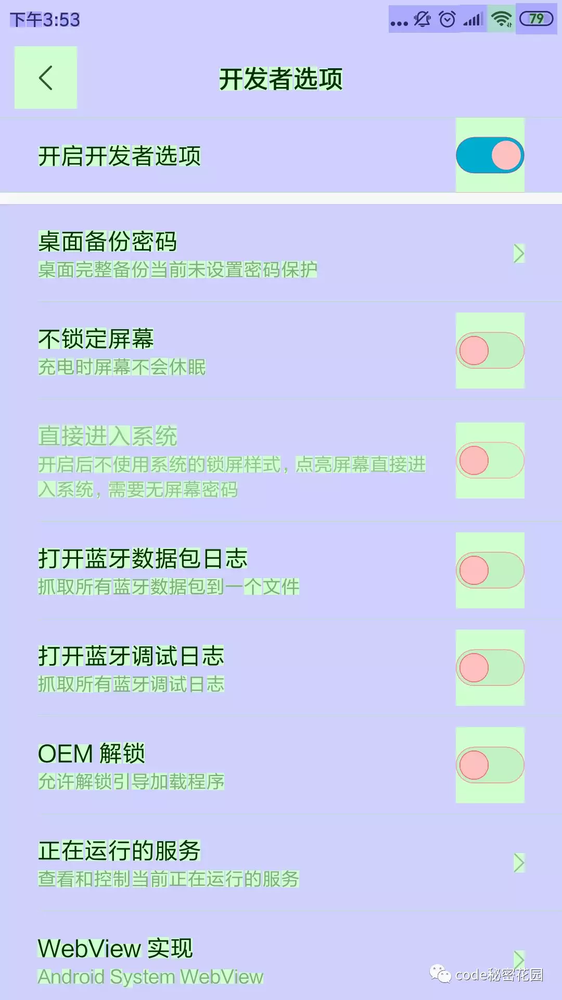
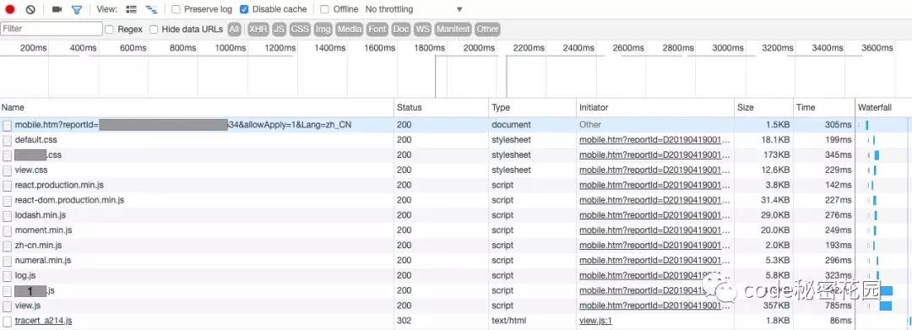
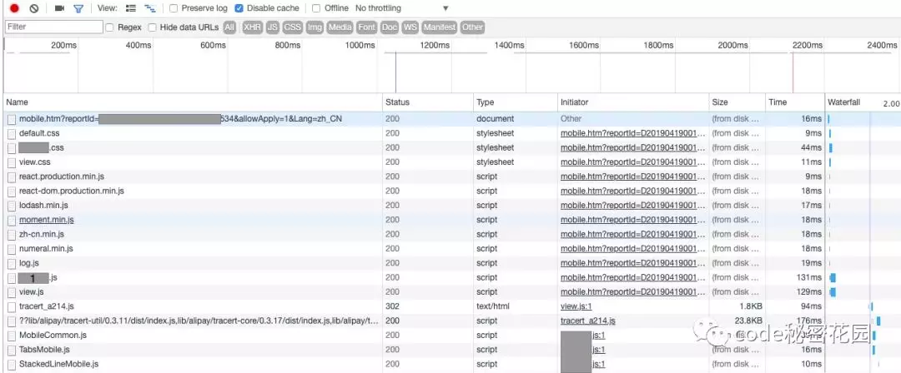

# 关于移动端体验优化经验总结

## 前言

很多企业都会特别注重自己产品的体验，尤其是移动端，那移动端的体验为什么这么重要？首先体验本身就很重要，好的体验带给用户的感受是截然不同的，用户选择使用一个产品除了产品本身功能满足需求之外，还有一个更重要的原因就是产品用起来“爽”，产品整个使用流程必然是舒适自然，才能受到大众喜爱；此外，产品体验已成为市场竞争力之一，借用人人都是产品经理上面对体验的论述：

> 当技术已不再是产品核心竞争力时，产品竞争的实质就是用户体验之争。

如果产品不能让用户身心感到愉悦和舒适，他们很可能会迅速使用其他替代品，对于 toC 的产品尤为明显，产品体验糟糕必然会被市场淘汰。但是体验是一个很庞大的话题，有很多方面会影响产品的体验，如性能、UI、交互以及人性化的功能等等，本文抛砖引玉，只从技术层面的某几个方面聊聊移动端的体验优化，主要以 Android 为切入点，IOS 大部分优化方向与 Android 类似。考虑到市面上绝大多数 APP 都是 Native+H5 相结合的应用，且本人项目中也大量使用 H5 页面，因此将从 Native 端和 H5 端分别总结如何优化体验。

## Native 端体验优化

一直在思考从技术层面上，Native 端什么样才称得上是体验佳的产品，有什么评判标准，从过往经验来看，个人觉得应该具备以下基本特质:

- 启动速度要快
- 交互流畅不卡顿
- 有离线缓存
- 支持弱网环境
- 友好的用户提示

作为技术人需要重点把控的是前 4 点，第 5 点可能更多需要设计同学介入，根据以往的经验，可以从以下几个方面着手：`启动优化`， `内存优化`、 `UI 渲染优化`、 `网络优化`等，`内存`和 `UI` 渲染的优化主要针对卡顿问题，网络优化中一个重点涉及的对象是缓存和弱网支持，每一个方面都可以独立成文进行专门的探索，本文只提供一些主流的优化思路供参考，不详细展开。

## 内存优化

虽然现在手机内存配置越来越好，但是**内存**依然是很吃紧的资源，因为系统对 `APP` **内存**占用有限制（具体大小依不同手机厂商而异）。**内存**的优化首先要避免大量的**内存**泄露，可以使用 `leakcanary` 进行自动检测，若要深入分析，可以使用 `AndroidStudio` 手动 `dump` 内存下来用 `MAT` 工具进行分析，发现其中潜在的内存泄露对象。其次是尽量使用**成熟的图片开源框架**，如 `Glide` 或者 `Picasso` 等展示图片或者 `Gif`。

内存优化除了注意 **内存泄露**，还要关注 **内存的抖动**，出现的原因一般是大量频繁的创建对象，导致频繁触发 `GC`，以致于 `APP` 使用卡顿，比如常见的场景是在自定义控件的 `onDraw` 方法创建对象，因为 `onDraw` 方法会频繁调用，在 `onDraw` 方法中创建大对象会导致内存急剧增长，触发 `GC` 导致卡顿。因此要尽量避免在循环体中创建对象，可以考虑使用对象池一次创建多处复用来规避内存抖动。

## UI 渲染优化

`UI` 渲染性能关系到 `APP` `的流畅度，16ms` 内未能完成一次绘制就会出现掉帧，给人感觉就是页面卡顿，响应不及时。移动端上导致渲染性能下降的原因和解决的一般套路如下：

### 布局不合理

布局要**避免不必要嵌套**，以使用 `Hierarchy View` 进行辅助查看布局层级关系，来识别嵌套是否合理；同时要根据具体场景合理使用哪一种布局，如 RelativeLayout 不能滥用，对于复杂布局可以用 `ConstaintLayout` 代替；此外还可以使用 `viewstub` 进行**延迟加载布局**，用 `merge` 和 `include` 进行布局复用。

### 过度绘制（overdraw）

过度绘制的出现是因为在重叠的层级结构中，一些不可见的部分因为某些原因，如设置了背景色，也会出现在绘制操作中，导致这块重叠区域的像素被多次绘制，那明显是浪费计算资源。可以使用简单方法识别过度绘制是否严重，在 `Android` 系统中开发主菜单里面打开`「调试 GPU 过度绘制」`开关就能看到界面 `UI` 元素被不同的颜色块标注（如下图），



颜色从`原色——蓝色——绿色——粉色——红色`依次代表**过度绘制**严重程度从低到高，一般而言需要关心**红色的色块 `UI` 元素**，因为它有严重的过度绘制，是有优化空间的。我的一般解法是**去掉布局背后不必要的背景色**，当然还有其他因素会导致过度绘制，如包装的自定义控件，本身因为不注意避免过度绘制的影响，在使用的时候就自带严重的过度绘制问题。

### 主线程有复杂耗时任务

主线程（`UI 线程`）不能有复杂耗时的计算任务，否则会导致 `UI` 无响应，卡顿，最终导致 `ANR` 的发生。

### 网络优化

- **保证接口设计的合理性**，必要时合并网络请求，减少请求次数；
- **网络缓存**，针对服务端返回的数据设置有效时间，在有效时间内不走网络请求，减少流量消耗，可以按照自己业务的特性自定义缓存的实现。在弱网或者是无网络的情况下，因为有缓存的支持，不至于 `APP` 打开一片空白，这给用户更好的体验。
- **数据压缩**，如 `Gzip` 压缩 `request` 和 `response`，减少网络流量传输。

### 启动优化

最主要的思路避免把全部的初始化任务放在 `Application` 中，可以使用**子线程**或者**懒加载**的方式来处理初始化任务；另外常规套路是会给第一个 `Activity` 设置 `theme`，这样打开 `APP` 瞬间看到不是白屏，给用户的感觉就是启动速度得到改善。

### H5 页面加速优化

移动互联网时代，`H5` 页面无处不在，几乎 `80%` 以上的 `APP` 都有 `H5` 页面的影子，**一份代码多端运行且能快速部署**的优势，让 `Hybrid` 开发成为很多 `APP` 的标配。虽然 `Hybrid` 在体验上总是赶不上 `Native` 的体验，甚至在处理不当的情况下，糟糕的体验会让很多企业选择使用其他技术栈，但是 `Hybrid` 依然是很多公司使用的主流技术。个人认为，在**对页面体验没有太高要求的情况**下，`Hybrid` 依然是当下最佳的开发方式。要实现较好的体验，需要花费心思对 `H5` 页面进行优化，我觉得有三个方向可以进行优化：

- 页面启动白屏时间
- `H5` 页面的交互体验，如响应流畅度
- 页面渲染性能

本文只从影响体验最重要的指标——**白屏时间**来聊聊如何进行优化，**响应流畅度**和**页面渲染性能**因为缺乏实践经验，这里就不班门弄斧。

## 耗时拆解

先分析下在移动端从用户点 `H5` 链接到页面渲染完成展示给用户，需要经历的粗略过程，示意如下图：


- `Webview` 初始化
- 下载静态资源（html、js 和 css 等）
- 数据请求
- 渲染（解析、组装、绘制）

这里的渲染包含了 `html、js、css` 的解析，组装成 `Render Tree` 以及最后的绘制。粗略的估算，可以将耗时拆解为：

```text
总耗时(t) = Webview 初始化耗时(t1) + 下载静态资源耗时(t2) + 数据请求耗时(t3) + 渲染耗时(t4)
```

其中 `Webview` 初始化、静态资源加载以及数据请求占用的耗时是比较多的，且这个耗时页面一定处于**白屏阶段**，以下对这三块给出一些常规的优化方案，渲染的耗时优化本文不论述。

### 静态资源的优化

静态资源主要指 `html，js` 和 `css` 资源，对于单页应用而言主要是 `js` 和 `css`，下图是我参与的项目中页面第一次打开时的静态资源请求情况（无浏览器缓存）



从页面请求可以看到，其中 `1.js` 的下载是比较耗时的，是应用比较核心的 `js` 文件，必须等待此文件下载完成，才有可能继续后面的页面渲染。在几乎零优化的情况下可以看到耗时接近 `800ms`，还是有很大的优化空间的。下面从**前端视角**和**客户端视角**来讲解下静态资源优化的思路。

#### 前端视角

从前端的角度入手，可以有以下几个优化手段：

- **资源压缩**，前端有成熟的工具可以对生成的 `js、css` 等产物进行压缩，若有必要可以还考虑 `gzip` 压缩，获得更大的压缩比。
- **资源请求合并**，过多分散的资源包会产生过多的网络请求，但也不能随意合并，最佳的方式是按照页面或者模块进行划分，并配置 `async` 属性来异步加载 `script` 脚本。
- **配置浏览器缓存**，主要指强缓存和协商缓存，可以大大减少网络时延，减少服务器压力。
- **按需加载**，对于单页应用，如果在首页就把整个站点的资源全部下载，其实是不合理的，使用按需加载（懒加载）的方式可以有效提高首页性能。
- **骨架屏**也是在移动端页面首屏优化的一个重要手段，在页面数据未准备好的情况，相比与枯燥的白屏页面而言，展示骨架屏能给用户一个好的感官体验。但是如何生成质量高的骨架屏也是一个难点，需要综合考虑 ROI 来选择是否使用骨架屏。

#### 客户端视角

从客户端角度入手，其实是客户端预加载静态资源或者提前内置到手机本地，因此客户端需要维护要加载到本地的**静态资源列表**，当页面打开时，拦截 `webview` 资源请求，根据资源 `URL` 路由到本地对应资源，这样的速度是极快的。自己去实现该过程会比较繁琐，上述过程的实现其实就是离线包方案，离线包机制能帮助做好静态资源更新、管理、拦截、重定向以及异常链路，如支付宝的 `nebula` 容器自带离线包解决方案。但是单个离线包不宜过大，一般 `0-4M`，对于较大应用有时候会突破这个限制，实际项目中将一些共用通用的框架资源（如 `React`、`lodash`、`moment`）提取出来，提前预置 `APP` 中来解决单个离线包大小限制，除此之外成熟的离线包方案自带公共包机制，也可以解决离线包过大的问题。下图是经过优化后资源请求情况，



可以看到使用**离线包**外加**预置公共资源**方案之后，静态资源的请求耗时直接降到 `200ms` 以下，几乎所有的静态资源在首次打开页面就全部走本地存储，优化效果还是很明显的

## 数据请求优化

一些在浏览器中打开的 `web` 页面可能不太注重数据请求的优化，在移动端，由于追求极致体验，往往数据请求也是有很大优化空间的。以下总结几点数据请求的优化思路。

### 请求合并

单页面数据请求接口压缩到 `1—2` 个，过多的网络接口请求，一是会有过多**建链和断链**的网络耗时，二是会**提高接口请求失败率**。尤其是相互依赖的接口，可以考虑**将请求进行合并**。

### 请求提前

数据请求提前。首屏的数据如果在打开 webview 的瞬间已经准备完毕，那基本很快可以将页面展示出来。因此在对首屏性能要求较高的场景下，可以考虑将接口请求提前在页面打开前，如 APP 打开后就提前开始缓存用户可能要打开的页面数据，在用户打开页面时从本地缓存获取数据。在实际项目中请求提前涉及两个现实的问题，请求具体时机以及缓存问题。

- 请求时机。我参与的项目中，用户可能要打开的页面很多，无法提前预知要缓存哪个页面的数据，初期使用粗暴的方法是在 APP 首页列表打开时把所有页面数据全部提前缓存，列表数据太多时性能很差，最终优化方案是使用部分缓存的方式，只对列表可见项进行提前缓存，用户在滑动页面时，只缓存可见项的页面数据，性能有明显提升。
- 缓存问题，客户端提前缓存页面数据，会遇到缓存一致性问题，如何更新缓存在体验和正确性之间需要做权衡。我参与的项目没有健全的推送机制，服务端无法主动通知缓存更新，在这种情况下，何时更新客户端缓存是一个难题，一般客户端不会选择短时间轮询方式进行缓存更新，因为轮询会大量消耗手机电量，也会造成服务端压力。最后使用一个折中方式，牺牲极少概率的正确性换取更好的体验，客户端会根据用户的一些行为来更新缓存，如杀进程、下拉刷新等，同时给缓存设定一个固定的有效期，有效期根据 APP 单次使用平均时长（如 15 分钟）来设定，保证下次打开 APP 绝大多数用户缓存能更新。

## webview 初始化

`webview` 是移动端浏览器实例，几乎具备 `PC` 端浏览器的绝大多数能力，客户端在使用 `webview` 打开 H5 页面前，需要实例化 `webview` 对象，其初始化的过程在 `android` 系统中需要大约 `500ms` 以上的时间。有一种手段是使用`对象复用机制`，提前创建 `webview` **对象池**，需要使用 `webview` 时直接**从池中获取初始化完毕的对象**，这种类似于**线程池**的方式可以避免每次打开 H5 页面都要初始化 `webview` 实例，从而提升页面打开速度

## 其他

还有另外一个完全不同思路来优化移动端 `H5` 页面打开速度，那就是**服务端渲染**，也称之为 `SSR`，简单来讲就是服务端将页面的 `html` 和**数据提前组装好**再传递给浏览器，浏览器只负责解析 `html` 和展示，因此**首屏渲染较快**。但是**会给服务端增加压力和复杂度**，现实中需要综合考虑利弊以及 `ROI` 来选择是否使用 `SSR` 方案。

## 实践效果

本人参与的项目在 `H5` 页面只针对**静态资源**和**数据请求**进行了优化，完成后获得效果还是较为理想的，见下图绿色线是优化之后页面打开的**平均白屏时间**，蓝色是优化前的**平均白屏时间**，能看到优化成效还是相当可观的，如果能将 `webview` 的初始化时间也优化掉，基本上能达到**页面秒开**


## 总结

以上是结合自己项目以及以往的经验总结的较为常规的针对移动端体验优化的思路，比较浅显，其实每一个优化思路虽然说起来简单，但是在实践中会因为各种因素（如**投入产出比，前后端资源协调**等）导致夭折，而且**优化思路也需要分场景**，需要**因地制宜选用不同的方案**。每一个优化思路都可以写长文进行深入探讨，体验优化是一个马拉松，需要长期持续的投入，有兴趣的欢迎一起交流。

## 最后

文中若有不准确或错误的地方，欢迎指出，有兴趣可以的关注下[Github](https://github.com/GolderBrother)~

 <comment/>
