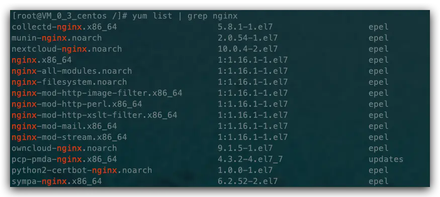
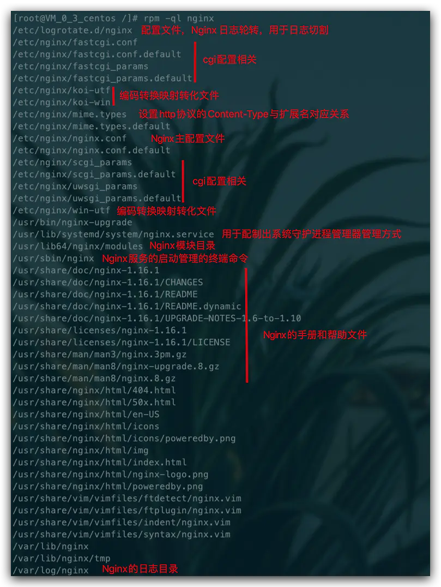
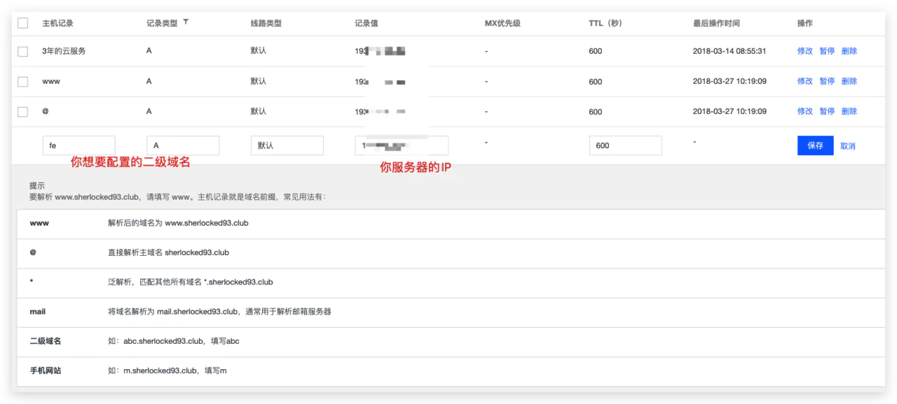

# Nginx 从入门到实践，万字详解！

最近越来越频繁地遇到需要配置**反向代理**的场景，在自己搭建博客的时候，也不可避免要用到 Nginx，所以这段时间集中学习了一下 Nginx，同时做了一些笔记，希望也可以帮助到大家～ 😜

这篇文章会在 CentOS 环境下安装和使用 Nginx

CentOS 版本： `7.6`

Nginx 版本： `1.16.1`


## 1. Nginx 介绍

传统的 Web 服务器，每个客户端连接作为一个单独的进程或线程处理，需在切换任务时将 CPU 切换到新的任务并创建一个新的运行时上下文，消耗额外的内存和 CPU 时间，当并发请求增加时，服务器响应变慢，从而对性能产生负面影响。


`Nginx` 是**开源、高性能、高可靠**的 `Web` 和**反向代理**服务器，而且支持热部署，几乎可以做到 `7 \ 24` 小时不间断运行，即使运行几个月也不需要重新启动，还能在不间断服务的情况下对软件版本进行热更新。**性能**是 Nginx 最重要的考量，其**占用内存少**、**并发能力强**、能支持高达 `5w` 个并发连接数，最重要的是，Nginx 是免费的并可以商业化，配置使用也比较简单。

Nginx 的最重要的几个使用场景：

1. 静态资源服务，通过本地文件系统提供服务；
2. 反向代理服务，延伸出包括缓存、负载均衡等；
3. `API` 服务，`OpenResty`；

对于前端来说 `Node.js` 不陌生了，`Nginx` 和 `Node.js` 的很多理念类似，`HTTP` 服务器、**事件驱动**、**异步非阻塞**等，且 Nginx 的大部分功能使用 Node.js 也可以实现，但 Nginx 和 Node.js 并不冲突，都有自己擅长的领域。Nginx 擅长于**底层服务器端资源的处理**（`静态资源处理转发、反向代理，负载均衡`等），`Node.js` 更擅长**上层具体业务逻辑的处理**，两者可以完美组合，共同助力前端开发。

下面我们来着重学习一下 Nginx 的使用。

## 2. 相关概念

### 2.1 简单请求和非简单请求

首先我们来了解一下简单请求和非简单请求，如果同时满足下面两个条件，就属于简单请求：

1. 请求方法是 `HEAD、GET、POST` 三种之一；
2. `HTTP` 头信息不超过右边这几个字段：`Accept、Accept-Language、Content-Language、Last-Event-ID`
   `Content-Type` 只限于三个值 `application/x-www-form-urlencoded、multipart/form-data、text/plain`；

凡是不同时满足这两个条件的，都属于非简单请求。

浏览器处理简单请求和非简单请求的方式不一样：

#### 简单请求

对于简单请求，浏览器会在头信息中增加 `Origin` 字段后直接发出，`Origin` 字段用来说明，本次请求来自的哪个源（`协议+域名+端口`）。
如果服务器发现 `Origin` 指定的源`不在许可范围内`，服务器会返回一个正常的 `HTTP` 回应，浏览器取到回应之后发现回应的头信息中没有包含 `Access-Control-Allow-Origin` 字段，就抛出一个错误给 `XHR` 的 `error` 事件；
如果服务器发现 `Origin` 指定的域名`在许可范围内`，服务器返回的响应会多出几个 `Access-Control-` 开头的头信息字段。

#### 非简单请求

非简单请求是那种对服务器有特殊要求的请求，比如请求方法是 `PUT` 或 `DELETE`，或 `Content-Type` 值为 `application/json`。浏览器会在正式通信之前，发送一次 HTTP **预检 `OPTIONS` 请求**，先**询问**服务器，当前网页所在的域名是否在**服务器的许可名单**之中，以及可以使用哪些 **HTTP 请求方法**和**头信息字段**。只有得到肯定答复，浏览器才会发出**正式**的 `XHR 请求`，否则**报错**。

### 2.2 跨域

在浏览器上**当前访问的网站**向**另一个网站**发送请求获取数据的过程就是跨域请求。

跨域是**浏览器的同源策略**决定的，是一个重要的浏览器安全策略，用于限制一个 origin 的文档或者它加载的脚本与另一个源的资源进行交互，它能够帮助阻隔恶意文档，减少可能被攻击的媒介，可以使用 CORS 配置解除这个限制。
关于跨域网上已经有很多解释，这里就不啰嗦，也可以直接看 `MDN` 的 [`<浏览器的同源策略>`](https://developer.mozilla.org/zh-CN/docs/Web/Security/Same-origin_policy) 文档进一步了解，这里就列举几个同源和不同源的例子，相信程序员都能看得懂。

```text
# 同源的例子
http://example.com/app1/index.html  # 只是路径不同
http://example.com/app2/index.html

http://Example.com:80  # 只是大小写差异
http://example.com

# 不同源的例子
http://example.com/app1   # 协议不同
https://example.com/app2

http://example.com        # host 不同
http://www.example.com
http://myapp.example.com

http://example.com        # 端口不同
http://example.com:8080

```

### 2.3 正向代理和反向代理

**反向代理**（`Reverse Proxy`）对应的是**正向代理**（`Forward Proxy`），他们的区别：

**正向代理**： 一般的访问流程是客户端直接向**目标服务器**发送请求并获取内容，使用正向代理后，客户端改为向**代理服务器**发送请求，并指定**目标服务器**（**原始服务器**），然后由**代理服务器**和**原始服务器**通信，**转交请求**并获得的内容，再返回给客户端。正向代理**隐藏了真实的客户端**，为客户端收发请求，使**真实客户端对服务器不可见**；

举个具体的例子 🌰，你的浏览器无法直接访问谷歌，这时候可以通过一个代理服务器来帮助你访问谷哥，那么这个服务器就叫正向代理。

**反向代理**： 与一般访问流程相比，使用反向代理后，直接收到请求的服务器是代理服务器，然后将请求转发给**内部网络**上真正进行处理的服务器，得到的结果返回给客户端。反向代理**隐藏**了真实的服务器，为服务器收发请求，使**真实服务器对客户端不可见**。一般在**处理跨域请求**的时候比较常用。现在基本上所有的大型网站都设置了反向代理。

举个具体的例子 🌰，去饭店吃饭，可以点川菜、粤菜、江浙菜，饭店也分别有三个菜系的厨师 👨‍🍳，但是你作为顾客不用管哪个厨师给你做的菜，只用点菜即可，小二将你菜单中的菜分配给不同的厨师来具体处理，那么这个小二就是反向代理服务器。

都是需要代理服务器来转发客户端请求，那正向代理和反向代理的区别在哪呢？

1. 正向代理：客户端知道自己所访问的真实服务器，客户端跟代理服务器是`一伙的`
2. 反向代理：客户端不知道自己所访问的真实服务器，代理服务器和真实服务器是`一伙的`

简单的说，一般给客户端做代理的都是正向代理，给服务器做代理的就是反向代理。

正向代理和反向代理主要的原理区别可以参见下图：


### 2.4 负载均衡

一般情况下，客户端发送多个请求到服务器，服务器处理请求，其中一部分可能要操作一些资源比如数据库、静态资源等，服务器处理完毕后，再将结果返回给客户端。

这种模式对于早期的系统来说，功能要求不复杂，且并发请求相对较少的情况下还能胜任，成本也低。随着信息数量不断增长，访问量和数据量飞速增长，以及系统业务复杂度持续增加，这种做法已无法满足要求，并发量特别大时，服务器容易崩。

很明显这是由于服务器性能的瓶颈造成的问题，除了**堆机器之外**，最重要的做法就是**负载均衡**。

请求爆发式增长的情况下，单个机器性能再强劲也无法满足要求了，这个时候集群的概念产生了，单个服务器解决不了的问题，可以使用多个服务器，然后将请求分发到各个服务器上，将负载分发到不同的服务器，这就是**负载均衡**，核心是`「分摊压力」`。Nginx 实现负载均衡，一般来说指的是**将请求转发给服务器集群**。

举个具体的例子 🌰，**晚高峰**乘坐地铁的时候，入站口经常会有地铁工作人员大喇叭“请走 B 口，B 口人少车空....”，这个`工作人员`的作用就是**负载均衡**。


### 2.5 动静分离

为了加快网站的解析速度，可以把动态页面和静态页面由不同的服务器来解析，加快解析速度，降低原来单个服务器的压力。


一般来说，都需要将动态资源和静态资源分开，由于 `Nginx` 的**高并发**和**静态资源缓存**等特性，经常将静态资源部署在 Nginx 上。如果请求的是静态资源，直接到静态资源目录获取资源，如果是动态资源的请求，则利用反向代理的原理，把请求转发给对应后台应用去处理，从而实现动静分离。

使用前后端分离后，可以很大程度提升**静态资源的访问速度**，即使动态服务不可用，静态资源的访问也不会受到影响。

## 3. Nginx 快速安装

### 3.1 安装

我们可以先看看

```bash
yum list | grep nginx
```

来看看



然后

```bash
yum install nginx
```

来安装 `Nginx`，然后我们在命令行中 `nginx -v` 就可以看到具体的 `Nginx` 版本信息，也就安装完毕了。


### 3.2 相关文件夹

然后我们可以使用 `rpm -ql nginx` 来查看 `Nginx` 被安装到了什么地方，有哪些相关目录，其中位于 /etc 目录下的主要是配置文件，还有一些文件见下图：



主要关注的文件夹有两个：

1. `/etc/nginx/conf.d/` 文件夹，是我们进行**子配置的配置项存放处**，`/etc/nginx/nginx.conf` 主配置文件会默认把这个文件夹中所有子配置项都引入；
2. `/usr/share/nginx/html/` 文件夹，通常**静态文件**都放在这个文件夹，也可以根据你自己的习惯放其他地方；

### 3.3 跑起来看看啦

安装之后开启 `Nginx`，如果系统开启了**防火墙**，那么需要设置一下在**防火墙**中加入需要开放的端口，下面列举几个常用的**防火墙**操作（没开启的话不用管这个）：

```bash
systemctl start firewalld  # 开启防火墙
systemctl stop firewalld   # 关闭防火墙
systemctl status firewalld # 查看防火墙开启状态，显示running则是正在运行
firewall-cmd --reload      # 重启防火墙，永久打开端口需要reload一下

# 添加开启端口，--permanent表示永久打开，不加是临时打开重启之后失效
firewall-cmd --permanent --zone=public --add-port=8888/tcp

# 查看防火墙，添加的端口也可以看到
firewall-cmd --list-all

```

然后设置 Nginx 的开机启动：

```bash
systemctl enable nginx

```

启动 Nginx （其他命令后面有详细讲解）：

```bash
systemctl start nginx

```

然后访问你的 `IP`，这时候就可以看到 `Nginx` 的欢迎页面了～ `Welcome to nginx！` 👏

### 3.4 安装 nvm & node & git

```bash
# 下载 nvm，或者看官网的步骤 https://github.com/nvm-sh/nvm#install--update-script
curl -o- https://raw.githubusercontent.com/nvm-sh/nvm/v0.35.3/install.sh | bash

source   ~/.bashrc    # 安装完毕后，更新配置文件即可使用 nvm 命令
nvm ls-remote         # 查看远程 node 版本
nvm install v12.16.3  # 选一个你要安装的版本安装，我这里选择 12.16.3
nvm list              # 安装完毕查看安装的 node 版本
node -v               # 查看是否安装好了

yum install git   # git 安装

```

## 4. Nginx 操作常用命令

Nginx 的命令在控制台中输入 `nginx -h` 就可以看到完整的命令，这里列举几个常用的命令：

```bash
nginx -s reload  # 向主进程发送信号，重新加载配置文件，热重启
nginx -s reopen	 # 重启 Nginx
nginx -s stop    # 快速关闭
nginx -s quit    # 等待工作进程处理完成后关闭
nginx -T         # 查看当前 Nginx 最终的配置
nginx -t -c <配置路径>    # 检查配置是否有问题，如果已经在配置目录，则不需要-c

```

`systemctl` 是 `Linux` 系统应用管理工具 `systemd` 的主命令，用于管理系统，我们也可以用它来对 Nginx 进行管理，相关命令如下：

```bash
systemctl start nginx    # 启动 Nginx
systemctl stop nginx     # 停止 Nginx
systemctl restart nginx  # 重启 Nginx
systemctl reload nginx   # 重新加载 Nginx，用于修改配置后
systemctl enable nginx   # 设置开机启动 Nginx
systemctl disable nginx  # 关闭开机启动 Nginx
systemctl status nginx   # 查看 Nginx 运行状态

```

## 5. Nginx 配置语法

就跟前面文件作用讲解的图所示，`Nginx` 的主配置文件是 `/etc/nginx/nginx.conf`，你可以使用 `cat -n nginx.conf` 来查看配置。

`nginx.conf` 结构图可以这样概括：

```
main        # 全局配置，对全局生效
├── events  # 配置影响 Nginx 服务器或与用户的网络连接
├── http    # 配置代理，缓存，日志定义等绝大多数功能和第三方模块的配置
│   ├── upstream # 配置后端服务器具体地址，负载均衡配置不可或缺的部分
│   ├── server   # 配置虚拟主机的相关参数，一个 http 块中可以有多个 server 块
│   ├── server
│   │   ├── location  # server 块可以包含多个 location 块，location 指令用于匹配 uri
│   │   ├── location
│   │   └── ...
│   └── ...
└── ...

```

一个 `Nginx` 配置文件的结构就像 `nginx.conf` 显示的那样，配置文件的语法规则：

1. 配置文件由指令与指令块构成；
2. 每条指令以 ; 分号结尾，指令与参数间以**空格符号分隔**；
3. 指令块以 `{}` 大括号将**多条指令组织**在一起；
4. `include` 语句允许组合多个配置文件以提升可维护性；
5. 使用 `#` 符号**添加注释**，提高可读性；
6. 使用 `\$` 符号**使用变量**；
7. 部分指令的参数支持**正则表达式**；

### 5.1 典型配置

来看下 Nginx 的典型配置：

```bash

user  nginx;                        # 运行用户，默认即是nginx，可以不进行设置
worker_processes  1;                # Nginx 进程数，一般设置为和 CPU 核数一样
error_log  /var/log/nginx/error.log warn;   # Nginx 的错误日志存放目录
pid        /var/run/nginx.pid;      # Nginx 服务启动时的 pid 存放位置

events {
    use epoll;     # 使用epoll的I/O模型(如果你不知道Nginx该使用哪种轮询方法，会自动选择一个最适合你操作系统的)
    worker_connections 1024;   # 每个进程允许最大并发数
}

http {   # 配置使用最频繁的部分，代理、缓存、日志定义等绝大多数功能和第三方模块的配置都在这里设置
    # 设置日志模式
    log_format  main  '$remote_addr - $remote_user [$time_local] "$request" '
                      '$status $body_bytes_sent "$http_referer" '
                      '"$http_user_agent" "$http_x_forwarded_for"';

    access_log  /var/log/nginx/access.log  main;   # Nginx访问日志存放位置

    sendfile            on;   # 开启高效传输模式
    tcp_nopush          on;   # 减少网络报文段的数量
    tcp_nodelay         on;
    keepalive_timeout   65;   # 保持连接的时间，也叫超时时间，单位秒
    types_hash_max_size 2048;

    include             /etc/nginx/mime.types;      # 文件扩展名与类型映射表
    default_type        application/octet-stream;   # 默认文件类型

    include /etc/nginx/conf.d/*.conf;   # 加载子配置项

    server {
    	listen       80;       # 配置监听的端口
    	server_name  localhost;    # 配置的域名

      location / {
        root   /usr/share/nginx/html;  # 网站根目录
        index  index.html index.htm;   # 默认首页文件
        deny 172.168.22.11;   # 禁止访问的ip地址，可以为all
        allow 172.168.33.44； # 允许访问的ip地址，可以为all
    	}

    	error_page 500 502 503 504 /50x.html;  # 默认50x对应的访问页面
    	error_page 400 404 error.html;   # 同上
    }
}

```

`server` 块可以包含多个 `location` 块，`location` 指令用于匹配 uri，语法：

```bash
location [ = | ~ | ~* | ^~] uri {
	...
}
```

指令后面：

1. `=` 精确匹配路径，用于不含正则表达式的 `uri` 前，如果匹配成功，不再进行后续的查找；
2. `^~` 用于不含正则表达式的 `uri；` 前，表示如果该符号后面的字符是最佳匹配，采用该规则，不再进行后续的查找；
3. `~` 表示用该符号后面的正则去匹配路径，区分大小写；
4. `~\*` 表示用该符号后面的正则去匹配路径，不区分大小写。跟 `~` 优先级都比较低，如有多个 `location` 的正则能匹配的话，则使用正则表达式最长的那个；

如果 `uri` 包含正则表达式，则必须要有 `~` 或 `~\*` 标志。

### 5.2 全局变量

Nginx 有一些常用的全局变量，你可以在配置的任何位置使用它们，如下表：

| 全局变量名         | 功能                                                                                                   |
| ------------------ | ------------------------------------------------------------------------------------------------------ |
| `$host`            | 请求信息中的 `HostHost`，如果请求中没有 `Host` 行，则等于设置的服务器名，不包含端口                    |
| `$request_method`  | 客户端请求类型，如 `GET、POST`                                                                         |
| `$remote_addr`     | 客户端的 `IP` 地址                                                                                     |
| `$args`            | 请求中的参数                                                                                           |
| `$arg_PARAMETER`   | `GET` 请求中变量名 `PARAMETER` 参数的值，例如：`$http_user_agent`(`Uaer-Agent` 值), `$http_referer`... |
| `$content_length`  | 请求头中的 `Content-length` 字段                                                                       |
| `$http_user_agent` | 客户端 `agent` 信息                                                                                    |
| `$http_cookie`     | 客户端 `cookie` 信息                                                                                   |
| `$remote_addr`     | 客户端的 `IP` 地址                                                                                     |
| `$remote_port`     | 客户端的端口                                                                                           |
| `$server_protocol` | 请求使用的协议，如 `HTTP/1.0`、`HTTP/1.1`                                                              |
| `$server_addr`     | 服务器地址                                                                                             |
| `$server_name`     | 服务器名称                                                                                             |
| `$server_port`     | 服务器的端口号                                                                                         |
| `$scheme`          | `HTTP` 方法（如 `http`，`https`）                                                                      |

还有更多的内置预定义变量，可以直接搜索关键字`「nginx内置预定义变量」`可以看到一堆博客写这个，这些变量都可以在配置文件中直接使用。

## 6. 设置二级域名虚拟主机

在某某云 ☁️ 上购买了域名之后，就可以配置虚拟主机了，一般配置的路径在 `域名管理 -> 解析 -> 添加记录` 中添加**二级域名**，配置后某某云会把**二级域名**也解析到我们配置的服务器 `IP` 上，然后我们在 `Nginx` 上配置一下`虚拟主机的访问监听`，就可以拿到从这个`二级域名过来的请求`了。



现在我自己的服务器上配置了一个 `fe` 的二级域名，也就是说在外网访问 `fe.sherlocked93.club` 的时候，也可以访问到我们的服务器了。

由于默认配置文件 `/etc/nginx/nginx.conf` 的 `http` 模块中有一句 `include /etc/nginx/conf.d/_.conf` 也就是说 `conf.`d 文件夹下的所有 `_.conf` 文件都会**作为`子配置项`被引入配置文件中**。为了维护方便，我在 `/etc/nginx/conf.d` 文件夹中新建一个 `fe.sherlocked93.club.conf` ：

```bash
# /etc/nginx/conf.d/fe.sherlocked93.club.conf

server {
  listen 80;
    server_name fe.sherlocked93.club;

    location / {
        root  /usr/share/nginx/html/fe;
        index index.html;
    }
}

```

然后在 `/usr/share/nginx/html` 文件夹下新建 `fe` 文件夹，前面说过，这个是用来存放静态资源的文件夹，新建文件 `index.html`，内容随便写点，改完 `nginx -s reload` 重新加载(重启`nginx`)，浏览器中输入 `fe.sherlocked93.club`，发现从二级域名就可以访问到我们刚刚新建的 `fe` 文件夹：


## 7. 配置反向代理

未完待续~

## 最后

文中若有不准确或错误的地方，欢迎指出，有兴趣可以的关注下[Github](https://github.com/GolderBrother)~
