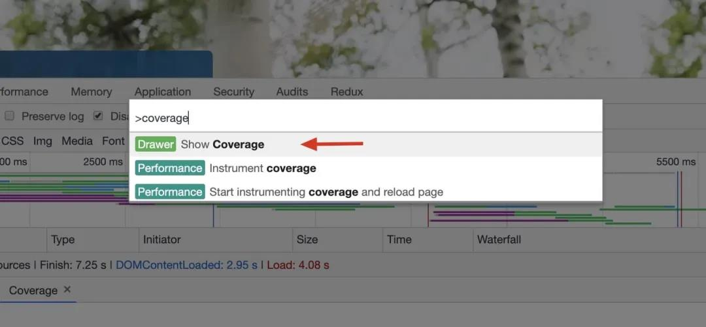
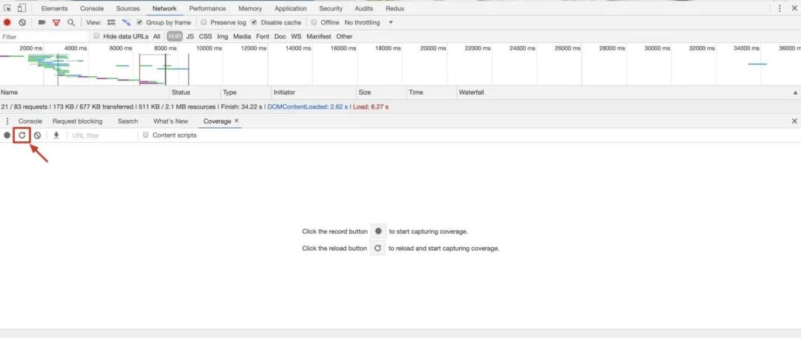
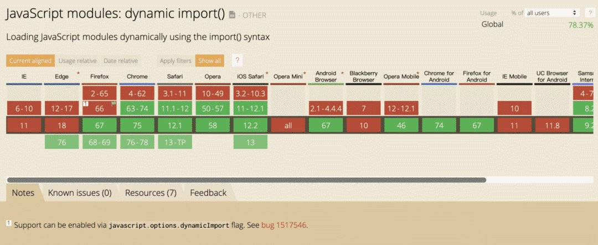

# 项目不知道如何做性能优化？不妨试试代码分割吧

## 一、Web 应用性能优化的关键

关于 `Web` 应用性能优化，有一点是毫无疑问的：**「页面加载越久，用户体验就越差」**。我们几乎可以说 `Web` 应用性能优化的关键之处就在于：**减少页面初载时，所需加载资源的「数量」和「体积」**。

那么当所需加载的资源数量到达多少或资源大小小于多少，我们才可以自信地宣称我们的 Web 应用拥有出色的性能呢？

下面是我给出的一个参考值，该参考值考虑到了移动端与国外等多种访问环境：

页面初载时，所有未压缩的 `JavaScript` 脚本大小：`<=200KB`；
页面初载时，所有未压缩的 `CSS` 资源大小：`<=100K`B；
`HTTP` 协议下，请求资源数：`<=6` 个；
`HTTP/2` 协议下，请求资源数：`<=20` 个 ；
`90%`的代码利用率（也就是说，仅允许 `10%` 的未使用代码）；

或许你会觉得这个标准有点过于苛刻了，是有一点点，但为了创建出高性能的 `Web` 应用，你的实际资源加载情况应该尽可能靠近这个目标。

## 二、如何查看代码利用率

也许你注意到了，这个指标术语是「代码利用率」，你可能是第一次听说这个概念，这里我解释一下它的计算方式：

`代码利用率 = 你页面中实际被执行的代码 / 你页面中引入的代码 * 100%`

你可能会困惑在实际开发中如何得到这个值，别担心，通过使用 `Chrome` 开发者工具（很遗憾，目前只有 `Chrome` 支持这一功能），你就可以迅速对你的 `Web` 应用进行分析，得到当前页面下的代码利用率状态，步骤如下：

1. 打开 `Chrome Dev Tool`；
2. 按下 `Cmd + Shift + P or Ctrl + Shift + P` ;
3. 输入 `Coverage`，并选择第一个出现的选项；



4. 点击面板上的 `reload` 按钮，查看整个应用 `JavaScript` 的代码利用率；



## 三、提高代码使用率的关键技术 — 代码分割（code splitting）

### 什么是「代码分割」（code splitting）？

代码分割是指，将脚本中**无需立即调用的代码**在**代码构建**时转变为**异步加载**的过程。

在 `Webpack` 构建时，会避免加载已声明要**异步加载**的代码，异步代码会被单独分离出一个文件，当代码实际调用时被加载至页面。

### 代码分割的原理

代码分割技术的核心是**「异步加载资源」**，可喜的是，浏览器允许我们这么做，`W3C stage 3` 规范：`whatwg/loader` 对其进行了定义：你可以通过 `import()` 关键字让浏览器在程序执行时**异步加载**相关资源。



没错，正如你所看到的， IE 浏览器目前并不支持这一特性，但这并不意味着你的异步加载功能在 IE 浏览会失效（那太可怕了 🤦‍♂️），实际上，`Webpack` 底层帮你将**异步加载的代码抽离成一份新的文件**，并在你需要时通过 `JSONP` 的方式去获取文件资源，因此，你可以在任何浏览器上实现代码的异步加载，并且在将来所有浏览器都实现 `import()` 方法时**平滑过渡**，cool！👍

### 代码分割的类型

代码分割可以分为**「静态分割」**和**「"动态"分割」**两种方式，注意这里打了引号的 `"动态"`，因为实际上它并不意味着异步调用的代码是 "动态" 生成的，我们之后会看到 `Webpack` 是如何做到这一点的，在那之前，让我们先看看**「静态代码分割」**。

### 静态代码分割

静态代码分割是指：**在代码中明确声明需要异步加载的代码**。

下面 👇 的代码说明了我们应该如何使用这一技术：

```js

import Listener from './listeners.js'
const getModal = () => import('./src/modal.js') Listener.on('didSomethingToWarrentModalBeingLoaded', () => {  // Async fetching modal code from a separate chunk  getModal().then((module) => {    const modalTarget = document.getElementById('Modal')    module.initModal(modalTarget)  })})
const getModal = () => import('./src/modal.js')
Listener.on(
  'didSomethingToWarrentModalBeingLoaded',
  () => {
    // Async fetching modal code from a separate chunk
    getModal().then(
      (module) => {
        const modalTarget = document.getElementById('Modal')
        module.initModal(modalTarget)
      })
  }
)
```

正如你所看到的：每当你调用一个声明了异步加载代码的变量时，它总是返回一个 `Promise` 对象。

⚠️ 注意：在 Vue 中，可以直接使用 `import()` 关键字做到这一点，而在 `React` 中，你需要使用 `react-loadable` 去完成同样的事。

最后，让我们谈谈何时使用静态代码分割技术，这一技术适合以下的场景：

1. **你正在使用一个非常大的库或框架**：如果在页面初始化时你不需要使用它，就不要在页面初载时加载它；
2. **任何临时的资源**：指不在页面初始化时被使用，被使用后又会立即被销毁的资源，例如模态框，对话框，`tooltip` 等（任何一开始不显示在页面上的东西都可以有条件的加载）；
3. **路由**：既然用户不会一下子看到所有页面，那么只把当前页面相关资源给用户就是个明智的做法；

好了，现在你掌握了静态代码分割技术，现在让我们看看什么是「"动态"代码分割」技术。

### 动态代码分割

动态代码分割是指：**在代码调用时根据当前的状态，`「动态地」`异步加载对应的代码块**。

下面 👇 的代码说明了它具体是如何被实现的：

```js
const getTheme = themeName => import(`./src/themes/${themeName}`);
// using `import()` 'dynamically'
if (window.feeling.stylish) {
  getTheme('stylish').then(module => {
    module.applyTheme();
  });
} else if (window.feeling.trendy) {
  getTheme('trendy').then(module => {
    module.applyTheme();
  });
}
```

看到了吗，我们 **动态** 的声明了我们要**异步加载**的代码块，这是怎么做到的？！答案出乎意料的简单，`Webpack` 会在**构建时**将你声明的目录下的**所有可能分离的代码都抽象为一个文件**（这被称为 `contextModule` 模块），因此无论你最终声明了调用哪个文件，本质上就**和静态代码分割一样**，在请求一个早已准备好的，静态的文件。

下面是一些使用 **动态** 代码分割技术的场景：

1. **A/B Test**：你不需要在代码中引入不需要的 UI 代码；
2. **加载主题**：根据用户的设置，动态加载相应的主题；
3. **为了方便**：本质上，你可以用静态代码分割代替「动态」代码分割，但是**后者比前者拥有更少的代码量**；

## 四、魔术注释(魔法字符串)

[魔术注释](https://webpack.js.org/api/module-methods/#magic-comments)是由 `Webpack` 提供的，可以为代码分割服务的一种技术。通过在 `import` 关键字后的**括号中使用指定注释**，我们可以**对代码分割后的 chunk 有更多的控制权**，让我们看一个例子：

示例代码如下：

```js
// index.js
import(
  /* webpackChunkName: 'my-chunk-name' */
  './footer'
);
```

同时，也要在 `webpack.config.js` 中做一些改动：

```js
// webpack.config.js
{
  output: {
    filename: 'bundle.js',
    chunkFilename: '[name].lazy-chunk.js'
  }
}
```

通过这样的配置，我们可以对分离出的 `chunk` 进行**命名**，这对于我们 `debug` 而言非常方便。

### Webpack Modes

除了上面提到过得 `webpackChunkName` 注释外，`Webpack` 还提供了一些其他注释让我们能够对异步加载模块拥有更多控制权，例如下方这个例子：

```js
import(
  /* webpackChunkName: “my-chunk-name” */
  /* webpackMode: lazy */
  './someModule'
);
```

`webpackMode` 的默认值为 `lazy` 它会使所有异步模块都会被**单独抽离成单一的 `chunk`**，若设置该值为 `lazy-once`，`Webpack` 就会将所有**带有标记的异步加载模块**放在同一个 `chunk` 中。

### Prefetch or Preload

通过添加 `webpackPrefetch` 魔术注释，`Webpack` 令我们可以使用与 `<link rel="prefetch">` 相同的特性。让浏览器会在 `Idle` 状态时**预先帮我们加载所需的资源**，善用这个技术可以使我们的应用交互变得更加流畅。

```js
import(
  /* webpackPrefetch: true */
  './someModule'
);
```

⚠️ 注意：你确保你的代码在未来一定会用到时，再开启该功能。

## 最后

文中若有不准确或错误的地方，欢迎指出，有兴趣可以的关注下[Github](https://github.com/GolderBrother)~
