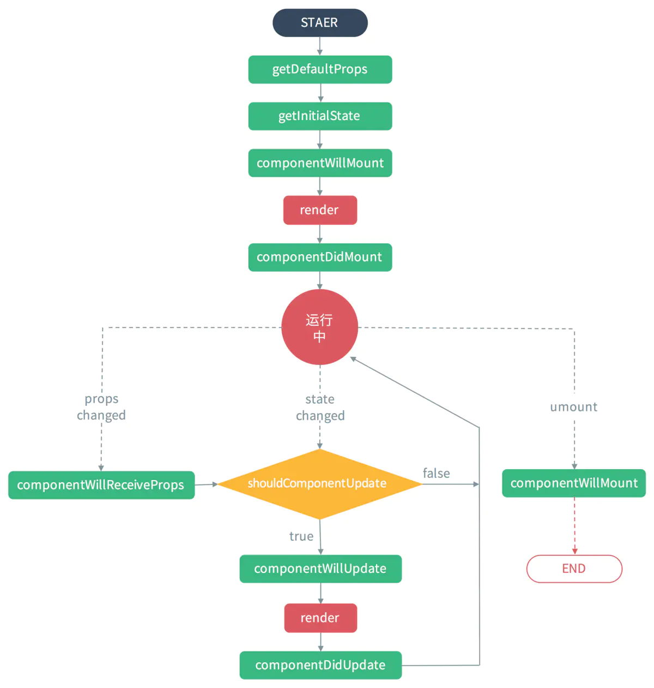
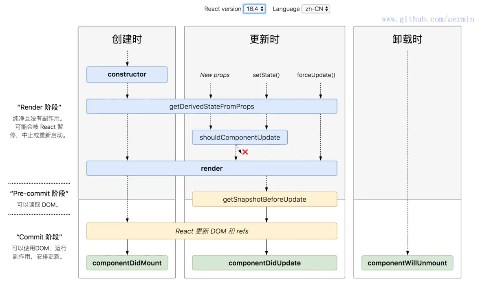

## React v16.0 前的生命周期

其实大部分团队不见得会跟进升到 16 版本，所以 16 前的生命周期还是很有必要掌握的，何况 16 也是基于之前的修改



## 第一个是组件初始化(initialization)阶段

也就是以下代码中类的构造方法( `constructor()` ),`Test` 类继承了 `react Component` 这个**基类**，也就继承这个 · 的**基类**，才能有 `render()`,生命周期等方法可以使用，这也说明为什么`函数组件不能使用这些方法的原因`。

`super(props)`用来调用基类的构造方法( `constructor()` ), 也将父组件的 props 注入给子组件，功子组件读取(组件中 `props` **只读不可变**，· 可变)。
而`constructor()`用来做一些组件的初始化工作，如定义 this.state 的初始内容。

```js
import React, { Component } from 'react';

class Test extends Component {
  constructor(props) {
    super(props);
  }
}
```

## 第二个是组件的挂载(Mounting)阶段

## 此阶段分为 componentWillMount，render，componentDidMount 三个时期。

- `componentWillMount`:
  在组件挂载到 DOM 前调用，且只会被调用一次，在这边调用 `this.setState` 不会引起组件重新渲染，也可以把写在这边的内容提前到 constructor()中，所以项目中很少用。

- `render`:
  根据组件的 `props` 和 `state`（无两者的重传递和重赋值，论值是否有变化，都可以引起组件重新 `render`） ，return 一个 React 元素（描述组件，即 UI），不负责组件实际渲染工作，之后由 React 自身根据此元素去渲染出页面 DOM。render 是纯函数（Pure function：函数的返回结果只依赖于它的参数；函数执行过程里面没有副作用），不能在里面执行 this.setState，会有改变组件状态的副作用。

- `componentDidMount`:
  组件挂载到 DOM 后调用，且只会被调用一次

## 第三个是组件的更新(update)阶段

在讲述此阶段前需要先明确下 `react` 组件**更新机制**。`setState` 引起的 `state` 更新或父组件重新 `render` 引起的 `props` 更新，更新后的 `state` 和 `props` 相对之前无论是否有变化，都将引起子组件的重新 `render`。[详细可看这篇文章](https://www.cnblogs.com/penghuwan/p/6707254.html)

### 造成组件更新有两类（三种）情况：

1.父组件重新 `render` 引起子组件重新 `render` 的情况有两种，内容及代码修引自[xiaoyann 的回答](https://segmentfault.com/q/1010000006019858)

- a. 直接使用,每当父组件重新 `render` 导致的重传 props，子组件将直接跟着重新渲染，无论 props 是否有变化。可通过 shouldComponentUpdate 方法优化

```js
class Child extends Component {
  shouldComponentUpdate(nextProps) {
    // 应该使用这个方法，否则无论props是否有变化都将会导致组件跟着重新渲染
    if (nextProps.someThings === this.props.someThings) {
      return false;
    }
  }
  render() {
    return <div>{this.props.someThings}</div>;
  }
}
```

- b.在 `componentWillReceiveProps` 方法中，将 `props` 转换成自己的 `state`

```js
class Child extends Component {
  constructor(props) {
    super(props);
    this.state = {
      someThings: props.someThings
    };
  }
  componentWillReceiveProps(nextProps) {
    // 父组件重传props时就会调用这个方法
    this.setState({ someThings: nextProps.someThings });
  }
  render() {
    return <div>{this.state.someThings}</div>;
  }
}
```

根据官网的描述

> 在该函数(componentWillReceiveProps)中调用 this.setState() 将不会引起第二次渲染。

是因为 `componentWillReceiveProps` 中判断 `props` 是否变化了，若变化了，`this.setState` 将引起 `state` 变化，从而引起 render，此时就没必要再做第二次因重传 `props` 引起的 render 了，不然重复做一样的渲染了

- 2.组件本身调用 `setState`，无论 `state` 有没有变化。可通过 `shouldComponentUpdate` 方法优化。

```js
class Child extends Component {
  constructor(props) {
    super(props);
    this.state = {
      someThings: 1
    };
  }
  shouldComponentUpdate(nextStates) {
    // 应该使用这个方法，否则无论state是否有变化都将会导致组件重新渲染
    if (nextStates.someThings === this.state.someThings) {
      return false;
    }
  }

  handleClick = () => {
    // 虽然调用了setState ，但state并无变化
    const preSomeThings = this.state.someThings;
    this.setState({
      someThings: preSomeThings
    });
  };

  render() {
    return <div onClick={this.handleClick}>{this.state.someThings}</div>;
  }
}
```

### 此阶段分为 componentWillReceiveProps，shouldComponentUpdate，componentWillUpdate，render，componentDidUpdate

- `componentWillReceiveProps(nextProps)`
  此方法只调用于 props 引起的组件更新过程中，参数 nextProps 是父组件传给当前组件的新 `props`。但父组件 `render` 方法的调用不能保证重传给当前组件的 props 是有变化的，所以在此方法中根据 `nextProps` 和 `this.props` 来查明重传的 `props` 是否改变，以及如果改变了要执行啥，比如根据新的 `props` 调用 `this.setState` 出发当前组件的重新 `render`
- `shouldComponentUpdate(nextProps, nextState)`
  此方法通过比较 n`extProps`，`nextState` 及当前组件的 `this.props`，`this.state`，返回 `true` 时当前组件将继续执行更新过程，返回 `false` 则当前组件更新停止，以此可用来减少组件的不必要渲染，优化组件性能。

ps：这边也可以看出，就算 `componentWillReceiveProps()`中执行了 `this.setState`，更新了 `state`，但在 `render` 前（如 `shouldComponentUpdate，componentWillUpdate`），`this.state` 依然指向更新前的 `state`，不然 `nextState` 及当前组件的 `this.state` 的对比就一直是 `false` 了。

- `componentWillUpdate(nextProps, nextState)`
  此方法在调用 `render` 方法前执行，在这边可执行一些组件更新发生前的工作，一般较少用。

- `render`
  `render` 方法在上文讲过，这边只是重新调用。

- `componentDidUpdate(prevProps, prevState)`
  此方法在组件更新后被调用，可以操作组件更新的 `DOM`，`prevProps` 和 `prevState` 这两个参数指的是组件更新前的 `props` 和 `state`

### 卸载阶段

此阶段只有一个生命周期方法：`componentWillUnmount`

- `componentWillUnmount`
  此方法在组件被卸载前调用，可以在这里执行一些清理工作，比如清楚组件中使用的定时器，清楚 `componentDidMount` 中手动创建的 `DOM` 元素等，以避免引起**内存泄漏**。

### React v16.4 的生命周期



## 最后

文中若有不准确或错误的地方，欢迎指出，有兴趣可以的关注下[Github](https://github.com/GolderBrother)~
