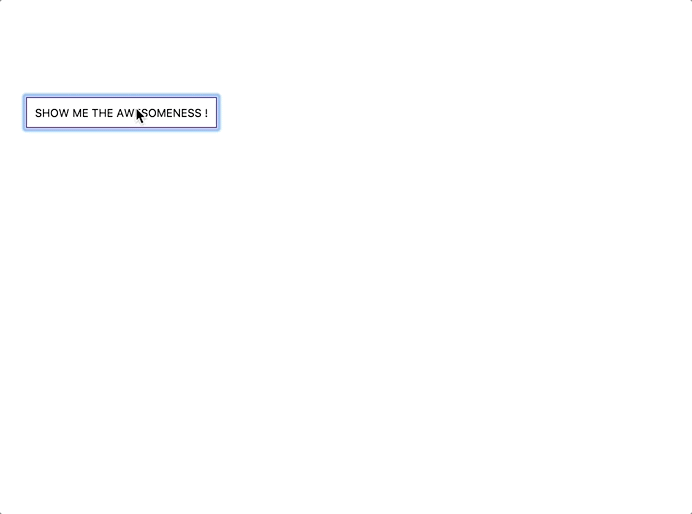
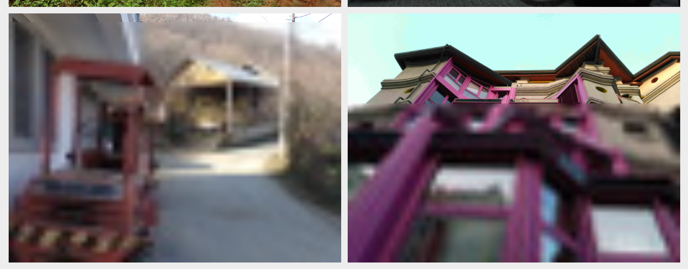

# 5 个很棒的 React.js 库，值得你亲手试试！

`React`在过去几年变得越来越受欢迎。随之而来的是越来越多的库的发布，给我们带来了新的可能性，但最重要的是让开发这工作变得越来越简单。

在本文中，介绍 5 个 `React` 库，希望能给你带来一些帮助。

## 1. react-portal

我认为 `React` 中的 **Portal(传送门)** 对大多数人来说都很熟悉，即使它们很少被使用。下面是 `React` 文档中对它们的描述:

> `Portal` 提供了一种将子节点渲染到存在于**父组件以外**的 `DOM`节点的优秀的方案。

通常，我们的整个 `React` 应用程序都是在 `HTML` 中的一个 `DOM` 节点中渲染的。但是通过 `portal`，我们可以定义附加的节点，在这些节点上我们可以**挂载**应用程序的各个部分，例如单个独立的组件。

然而，在官方文档中，门户以一种相当麻烦和复杂的方式进行描述，这就是也 `react-portal` 出现的一个原因。

现在是 `react-portal` 用法：

```js
import { Portal } from 'react-portal';
<Portal node={document && document.getElementById('portal')}>
  <p>This is portaled into the portal div!</p>
</Portal>;
```

只需使用 选择器（如`getElementById`）将 `HTML` 代码中的 `portal` 容器作为目标，就可以了。

在 `React.js` 应用程序的 `public/index.html` 文件中：

```html
<div id="root"></div>
<!-- 挂载的节点 -->
<div id="portal"></div>
```

如上所见，每个 `React` 应用程序所需的根元素都像往常一样存在，使用了 `portal` 我们就可以将元素指定到与**根同级的位置**。

当然，我们也可以动态切换`portal`

```js
{show ? (
 <Portal node={document && document.getElementById(‘portal’)}>
   <p>Portal content</p>
 </Portal>
) : null}

```

## 2. react-toastify

在现代 web 开发中，为终端用户提供动态信息是绝对必要的。不幸的是，`JavaScript` 中的 `alert()` 函数不是实现此目的的好选择，这一点大家都很清楚(比如阻塞页面渲染)，所以才会出现各种各样的 UI 库。

这里介绍一个 `React` 提示插件 [`react-toastify`](https://www.npmjs.com/package/react-toastify)，它是一个很小且可自定义的库，以下是官方给出的事例：



安装:

```bash
$ npm install --save react-toastify
$ yarn add react-toastify
```

用法如下：

```js
import { ToastContainer, toast } from 'react-toastify';
import 'react-toastify/dist/ReactToastify.css';
toast.configure({
  autoClose: 2000,
  draggable: false,
  position: toast.POSITION.TOP_LEFT
});
const notify = () => toast('Wow so easy !');

const App = () => (
  <div className="App">
    <button onClick={notify}>Notify !</button>
  </div>
);
```

一步一步说下：

- 首先**导入库**本身，但重要的是随后导入所需的 `CSS`。
- 然后配置 `toast`，`autoClose` 的意思是 `toast` 过了多长时间就会自动消失。
- 通过使用 `toast()` 函数，就可以让 `toast` 出现。

### 更酷的功能

我们还可以在 `toast` 中放入 `JSX：const notify = () => toast(<h1>Big Text</h1>)`。

`autoClose` 可以替换为 `false`，因此它永远不会自动关闭。

## 3. react-contextmenu

很难想象没有上下文菜单的应用，这在网站上也是很不寻常。 这不再是因为越来越多的 Web 应用程序接近真实的桌面应用程序，而这些应用程序通常已经提供了类似的良好性能和许多功能，而这些功能是我们多年前从未期望过的。

这些功能之一是用户对右键单击的评估，这种评估在网站上越来越多地使用。 当然，那些是带有许多 UI 元素的更复杂的控件。

通常用于显示所谓的上下文菜单，为此目的，有一个非常方便的 React.js 库，[react-contextmenu](https://www.npmjs.com/package/react-contextmenu)。用法如下：

```js
import React from 'react';
import { ContextMenu, MenuItem, ContextMenuTrigger } from 'react-contextmenu';

const App = () => (
  <React.Fragment>
    <ContextMenuTrigger id="TriggerID">
      {' '}
      {/* ID for every instance must be individual */}
      <p>Right click on me!</p>
    </ContextMenuTrigger>

    <ContextMenu id="MenuID">
      <MenuItem onClick={() => alert('first ')}>
        <button>1. Item</button>
      </MenuItem>

      <MenuItem onClick={() => alert('second')}>
        <button>2. Item</button>
      </MenuItem>
    </ContextMenu>
  </React.Fragment>
);

export default App;
```

`<ContextMenuTrigger>`是我们需要右键单击以切换菜单的组件。菜单本身是在`<ContextMenu>`包装器中定义的。对于每个项，都有一个`<MenuItem>`组件，我们可以给它一个 `onClick` 事件来处理我们的用户输入。

## 4. react-lazy-load-image-component

在我们的网站上展示大量的图片需要一段时间。通常，**已加载**和**突然出现**的图片会导致用户对 UI 产生不愉快的体验，当然我们希望避免这种情况。

一个为用户优化有关图像的所有功能的强大库是 [response-lazy-load-image-component](https://www.npmjs.com/package/react-lazy-load-image-component)。我们不仅可以创建一个良好的**模糊效果**，就像我下面的例子，以悄悄加载的图像，但我们也可以延迟加载图像。这可以在下面的[官方示例](https://www.albertjuhe.com/react-lazy-load-image-component/)中看到:



## 5. react-onclickoutside

用户界面设计的一个重要规则是，认真评估尽可能多的用户输入。 每个人都应该清楚这一点，但是有时可能很难将这样的东西实现为代码。

一个可以想象的例子是用户折叠的菜单。如果你想再次关闭它，`90%`的用户倾向于简单地点击网站的死区(即那些本身不会产生反应的元素)。在几乎所有的专业网站上，这是完全相同的。要关闭菜单，只需再次单击它的**旁边**，而不是直接**在它上切换**。

有一个库可以满足这类的操作，它就是 [`response-onclickoutside`](https://www.npmjs.com/package/react-onclickoutside)，它允许我们处理实际元素之外的单击事件。

在下面的示例中，你可以看到我们如何为一个简单的 `h1` 和 `button` 实现此功能。仅当单击除这两个之外的任何内容时，`console.log` 才会输出。处理此事件的函数必须调用 `handleClickOutside`。

安装：

```bash
$> npm install react-onclickoutside --save
```

使用

```js
import React, { Component } from 'react';
import onClickOutside from 'react-onclickoutside';

class App extends Component {
  handleClickOutside = evt => {
    console.log('You clicked outside!');
  };

  render() {
    return (
      <div>
        <h1>Click outside!</h1>
        <button>Don't click me!</button>
      </div>
    );
  }
}

export default onClickOutside(App);
```

## 最后

文中若有不准确或错误的地方，欢迎指出，有兴趣可以的关注下[Github](https://github.com/GolderBrother)~
