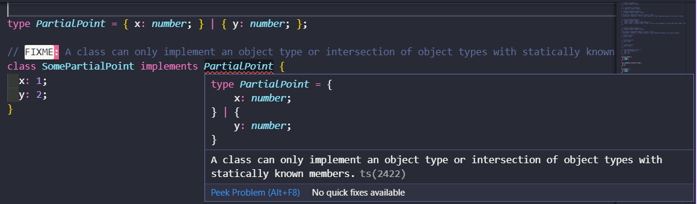
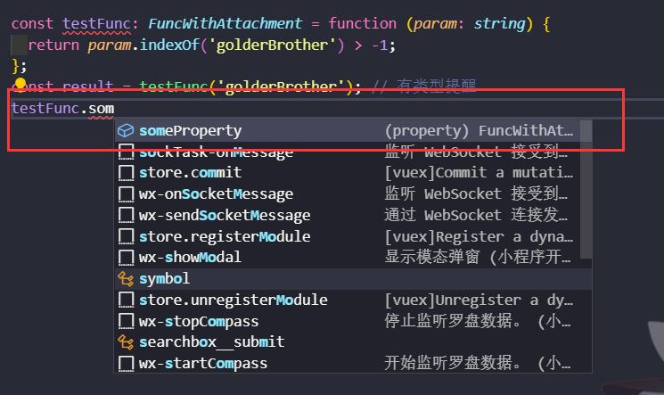
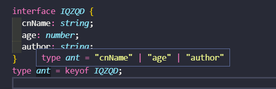
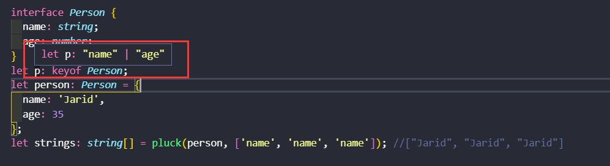
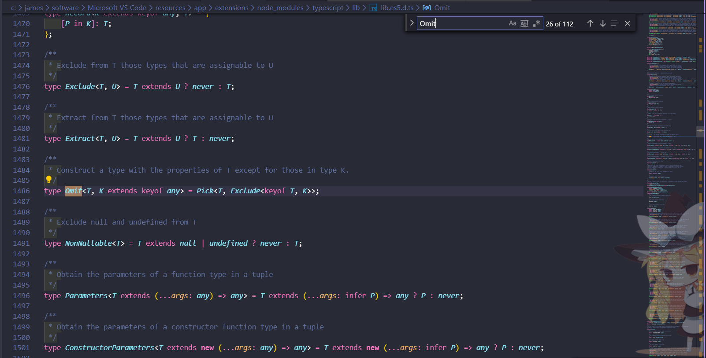

# TypeScript 重难点梳理

## 前言

`JavaScript` 毋庸置疑是一门非常好的语言，但是其也有很多的弊端，其中不乏是作者设计之处留下的一些 “bug”。当然，瑕不掩瑜~

话说回来，`JavaScript` 毕竟是一门弱类型语言，与强类型语言相比，其最大的编程陋习就是可能会造成我们类型思维的缺失（高级词汇，我从极客时间学到的）。而`「思维方式决定了编程习惯，编程习惯奠定了工程质量，工程质量划定了能力边界」`，而学习 `Typescript`，最重要的就是我们类型思维的重塑。

那么其实，`Typescript` 在我个人理解，并不能算是一个编程语言，它只是 JavaScript 的一层壳。当然，我们完全可以将它作为一门语言去学习。网上有很多推荐 or 不推荐 `Typescript` 之类的文章这里我们不做任何讨论，学与不学，用或不用，利与弊。各自拿捏~

再说说 `typescript`（下文均用 ts 简称），其实对于 ts 相比大家已经不陌生了。更多关于 ts 入门文章和文档也是已经烂大街了。`「此文不去翻译或者搬运各种 api 或者教程章节。只是总结罗列和解惑，笔者在学习 ts 过程中曾疑惑的地方」`。道不到的地方，欢迎大家评论区积极讨论。

其实 Ts 的入门非常的简单:`.js` to `.ts`; over!

「但是为什么我都会写 ts 了，却看不懂别人的代码呢？」 这！就是入门与进阶之隔。也是本文的目的所在。

首先推荐下 ts 的编译环境：typescriptlang.org

再推荐笔者收藏的几个网站：

- [Typescript 中文网](https://www.tslang.cn/)
- [深入理解 Typescript](https://jkchao.github.io/typescript-book-chinese/)
- [TypeScript Handbook](https://zhongsp.gitbooks.io/typescript-handbook/content/)
- [TypeScript 精通指南](https://nodelover.gitbook.io/typescript/)

下面，逐个难点梳理，逐个击破。

## 可索引类型

关于 ts 的类型应该不用过多介绍了，`「多用多记」` 即可。介绍下关于 ts 的可索引类型。准确的说，这应该属于接口的一类范畴。说到接口（interface），我们都知道 `「ts 的核心原则之一就是对值所具有的结构进行类型检查。」` 它有时被称之为“鸭式辩型法”或“结构性子类型”。而接口就是其中的契约。可索引类型也是接口的一种表现形式，非常实用！

```ts
interface StringArray {
  [index: number]: string;
}

let myArray: StringArray;
myArray = ['Bob', 'Fred'];

let myStr: string = myArray[0];
```

上面例子里，我们定义了 `StringArray` 接口，它具有索引签名。 这个索引签名表示了当用 number 去索引 `StringArray` 时会得到 `string` 类型的返回值。 `Typescript` 支持两种索引签名：字符串和数字。 可以同时使用两种类型的索引，但是数字索引的返回值必须是字符串索引返回值类型的子类型。

这是因为当使用 `number` 来索引时，`JavaScript` 会将它转换成 `string` 然后再去索引对象。 也就是说用 100（一个 number）去索引等同于使用"100"（一个 `string`）去索引，因此两者需要保持一致。

```ts
class Animal {
  name: string;
}
class Dog extends Animal {
  breed: string;
}

// 错误：使用数值型的字符串索引，有时会得到完全不同的Animal!
interface NotOkay {
  [x: number]: Animal;
  [x: string]: Dog;
}
```

下面的例子里，name 的类型与字符串索引类型不匹配，所以类型检查器给出一个错误提示：

```ts
interface NumberDictionary {
  [index: string]: number;
  length: number; // 可以，length是number类型
  name: string; // 错误，`name`的类型与索引类型返回值的类型不匹配
}
```

当然，我们也可以将索引签名设置为只读，这样就可以防止给索引赋值

```ts
interface ReadonlyStringArray {
  readonly [index: number]: string;
}
let myArray: ReadonlyStringArray = ['Alice', 'Bob'];
myArray[2] = 'Mallory'; // error!
```

## `interface` 和 `type` 关键字

`stackoverflow` 上的一个高赞回答还是非常赞的。`typescript-interfaces-vs-types`

`interface` 和 `type` 两个关键字的含义和功能都非常的接近。这里我们罗列下这两个主要的区别：

### `interface`

- 同名的 `interface` 自动聚合，也可以跟同名的 `class` 自动聚合
- 只能表示 `object、class、function` 类型

### type

- 不仅仅能够表示 `object、class、function`
- 不能重名（自然不存在同名聚合了），扩展已有的 `type` 需要创建新 `type`
- 支持复杂的类型操作

举例说明下上面罗列的几点：

### Objects/Functions

都可以用来表示 Object 或者 Function ，只是语法上有些不同而已

interface

```ts
interface Point {
  x: number;
  y: number;
}

interface SetPoint {
  (x: number, y: number): void;
}
```

type

```ts
type Point = {
  x: number;
  y: number;
};

type SetPoint = (x: number, y: number) => void;
```

### 其他数据类型

与 `interface` 不同，`type` 还可以用来表示其他的类型，比如`基本数据类型、元素、并集`等

```ts
type Name = string;

type PartialPointX = { x: number };
type PartialPointY = { y: number };

type PartialPoint = PartialPointX | PartialPointY;

type Data = [number, string, boolean];
```

### Extend

都可以被继承，但是语法上会有些不同。另外需要注意的是，**「interface 和 type 彼此并不互斥」**。

#### interface extends interface

```ts
interface PartialPointX {
  x: number;
}
interface Point extends PartialPointX {
  y: number;
}
```

#### type extends type

```ts
type PartialPointX = { x: number };
type Point = PartialPointX & { y: number };
```

#### interface extends type

```ts
type PartialPointX = { x: number };
interface Point extends PartialPointX {
  y: number;
}
```

#### type extends interface

```ts
interface ParticalPointX = {x:number;};

type Point = ParticalPointX & {y:number};
```

### implements

一个类，可以以完全相同的形式去实现 `interface` 或者 `type` 。但是，类和接口都被视为**静态蓝图（static blueprints）**，因此，他们不能实现/继承 联合类型的 `type`

```ts
interface Point {
  x: number;
  y: number;
}

class SomePoint implements Point {
  x: 1;
  y: 2;
}

type Point2 = {
  x: number;
  y: number;
};

class SomePoint2 implements Point2 {
  x: 1;
  y: 2;
}

type PartialPoint = { x: number } | { y: number };

// FIXME: A class can only implement an object type or intersection of object types with statically known members.
class SomePartialPoint implements PartialPoint {
  x: 1;
  y: 2;
}
```



### 声明合并

和 `type` 不同，`interface` 可以被重复定义，并且会被**自动聚合**(重名)

```ts
interface Person {
  name: string;
}

interface Person {
  age: number;
}

interface Person {
  sex: string;
}

const golderBrother: Person = {
  name: 'golderBrother',
  age: 18,
  sex: 'man'
};
```

### only interface can

在实际开发中，有的时候也会遇到 `interface` 能够表达，但是 `type` 做不到的情况：**「给函数挂载属性」**

```ts
interface FuncWithAttachment {
  (param: string): boolean;
  someProperty: number;
}

const testFunc: FuncWithAttachment = function(param: string) {
  return param.indexOf('golderBrother') > -1;
};
const result = testFunc('golderBrother'); // 有类型提醒
testFunc.someProperty = 4;
```



## & 和 | 操作符

这里我们需要区分，`|` 和 `&` 并非位运算符。我们可以理解为`&`表示必须**同时满足所有**的契约。`|`表示可以**只满足一个**契约。

```ts
interface IA {
  a: string;
  b: string;
}

type TB = {
  b: number | string;
  c: number[];
};

type TC = IA | TB; // TC 的 key，包含 ab 或者 bc 即可，当然，包含 abc 也可以
type TD = IA & TB; // TD 的 可以,必须包含 abc

let tc: TC = { a: 'a', b: 'b' };
let td: TD = { a: 'a', b: '2', c: [3] };
```

## 交叉类型

交叉类型，我们可以理解为**合并**。其实就是`「将多个类型合并为一个类型」`。

```ts
Man & WoMan;
```

必须满足：

- 同时是 `Man` 和 `Woman`
- 同时拥有 `Man` 和 `Woman` 这两种类型的成员

```ts
interface ObjectConstructor {
  assign<T, U>(target: T, source: U): T & U;
}
```

以上是 `ts` 的源码实现，下面我们再看一个我们日常使用中的例子

```ts
interface A {
  name: string;
  age: number;
  sayName: (name: string) => void;
}

interface B {
  name: string;
  gender: string;
  sayGender: (gender: string) => void;
}

let a: A & B;

// 这是都是合法的
a.age;
a.name;
a.gender;
a.sayName;
a.sayGender;
```

注意：16446

```ts
T & never = never
```

## extends

`extends` 即为扩展、继承。在 ts 中，**「extends 关键字既可以来扩展已有的类型，也可以对类型进行条件限定」**。在扩展已有类型时，不可以进行类型冲突的覆盖操作。例如，基类型中键`a`为`string`，在扩展出的类型中无法将其改为`number`。

```ts
type num = {
  num: number;
};

interface IStrNum extends num {
  str: string;
}

// 与上面等价
type TStrNum = A & {
  str: string;
};
```

在 ts 中，我们还可以通过条件类型进行一些三目操作：`T extends U ? X : Y`

```ts
type IsEqualType<A, B> = A extends B ? (B extends A ? true : false) : false;

type NumberEqualsToString = IsEqualType<number, string>; // false
type NumberEqualsToNumber = IsEqualType<number, number>; // true
```

## keyof

**「keyof 是索引类型操作符」**。用于获取一个“常量”的类型,这里的“常量”是指任何可以在编译期确定的东西，例如`const、function、class`等。它是从 **「实际运行代码」** 通向 **「类型系统」** 的单行道。理论上，任何运行时的符号名想要为类型系统所用，都要加上 `typeof`

在使用`class`时，`class`名表示实例类型，`typeof class`表示 `class`本身类型。是的，这个关键字和 `js` 的 `typeof` 关键字重名了 。

假设 `T` 是一个类型，那么`keyof T`产生的类型就是 `T` 的**属性名称字符串字面量类型**构成的联合类型(联合类型比较简单，和交叉类型对立相似，这里就不做介绍了)。

**「注意！上述的 T 是数据类型，并非数据本身」**。

```ts
interface IQZQD {
  cnName: string;
  age: number;
  author: string;
}
type ant = keyof IQZQD;
```

在 `vscode` 上，我们可以看到 `ts` 推断出来的 `ant`：



注意，如果 `T` 是带有字符串索引的类型，那么`keyof T`是 `string` 或者 `number` 类型。

索引签名参数类型必须为 `string` 或 `number`

```ts
interface SelfMap<T> {
  [key: string]: T;
}

//T[U]是索引访问操作符;U是一个属性名称。
let keys: keyof SelfMap<number>; //string | number
let value: SelfMap<number>['antzone']; //number
```

## 泛型

泛型可能是对于前端同学来说理解起来有点困难的知识点了。通常我们说，泛型就是指定一个**表示类型的变量**，用它来**代替某个实际的类型**用于编程，而后再**通过实际运行或推导的类型来对其进行替换**，以达到一段使用泛型程序可以实际适应不同类型的目的。说白了，**「泛型就是不预先确定的数据类型，具体的类型在使用的时候再确定的一种类型约束规范」**。

泛型可以应用于 `function、interface、type` 或者 `class` 中。但是注意，**「泛型不能应用于类的静态成员」**

几个简单的例子，先感受下泛型

```ts
function log<T>(value: T): T {
  console.log(value);
  return value;
}

// 两种调用方式
log<string[]>(['a', ',b', 'c']);
log(['a', ',b', 'c']);
log('golderBrother');
```

- 泛型类型、泛型接口

```ts
type Log = <T>(value: T) => T;
let myLog: Log = log;

interface Log<T> {
  (value: T): T;
}
let myLog: Log<number> = log; // 泛型约束了整个接口，实现的时候必须指定类型。如果不指定类型，就在定义的之后指定一个默认的类型
myLog(1);
```

「我们也可以把**泛型变量**理解为**函数的参数**，只不过是另一个维度的参数，是代表**类型**而不是代表值的参数。」

```ts
class Log<T> {
  // 泛型不能应用于类的静态成员
  run(value: T) {
    console.log(value);
    return value;
  }
}

let log1 = new Log<number>(); //实例化的时候可以显示的传入泛型的类型
log1.run(1);
let log2 = new Log();
log2.run({ a: 1 }); //也可以不传入类型参数，当不指定的时候，value 的值就可以是任意的值
```

类型约束，需预定义一个接口

```ts
interface Length {
  length: number;
}
function logAdvance<T extends Length>(value: T): T {
  console.log(value, value.length);
  return value;
}

// 输入的参数不管是什么类型，都必须具有 length 属性
logAdvance([1]);
logAdvance('123');
logAdvance({ length: 3 });
```

泛型的好处：

- 函数和类可以轻松的**支持多种类型**，增强程序的**扩展性**
- 不必写多条函数重载，冗长的联合类型声明，增强代码的可读性
- **灵活控制**类型之间的约束

泛型，在 `ts` 内部也都是非常常用的，尤其是对于**容器类**非常常用。而对于我们，还是要多使用，多思考的，这样才会有更加深刻的体会。同时也对塑造我们类型思维非常的有帮助。

### 小试牛刀

```ts
function pluck<T, K extends keyof T>(o: T, names: K[]): T[K][] {
  return names.map(n => o[n]);
}

interface Person {
  name: string;
  age: number;
}

let person: Person = {
  name: 'Jarid',
  age: 35
};
let strings: string[] = pluck(person, ['name', 'name', 'name']); //["Jarid", "Jarid", "Jarid"]
```



所谓的小试牛刀，就是结合上面我们说的那几个点，分析下 pluck 方法的意思

- `<T, K extends keyof T>`约束了这是一个**泛型函数**
  - `keyof T` 就是取 T 中的所有的常量 `key`（这个例子的调用中）,即为：`"name" | "age"`
  - `K extends keyof Person` 即为 `K` 是 `"name" or "age"`
- 结合以上泛型解释，再看形参
  - `K[]` 即为 只能包含`"name" or "age"`的数组
- 再看返回值
  - `T[K][]` 后面的`[]`是数组的意思。而 `T[K]`就是获取对象的 `T` 下的`key: K`的 `value`, 也就是 `string or number`

## infer

`infer` 关键字最早出现在 `PR` 里面，「表示在 `extends` 条件语句中**待推断的类型变量**」

是在 `ts2.8` 引入的，在条件判断语句中，该关键字用于「替换手动获取类型」。

```ts
type PramType<T> = T extends (param: infer p) => any ? p : T;
```

在上面的条件语句中，`infer P` 表示待推断的函数参数，如果 T 能赋值给`(param : infer p) => any`,则结果是`(param: infer P) => any`类型中的参数 `P`,否则为`T`.

```ts
interface IGolderBrother {
  name: 'GolderBrother';
  age: '25';
}

type Func = (user: IGolderBrother) => void;

type Param = ParamType<Func>; // Param = IGolderBrother
type Test = ParamType<string>; // string
```

## 工具泛型

所谓的工具泛型，其实就是泛型的一些**语法糖**的实现。完全也是可以自己的写的。我们也可以在`lib.d.ts`中找到他们的定义

### Partial

`Partial`的作用就是将传入的属性变为**可选**。

由于 `keyof` 关键字已经介绍了。其实就是可以用来取得一个对象接口的所有 `key` 值。在介绍 `Partial` 之前，我们再介绍下 `in` 操作符:

```ts
type Keys = 'a' | 'b';
type Obj = {
  [p in Keys]: any;
}; // -> { a: any, b: any }
```

然后再看 `Partial` 的实现：

```ts
type Partial<T> = { [P in keyof T]?: T[P] };
```

翻译一下就是`keyof T` 拿到 `T` 所有**属性名**, 然后 `in` 进行**遍历**, 将值赋给 `P`, 最后 `T[P]` 取得相应属性的值,然后配合`?:`改为`可选`。

### Required

`Required` 的作用是将传入的属性变为**必选项**, 源码如下

```ts
type Required<T> = { [P in keyof T]-?: T[P] };
```

### Readonly

将传入的属性变为**只读**选项, 源码如下

```ts
type Readonly<T> = { readonly [P in keyof T]: T[P] };
```

### Record

该类型可以将 `K` 中所有的属性的值转化为 `T` 类型，源码实现如下：

```ts
/**
 * Construct a type with a set of properties K of type T
 */
type Record<K extends keyof any, T> = {
  [P in K]: T;
};
```

可以根据 `K` 中的所有**可能值**来设置 `key`，以及 `value` 的类型，举个例子：

```ts
type T11 = Record<'a' | 'b' | 'c', Person>; // -> { a: Person; b: Person; c: Person; }
```

### Pick

从 `T` 中 **提取出** 一系列 `K` 的属性

```ts
/**
 * From T, pick a set of properties whose keys are in the union K
 */
type Pick<T, K extends keyof T> = {
  [P in K]: T[P];
};
```

比如这样

```ts
interface User {
  id: number;
  name: string;
  age: number;
  sex: string;
  email: string;
}

type PickUser = Pick<User, 'id' | 'name' | 'age'>;
// 等价于
type PickUser = {
  id: number;
  name: string;
  age: number;
};

let user: PickUser = {
  id: 1,
  name: 'golderBrother',
  number: 25
};
```

### Exclude

`Exclude` 将某个类型中属于另一个的类型**移除**掉。

```ts
/**
 * Exclude from T those types that are assignable to U
 */
type Exclude<T, U> = T extends U ? never : T;
```

以上语句的意思就是 如果 `T` 能赋值给 `U` 类型的话，那么就会返回 `never` 类型，否则返回 `T`，最终结果是将 `T` 中的某些属于 `U` 的类型**移除**掉

举个栗子：

```ts
type T00 = Exclude<'a' | 'b' | 'c' | 'd', 'a' | 'c' | 'f'>; // -> 'b' | 'd
```

可以看到 `T` 是 `'a' | 'b' | 'c' | 'd'` ，然后 `U` 是 `'a' | 'c' | 'f'` ，返回的新类型就可以将 `U` 中的类型给**移除**掉，也就是 `'b' | 'd'` 了。

### Extract

`Extract` 的作用是**提取**出 `T` 包含在 `U` 中的元素，换种更加贴近语义的说法就是从 `T` 中**提取**出 `U`，可以理解成获取**共同值**，源码如下：

```ts
/**
 * Extract from T those types that are assignable to U
 */
type Extract<T, U> = T extends U ? T : never;
```

Demo:

```ts
type T01 = Extract<'a' | 'b' | 'c' | 'd', 'a' | 'c' | 'f'>; // -> 'a' | 'c'
```

### Omit

`Pick` 和 `Exclude` 进行组合, 实现**忽略对象某些属性**功能, 源码如下:

```ts
/**
 * Construct a type with the properties of T except for those in type K.
 */
type Omit<T, K extends keyof any> = Pick<T, Exclude<keyof T, K>>;
```

Demo:

```ts
// 使用
type Foo = Omit<{ name: string; age: number }, 'name'>; // -> { age: number }
```

### 更多工具泛型



其实常用的工具泛型大概就是我上面介绍的几种。更多的工具泛型，可以通过查看 lib.es5.d.ts 里面查看。

毕竟。。。搬运几段声明着实是没啥意思，哈哈哈

## 类型断言

断言这种东西还是少用。。。。不多对于初学者，估计最快熟练掌握的就是类型断言了。毕竟 **「any 大法好」**

`Typescript` 允许我们**覆盖它的推断**（毕竟代码是我们自己写的，我们拥有掌控权），然后根据我们自定义的类型去分析它。这种机制，我们称之为 **「类型断言」**

```js
const golderBrother = {};
golderBrother.enName = 'GolderBrother'; // Error: 'enName' 属性不存在于 ‘{}’
golderBrother.cnName = '神哥'; // Error: 'cnName' 属性不存在于 '{}'
```

改成 ts 版本

```ts
interface IGolderBrother = {
  enName:string;
  cnName:string;
}

const golderBrother = {} as IGolderBrother; // const golderBrother = <IGolderBrother>{}; 断言默认的推断类型，告诉 typescript，golderBrother 就是 IGolderBrother 这种类型，不用再推断了
golderBrother.enName = 'GolderBrother';
golderBrother.cnName = '神哥';
```

类型断言比较简单，其实就是“纠正”ts 对类型的判断,当然，是不是纠正就看你自己的了。

需要注意一下两点即可：

- 推荐类型断言的预发使用 `as` 关键字，而不是`<>` ,防止歧义
- 类型断言并非**类型转换**，类型断言发生在**编译**阶段，而**类型转换**发生在**运行**时

## 函数重载

> 在我刚开始使用 ts 的时候，我一直困惑。。。为什么会有函数重载这么鸡肋的写法，可选参数它不香么？

### 函数重载的基本语法

```ts
declare function test(a: number): number;
declare function test(a: string): string;

const resS = test('Hello World'); // resS 被推断出类型为 string；
const resN = test(1234); // resN 被推断出类型为 number;
```

这里我们声明了两次？为什么我不能判断类型或者可选参数呢？后来我遇到这么一个场景，

```ts
interface User {
  name: string;
  age: number;
}

declare function test(para: User | number, flag?: boolean): number;
```

在这个 `test` 函数里，我们的本意可能是当传入参数 `para` 是 `User` 时，不传 `flag`，当传入 `para` 是 `number` 时，要传入 `flag`。`TypeScript` 并不知道这些，当你传入 `para` 为 `User` 时，`flag` 同样允许你传入：

因此，使用**函数重载**能帮助我们实现：

```ts
interface User {
  name: string;
  age: number;
}

// 当传入参数 `para` 是 `User` 时，不传 `flag`
declare function test(para: User): number;
// 当传入 `para` 是 `number` 时，要传入 `flag`
declare function test(para: number, flag: boolean): number;

const user: User = {
  name: 'Jack',
  age: 666
};

// Error: 参数不匹配(Argument of type 'User' is not assignable to parameter of type 'number')
const res = test(user, false);
```

所以，我们需要调整传入的参数类型, 也就是第一个参数需要传入 `number` 类型

```ts
const res2 = test(18, false);
```

## 最后

文中若有不准确或错误的地方，欢迎指出，有兴趣可以的关注下[Github](https://github.com/GolderBrother)~

 <comment/>
