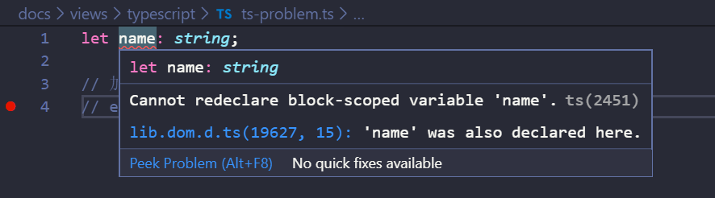

# TS 常见问题整理（60 多个）

<!-- [TS 常见问题整理（60 多个，持续更新 ing）](https://juejin.im/post/5e33fcd06fb9a02fc767c427) -->

## 前言

- 最近这段时间使用 `Angular8 + TS` 写项目，大大小小的坑踩了很多，在此整理了在项目中遇到的疑惑和问题。
- 体会：不要畏惧 `TS`，别看 `TS` 官方文档内容很多，其实在项目中常用的都是比较基础的东西，像泛型运用、一些高级类型这种用的很少（封装库、工具函数、UI 组件时用的比较多）。只要把常用的东西看熟，最多一个小时就能上手 TS。

## 纯 TS 问题

### 1. TS 1.5 版本的改动

- TypeScript 1.5 之前的版本：`module` 关键字既可以称做“内部模块”，也可以称做“外部模块”。这让刚刚接触 TypeScript 的开发者会有些困惑。
- TypeScript 1.5 的版本： 术语名已经发生了变化，“内部模块”的概念更接近于大部分人眼中的“命名空间”， 所以自此之后称作“命名空间”（也就是说 module X {...} 相当于现在推荐的写法 namespace X {...}），而 "外部模块" 对于 JS 来讲就是模块（ES6 模块系统将每个文件视为一个模块），所以自此之后简称为“模块”。
- 不推荐使用命名空间

#### 之前

```ts
module Math {
  export function add(x, y) { ... }
}
```

#### 之后

```ts
namespace Math {
  export function add(x, y) { ... }
}
```

### 2. null 和 undefined 是其它类型（包括 void）的子类型，可以赋值给其它类型（如：数字类型）

默认情况下，编译器会提示错误，这是因为 tsconfig.json 里面有一个配置项是默认开启的

```json
// tsconfig.json

{
  /* Strict Type-Checking Options */
  "strict": true /* Enable all strict type-checking options. */
  // "noImplicitAny": true,                 /* Raise error on expressions and declarations with an implied 'any' type. */
  // 对 null 类型检查，设置为 false 就不会报错了
  // "strictNullChecks": true,              /* Enable strict null checks. */
  // "strictFunctionTypes": true,           /* Enable strict checking of function types. */
  // "strictBindCallApply": true,           /* Enable strict 'bind', 'call', and 'apply' methods on functions. */
  // "strictPropertyInitialization": true,  /* Enable strict checking of property initialization in classes. */
  // "noImplicitThis": true,                /* Raise error on 'this' expressions with an implied 'any' type. */
  // "alwaysStrict": true,                  /* Parse in strict mode and emit "use strict" for each source file. */
}
```

`strictNullChecks` 参数用于新的严格空检查模式，在严格空检查模式下，`null` 和 `undefined` 值都不属于任何一个类型，它们只能赋值给自己这种类型或者 any

### 3. never 和 void 的区别

- `void` 表示没有任何类型（可以被赋值为 `null` 和 `undefined`）。
- `never` 表示一个不包含值的类型，即表示永远不存在的值。
- 拥有 `void` 返回值类型的函数能正常运行。拥有 `never` 返回值类型的函数无法正常返回，无法终止，或会抛出异常。


### 4. 元祖越界问题

```ts
let aaa: [string, number] = ['aaa', 5];
// 添加时不会报错
aaa.push(6);
// 打印整个元祖不会报错
console.log(aaa); // ['aaa',5,6];
// 打印添加的元素时会报错
console.log(aaa[2]); // error
```


### 5. 枚举成员的特点

- 是只读属性，无法修改
- 枚举成员值默认从 0 开始递增，可以自定义设置初始值

```ts
enum Gender {
  BOY = 1,
  GRIL
}
console.log(Gender.BOY); // 1
console.log(Gender); // { '1': 'BOY', '2': 'GRIL', BOY: 1, GRIL: 2 }
```

- 枚举成员值
  - 可以没有初始值
  - 可以是一个对常量成员的引用
  - 可以是一个常量表达式
  - 也可以是一个非常量表达式

```ts
enum Char {
  // const member 常量成员：在编译阶段被计算出结果
  a, // 没有初始值
  b = Char.a, // 对常量成员的引用
  c = 1 + 3, // 常量表达式

  // computed member 计算成员：表达式保留到程序的执行阶段
  d = Math.random(), // 非常量表达式
  e = '123'.length,
  // 紧跟在计算成员后面的枚举成员必须有初始值
  f = 6,
  g
}
console.log(Char);

// {
//   '0': 'b',
//   '3': 'e',
//   '4': 'c',
//   '6': 'f',
//   '7': 'g',
//   a: 0,
//   b: 0,
//   c: 4,
//   d: 0.30238488943273656,
//   '0.30238488943273656': 'd',
//   e: 3,
//   f: 6,
//   g: 7
// }
```


### 6. 常量枚举与普通枚举的区别

- 常量枚举会在编译阶段被删除
- 枚举成员只能是常量成员

```ts
const enum Colors {
  Red,
  Yellow,
  Blue
}
// 常量枚举会在编译阶段被删除
let myColors = [Colors.Red, Colors.Yellow, Colors.Blue];
console.log(myColors); // [ 0, 1, 2 ]
```

编译成 JS 后

```js
// 常量枚举会在编译阶段被删除
var myColors = [0 /* Red */, 1 /* Yellow */, 2 /* Blue */];
console.log(myColors); // [ 0, 1, 2 ]
```

- 常量枚举不能包含计算成员，如果包含了计算成员，则会在编译阶段报错

```ts
// 会报错
const enum Color {
  Red,
  Yellow,
  Blue = 'blue'.length
}
console.log(Colors.RED);
```


### 7. 枚举的使用场景

以下代码存在的问题：

- **可读性差**：很难记住数字的含义
- **可维护性差**：硬编码，后续修改的话牵一发动全身

比如，使用枚举前

```ts
function initByRole(role) {
  if (role === 1 || role === 2) {
    console.log('1,2');
  } else if (role === 3 || role === 4) {
    console.log('3,4');
  } else if (role === 5) {
    console.log('5');
  } else {
    console.log('');
  }
}
```

使用枚举后

```ts
enum Role {
  Reporter,
  Developer,
  Maintainer,
  Owner,
  Guest
}

function init(role: number) {
  switch (role) {
    case Role.Reporter:
      console.log('Reporter:1');
      break;
    case Role.Developer:
      console.log('Developer:2');
      break;
    case Role.Maintainer:
      console.log('Maintainer:3');
      break;
    case Role.Owner:
      console.log('Owner:4');
      break;
    default:
      console.log('Guest:5');
      break;
  }
}

init(Role.Developer);
console.log(Role);

/* Developer:2
{ '0': 'Reporter',
  '1': 'Developer',
  '2': 'Maintainer',
  '3': 'Owner',
  '4': 'Guest',
  Reporter: 0,
  Developer: 1,
  Maintainer: 2,
  Owner: 3,
  Guest: 4 } */
```

### 8. 什么是可索引类型接口

一般用来约束数组和对象

```ts
// 数字索引——约束数组
// index 是随便取的名字，可以任意取名
// 只要 index 的类型是 number，那么值的类型必须是 string
interface StringArray {
  // key 的类型为 number ，一般都代表是数组
  // 限制 value 的类型为 string
  [index: number]: string;
}
let arr: StringArray = ['aaa', 'bbb'];
console.log(arr);

// 字符串索引——约束对象
// 只要 index 的类型是 string，那么值的类型必须是 string
interface StringObject {
  // key 的类型为 string ，一般都代表是对象
  // 限制 value 的类型为 string
  [index: string]: string;
}
let obj: StringObject = { name: 'ccc' };
```

### 9. 什么是函数类型接口

对方法传入的参数和返回值进行约束

```ts
// 注意区别

// 普通的接口
interface discount1 {
  getNum: (price: number) => number;
}

// 函数类型接口
interface discount2 {
  // 注意:
  // “:” 前面的是函数的签名，用来约束函数的参数
  // ":" 后面的用来约束函数的返回值
  (price: number): number;
}
let cost: discount2 = function(price: number): number {
  return price * 0.8;
};

// 也可以使用类型别名
type Add = (x: number, y: number) => number;
let add: Add = (a: number, b: number) => a + b;
```

### 10. 什么是类类型接口

- 如果接口用于一个类的话，那么接口会表示**行为的抽象**
- 对类的约束，**让类去实现接口，类可以实现多个接口**
- 接口只能约束类的公有成员（实例属性/方法），无法约束私有成员、构造函数、静态属性/方法

```ts
// 接口可以在面向对象编程中表示为行为的抽象
interface Speakable {
  name: string;

  // ":" 前面的是函数签名，用来约束函数的参数
  // ":" 后面的用来约束函数的返回值
  speak(words: string): void;
}

interface Speakable2 {
  age: number;
}

class Dog implements Speakable, Speakable2 {
  name!: string;
  age = 18;

  speak(words: string) {
    console.log(words);
  }
}

let dog = new Dog();
dog.speak('汪汪汪');
```

### 11. 什么是混合类型接口

一个对象可以同时做为函数和对象使用

```ts
interface FnType {
  (getName: string): string;
}

interface MixedType extends FnType {
  name: string;
  age: number;
}

const mixed: FnType = (getName: string) => `hi~ ${getName}`;
```

```ts
interface Counter {
  (start: number): string;
  interval: number;
  reset(): void;
}

function getCounter(): Counter {
  let counter = <Counter>function(start: number) {};
  counter.interval = 123;
  counter.reset = function() {};
  return counter;
}

let c = getCounter();
c(10);
c.reset();
c.interval = 5.0;
```

### 12. 什么是函数重载

- 在 `Java` 中的函数重载，指的是两个或者两个以上的同名函数，**参数类型不同或者参数个数不同**。函数重载的好处是：**不需要为功能相似的函数起不同的名称**。
- 在 `TypeScript` 中，表现为给同一个函数提供多个函数类型定义，**适用于接收不同的参数和返回不同结果的情况**。
- TS 实现函数重载的时候，要求定义一系列的函数声明，在类型最宽泛的版本中实现重载（**前面的是函数声明，目的是约束参数类型和个数，最后的函数实现是重载，表示要遵循前面的函数声明。一般在最后的函数实现时用 any 类型**）
- 函数重载在实际应用中使用的比较少，一般会用联合类型或泛型代替
- 函数重载的声明只用于类型检查阶段，在编译后会被删除
- **TS 编译器在处理重载的时候，会去查询函数申明列表，从上至下直到匹配成功为止，所以要把最容易匹配的类型写到最前面**

举个栗子

```ts
function attr(val: string): string;
function attr(val: number): number;
// 前面两行是函数申明，这一行是实现函数重载
function attr(val: any): any {
  if (typeof val === 'string') {
    return 'This type is string';
  } else if (typeof val === 'number') {
    return 'Yhis type is number ';
  }
}

console.log(attr('aaa'));
console.log(attr(666));

// This type is string
// Yhis type is number
```

- 上面的写法声明完函数后，必须实现函数重载。也可以**只声明函数**

```ts
class Animal {
  speak(word: string): string {
    return '动作叫:' + word;
  }
}

class Sheep {
  speak(word: string): string {
    return '梦里见:' + word;
  }
}

class Cat extends Animal {
  speak(word: string): string {
    return '猫叫:' + word;
  }
}

class Dog extends Animal {
  speak(word: string): string {
    return '狗叫:' + word;
  }
}

// 后写的接口中的函数声明优先级高
interface Cloner111 {
  clone(animal: Animal): Animal;
}
interface Cloner111 {
  clone(animal: Sheep): Sheep;
}
interface Cloner111 {
  clone(animal: Dog): Dog;
  clone(animal: Cat): Cat;
}

// ==> 同名接口会合并
// 后写的接口中的函数声明优先级高
interface Cloner111 {
  clone(animal: Dog): Dog;
  clone(animal: Cat): Cat;
  clone(animal: Sheep): Sheep;
  clone(animal: Animal): Animal;
}

interface Cloner222 {
  // 接口内部按书写的顺序来排，先写的优先级高
  clone(animal: Dog): Dog;
  clone(animal: Cat): Cat;
  clone(animal: Sheep): Sheep;
  clone(animal: Animal): Animal;
}

const cloner222: Cloner222 = {
  clone(animal: Animal) {
    return animal;
  }
};
```

### 13. 什么是访问控制修饰符

```ts
class Father {
  str: string; // 默认就是 public
  public name: string; // 在定义的类中、类的实例、子类、子类实例都可以访问
  protected age: number; // 只能在定义的类和子类中访问，不允许通过实例（定义的类的实例和子类实例）访问
  private money: number; // 只能在定义的类中访问，类的实例、子类、子类实例都不可以访问
  constructor(name: string, age: number, money: number) {
    this.name = name;
    this.age = age;
    this.money = money;
  }

  getName(): string {
    return this.name;
  }

  setName(name: string): void {
    this.name = name;
  }
}

const fa = new Father('aaa', 18, 1000);
console.log(fa.name); // aaa
console.log(fa.age); // error
console.log(fa.money); // error

class Child extends Father {
  constructor(name: string, age: number, money: number) {
    super(name, age, money);
  }

  desc() {
    console.log(`${this.name} ${this.age} ${this.money}`);
  }
}

let child = new Child('bbb', 18, 1000);
console.log(child.name); // bbb
console.log(child.age); // error
console.log(child.money); // error
```


### 14. 重写(`override`) vs 重载(`overload`)

- **重写是指子类重写**继承**自父类中的方法** 。虽然 `TS` 和 `JAVA` 相似，但是 `TS` 中的继承本质上还是 `JS` 的**继承**机制—`原型链机制`
- **重载是指为同一个函数提供多个类型定义**

```ts
// 重写

class Animal {
  speak(word: string): string {
    return '动作叫:' + word;
  }
}

class Cat extends Animal {
  speak(word: string): string {
    return '猫叫:' + word;
  }
}

let cat = new Cat();
console.log(cat.speak('hello'));

/**--------------------------------------------**/

// 重载

function double(val: number): number;
function double(val: string): string;
function double(val: any): any {
  if (typeof val == 'number') {
    return val * 2;
  }
  return val + val;
}

let r = double(1);
console.log(r);
```

### 15. 继承 vs 多态

- 继承：子类继承父类，子类除了拥有父类的所有特性外，还有一些更具体的特性
- 多态：由继承而产生了相关的不同的类，对同一个方法可以有不同的状态或者表现

```ts
class Animal {
  speak(word: string): string {
    return 'Animal: ' + word;
  }
}

class Cat extends Animal {
  speak(word: string): string {
    return 'Cat:' + word;
  }
}

class Dog extends Animal {
  speak(word: string): string {
    return 'Dog:' + word;
  }
}

// cat和dog就是继承自同一个超类Animal的不同表现
let cat = new Cat();
console.log(cat.speak('hello'));
let dog = new Dog();
console.log(dog.speak('hello'));
```

### 16. 什么是泛型

- 泛型是指在定义函数、接口或类的时候，不预先指定具体的类型，**使用时再去指定类型**的一种特性。
- 可以把泛型理解为代表**类型(形参)的实参**

使用泛型前

```ts
// 我们希望传入的值是什么类型，返回的值就是什么类型
// 传入的值可以是任意的类型，这时候就可以用到 泛型

// 如果使用 any 的话，就失去了类型检查的意义
function createArray1(length: any, value: any): Array<any> {
  let result: any = [];
  for (let i = 0; i < length; i++) {
    result[i] = value;
  }
  return result;
}

let result = createArray1(3, 'x');
console.log(result);

// 最傻的写法：每种类型都得定义一种函数
function createArray2(length: number, value: string): Array<string> {
  let result: Array<string> = [];
  for (let i = 0; i < length; i++) {
    result[i] = value;
  }
  return result;
}

function createArray3(length: number, value: number): Array<number> {
  let result: Array<number> = [];
  for (let i = 0; i < length; i++) {
    result[i] = value;
  }
  return result;
}

// 或者使用函数重载，写法有点麻烦
function createArray4(length: number, value: number): Array<number>;
function createArray4(length: number, value: string): Array<string>;
function createArray4(length: number, value: any): Array<any> {
  let result: Array<number> = [];
  for (let i = 0; i < length; i++) {
    result[i] = value;
  }
  return result;
}

createArray4(6, '666');
```

使用泛型后

```ts
// 有关联的地方都改成 <T>
function createArray<T>(length: number, value: T): Array<T> {
  let result: T[] = [];
  for (let i = 0; i < length; i++) {
    result[i] = value;
  }
  return result;
}

// 使用的时候再指定类型 类型形参 T -> 类型实参 string
let result = createArray<string>(3, 'x');

// 也可以不指定类型，TS 会自动类型推导
let result2 = createArray(3, 'x');
console.log(result);
```

### 17. 什么是类型谓词

- 类型保护函数：要自定义一个类型保护，只需要简单地为这个类型保护定义一个函数即可，这个函数的返回值是一个类型谓词
- **类型谓词**的语法为 `parameterName is Type` 这种形式，有点类似**类型断言**，其中 `parameterName` 必须是当前函数签名里的一个参数名

```ts
interface Bird {
  fly();
  layEggs();
}
interface Fish {
  swim();
  layEggs();
}

function getSmallPet(): Fish | Bird {
  return;
}
let pet = getSmallPet();

pet.layEggs();
// 当使用联合类型时，如果不用类型断言，默认只会从中获取共有的部分
(pet as Fish).swim();

// 报错：Property 'swim' does not exist on type 'Bird | Fish'. Property 'swim' does not exist on type 'Bird'
pet.swim();
```


```ts
interface Bird {
  fly();
  layEggs();
}
interface Fish {
  swim();
  layEggs();
}

function getSmallPet(): Fish | Bird {
  return;
}
let _pet = getSmallPet();

// 使用类型谓词
function isFish(_pet: Fish | Bird): _pet is Fish {
  return (_pet as Fish).swim !== undefined;
}

if (isFish(_pet)) {
  _pet.swim();
} else {
  _pet.fly();
}
```


### 18. 可选链运算符的使用

- 可选链运算符是一种先检查属性是否存在，再尝试访问该属性的运算符，其符号为 `?.`
- 如果运算符左侧的操作数 `?.` 计算为 undefined 或 null，则表达式求值为 undefined 。否则，正常触发目标属性访问、方法或函数调用。
- 可选链运算符处于 stage3 阶段，使用 [@babel/plugin-proposal-optional-chaining](https://www.npmjs.com/package/@babel/plugin-proposal-optional-chaining) 插件可以提前使用，TS 3.7 版本正式支持使用，以前的版本会报错

```ts
a?.b;
// 相当于 a == null ? undefined : a.b;
// 如果 a 是 null/undefined，那么返回 undefined，否则返回 a.b 的值.

a?.[x];
// 相当于 a == null ? undefined : a[x];
// 如果 a 是 null/undefined，那么返回 undefined，否则返回 a[x] 的值

a?.b();
// 相当于a == null ? undefined : a.b();
// 如果 a 是 null/undefined，那么返回 undefined
// 如果 a.b 不是函数的话，会抛类型错误异常，否则计算 a.b() 的结果
```

### 19. 非空断言符的使用

TS 3.7 版本正式支持使用

```ts
let root: any = document.getElementById('root');
root.style.color = 'red';

let root2: HTMLElement | null = document.getElementById('root');
// 非空断言操作符--> 这样写只是为了骗过编译器，意思是root2肯定不为空，防止编译的时候报错，打包后的代码可能还是会报错
root2!.style.color = 'red';
```

### 20. 空值合并运算符的使用

- **TS 3.7 版本正式支持使用**
- **`||` 运算符的缺点**： 当左侧表达式的结果是数字 0 或空字符串时，会被视为 false。
- 空值合并运算符：只有左侧表达式结果为 null 或 undefined 时，才会返回右侧表达式的结果。通过这种方式可以明确地区分 undefined、null 与 false 的值。

### 21. typeof class 和直接用 class 作为类型有什么区别

```ts
class Greeter {
  static message = 'hello';

  greet() {
    return Greeter.message;
  }
}

// 获取的是实例的类型，该类型可以获取实例对象上的属性/方法
let greeter1: Greeter = new Greeter();
console.log(greeter1.greet()); // 'hello'

// 获取的是类的类型，该类型可以获取类上面的静态属性/方法
let greeterTwo: typeof Greeter = Greeter;
greeterTwo.message = 'hey';

// 实例化类的类型Greeter
let greeter2: Greeter = new greeterTwo();
console.log(greeter2.greet()); // 'hey'
```

### 22. 当使用联合类型时，在类型未确定的情况下，默认只会从中获取共有的部分

使用类型断言

```ts
interface Bird {
  fly();
  layEggs();
}
interface Fish {
  swim();
  layEggs();
}

function getSmallPet(): Fish | Bird {
  return;
}

let pet = getSmallPet();
pet.layEggs();
// 当使用联合类型时，在类型未确定的情况下，默认只会从中获取共有的部分，在这个看例子中就是layEggs
// 需要使用类型断言
(pet as Fish).swim();

// 报错：Property 'swim' does not exist on type 'Bird | Fish'. Property 'swim' does not exist on type 'Bird'.
pet.swim();
```


- 可区分的联合类型（借助 never ）

```ts
enum KindType {
  square = 'square',
  rectangle = 'rectangle',
  circle = 'circle'
}

interface Square {
  kind: KindType.square;
  size: number;
}

interface Rectangle {
  kind: KindType.rectangle;
  width: number;
  height: number;
}

interface Circle {
  kind: KindType.circle;
  radius: number;
}

type Shape = Square | Rectangle | Circle;

function area1(s: Shape) {
  // 如果联合类型中的多个类型，拥有共有的属性，那么就可以凭借这个属性来创建不同的类型保护区块
  // 这里 kind 是共有的属性
  switch (s.kind) {
    case KindType.square:
      return s.size * s.size;
    case KindType.rectangle:
      return s.height * s.width;
    default:
      return;
  }
}
// 以上代码有隐患，如果后续新增类型时，TS 检查以上代码时，虽然缺失后续新增的类型，但不会报错
console.log(area1({ kind: KindType.circle, radius: 1 })); // undefined

function area2(s: Shape) {
  switch (s.kind) {
    case KindType.square:
      return s.size * s.size;
    case KindType.rectangle:
      return s.height * s.width;
    case KindType.circle:
      return Math.PI * s.radius ** 2;
    default:
      // 检查 s 是否是 never 类型
      // 如果是 never 类型，那么上面的分支语句都被覆盖了，就永远都不会走到当前分支
      // 如果不是 never 类型。就说明前面的分支语句有遗漏，需要补上
      return ((e: never) => {
        throw new Error(e);
      })(s);
  }
}

console.log(area2({ kind: KindType.circle, radius: 1 })); // 3.141592653589793
```

### 23. 在全局环境中，不能给某些变量声明类型

```ts
let name: string;

// 加了 export 后就不会报错
// export {}
```



### 24. 不必要的命名空间：命名空间和模块不要混在一起使用，不要在一个模块中使用命名空间，命名空间要在一个全局的环境中使用

你可能会写出下面这样的代码：将命名空间导出

- `shapes.ts`

```ts
export namespace Shapes {
  export class Triangle {
    /* ... */
  }
  export class Square {
    /* ... */
  }
}
```

- `shapeConsumer.ts`

```ts
import * as shapes from './shapes';
let t = new shapes.Shapes.Triangle();
```

**不应该在模块中使用命名空间或者说将命名空间导出**:

使用命名空间是为了提供**逻辑分组和避免命名冲突**，模块文件本身已经是一个逻辑分组，并且它的名字是由导入这个模块的代码指定，所以没有必要为导出的对象增加额外的模块层。

下面是改进的例子：

- `shapes.ts`

```ts
// 直接模块具名导出即可
export class Triangle {
  /* ... */
}
export class Square {
  /* ... */
}
```

- `shapeConsumer.ts`

```ts
import * as shapes from './shapes';
let t = new shapes.Triangle();
```

或者

- `shapes.ts`

```ts
namespace Shapes {
  export class Triangle {
    /* ... */
  }
  export class Square {
    /* ... */
  }
}
```

- `shapeConsumer.ts`

```ts
let t = new Shapes.Triangle();
```

### 25. 扩展全局变量的类型

```ts
interface String {
  // 这里是扩展，不是覆盖，所以放心使用
  double(): string;
}

String.prototype.double = function() {
  return this + '+' + this;
};
console.log('hello'.double());

// 如果加了这个，就会报错
// export {}
```

```ts
interface Window {
  myname: string;
}

// 注意：这里的 window 要小写
console.log(window);

// 如果加了这个，当前模块就会变成局部的
// 然后定义的类型 Window 就是局部的变量，不再是一个全局变量
// 所以上面给 Window 扩展属性/方法就失效了
export {};
```

### 26. `export = xxx` 和 `import xxx = require('xxx')`

- `CommonJS` 和 `AMD` 的环境里都有一个 `exports` 变量，这个变量包含了一个模块的所有导出内容。`CommonJS` 和 `AMD` 的 `exports` 都可以被赋值为一个对象, 这种情况下其作用就类似于 es6 语法里的默认导出，即 export default 语法了。虽然作用相似，但是 export default 语法并不能兼容 `CommonJS`和 `AMD` 的 `exports`。
- 如果一个模块遵循 ES6 模块规范，当默认导出内容时（export default xxx），ES6 模块系统会自动给当前模块的顶层对象加上一个 default 属性，指向导出的内容。当一个 ES6 模块引入该模块时（import moduleName from 'xxx'），ES6 模块系统默认会自动去该模块中的顶层对象上查找 default 属性并将值赋值给 moduleName。而如果一个非 ES6 规范的模块引入 ES6 模块直接使用时（var moduleName = require('xxx')），就会报错，可以通过 moduleName.default 来使用。
- 为了支持 `CommonJS` 和 `AMD` 的 `exports`，TypeScript 提供了 export = 语法。export = 语法定义一个模块的导出对象。 这里的对象一词指的是类，接口，命名空间，函数或枚举。若使用 export = 导出一个模块，则必须使用 TypeScript 的特定语法 import module = require("module") 来导入此模块。

```ts
// exports === module.exports // 即：这两个变量共用一个内存地址

// 整体导出
// module.exports = {}

// 导出多个变量
exports.c = 3;
exports.d = 4;
```

- 一个 es6 模块默认导出，被一个 node 模块导入使用

```ts
// 兼容性写法只在 TS 中有效 ！！！！！！
// 兼容性写法只在 TS 中有效 ！！！！！！
// 兼容性写法只在 TS 中有效 ！！！！！！

// a.es6.ts
// 这里只能导出一个
export = function() {
  console.log("I'm default");
};

// b.node.ts
import fn = require('./a.es6.ts');
fn();
```

### 27. 如何在 Node 中使用 TS

- 安装相关声明文件，如：[`@types/node`](https://www.npmjs.com/package/@types/node)；
  因为 `node` 模块遵循 `CommonJS` 规范，一些 `node` 模块（如：express）的声明文件，用 export = xxx 导出模块声明。TS 进行类型推导时，会无法推断导致报错。所以需要使用 import xxx from "xxx" 或者 import xxx = "xxx" 导入 node 模块；

### 28. 使用 as 替代尖括号表示类型断言

在 `TS` 可以使用尖括号来表示类型断言，但是在结合 `JSX` 的语法时将带来解析上的困难。因此，`TS` 在 `.tsx` 文件里禁用了使用尖括号的类型断言。
`as` 操作符在 `.ts` 文件和 `.tsx` 文件里都可用

```ts
interface Person {
  name: string;
  age: number;
}

// 这样写是有效果的
let p1 = { age: 18 } as Person;
console.log(p1.name);

// 这种写法在 .tsx 文件中会报错
let p2 = <Person>{ age: 18 };
console.log(p2.name);
```

### 29. 如何对 JS 文件进行类型检查

- 在 `tsconfig.json` 中可以设置 `checkJs:true`，对 .js 文件进行类型检查和错误提示。

  - 通过在 `.js` 文件顶部添加 `// @ts-nocheck` 注释，让编译器**忽略**当前文件的类型检查。
  - 相反，你可以通过不设置 `checkJs:true` 并在 `.js` 文件顶部添加一个 `// @ts-check` 注释，让编译器检查当前文件。
  - 也可以在 `tsconfig.json` 中配置 `include/exclude`，选择/排除对某些文件进行类型检查 。
  - 你还可以使用 `// @ts-ignore` 来忽略本行的错误。

- 在 `.js` 文件里，类型可以和在 `.ts` 文件里一样被推断出来。当类型不能被推断时，可以通过 [`JSDoc`](https://jsdoc.comptechs.cn/) 来指定类型。

```ts
/** @type {number} */
var x;

x = 0; // OK
x = false; // Error: boolean is not assignable to number
```

- TS 中支持的 [`JSDoc 注解`](https://www.typescriptlang.org/docs/handbook/type-checking-javascript-files.html#supported-jsdoc)

### 30. 不要使用如下类型 Number，String，Boolean、Object，应该使用类型 number、string、boolean、object

```ts
/* 错误 */
function reverse(s: String): String;

/* OK */
function reverse(s: string): string;
```

### 31. 如何在解构一个函数 `function fn({ x: number }) { /* ... */ }` 时，即能给变量声明类型，又能给变量设置默认值

可以这样子

```ts
// error Cannot find name 'x'
function f({ x: number }) {
  console.log(x);
}

// ok
function f({ x }: { x: number } = { x: 0 }) {
  console.log(x);
}
```

### 32. Pick **提取**返回的结果是一个对象（或者说新的接口），里面包含**提取**到的属性

```ts
interface Test {
  arr: string[];
}
// pick 摘取返回的结果 => {arr: string[]}
let aaa: Pick<Test, 'arr'> = { arr: ['1'] };
```

### 33. 无法使用 for of 遍历 map 数据

```ts
const map = new Map([
  ['F', 'no'],
  ['T', 'yes']
]);
for (let key of map.keys()) {
  console.log(key);
}

// 用 forEach 也可以遍历
map.forEach((value, key) => {
  console.log(key);
});
```

- 设置 target=es5 的时候，会报错误，并且无法执行 for 语句

`TS2569: Type 'Map<string, string>' is not an array type or a string type. Use compiler. option '- downlevellteration' to allow iterating of iterators.`

**配置 dom.iterable 和 downlevelIteration 就可以正常运行**

tsconfig.json

```json
{
  /*当目标是ES5或ES3的时候提供对for-of、扩展运算符和解构赋值中对于迭代器的完整支持*/
  "downlevelIteration": true,
  "lib": ["dom", "es5", "es6", "es7", "dom.iterable"]
}
```

- 设置 `target=es6` 的时候，就能正常执行。原因：

注意：如果未指定--lib，则会注入默认的库列表。注入的默认库是：
► For --target ES5: DOM,ES5,ScriptHost
► For --target ES6: DOM,ES6,DOM.Iterable,ScriptHost

### 34. 有时候我们需要复用一个类型，但是又不需要此类型内的全部属性，因此需要`剔除`某些属性

这个方法在 React 中经常用到，当父组件通过 props 向下传递数据的时候，通常需要复用父组件的 props 类型，但是又需要剔除一些无用的类型。

```ts
interface User {
  username: string;
  id: number;
  token: string;
  avatar: string;
  role: string;
}
// Omit<User, 'token'> 从 User 类型中剔除'token'属性
type UserWithoutToken = Omit<User, 'token'>;
```

### 35. 为什么在 `exclude` 列表里的模块还会被编译器使用

有时候是被自动加入的，如果编译器识别出一个文件是模块导入目标，它就会加到编译列表里，不管它是否被排除了。因此，要从编译列表中排除一个文件，你需要在排除它的同时，还要排除所有对它进行 import 或使用了 /// 指令的文件。

### 36. 使用 import xxx= namespace.xxx 创建命名空间别名

```ts
// a.ts
namespace Shape {
  const pi = Math.PI;

  export function cricle(r: number) {
    return pi * r ** 2;
  }
}

// b.ts
// 直接使用
// console.log(Shape.cricle(2));

// 或者通过以下方式来使用该命名空间中的变量/函数/类
// import newName = a.b.c.d 用来给常用的、层级较深的对象起一个短的名字
// 这里的 import 的作用是创建一个别名，为任意标识符创建别名，包括导入的模块中的对象
// 不要与用来加载模块的 import x from "module-name" 语法弄混了
import cricle = Shape.cricle;
console.log(cricle(2));
```

## 最后

文中若有不准确或错误的地方，欢迎指出，有兴趣可以的关注下[Github](https://github.com/GolderBrother)~
