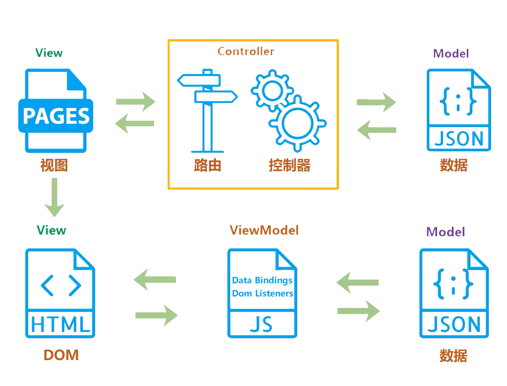

# Vue 面试题汇总之上篇

## 1.谈一下你对`MVVM`原理的理解

<!--  -->

- 传统的`MVC`指的是,用户操作(`View`)会请求服务端路由，路由会调用对应的控制器(`Controller`)来处理,控制器会获取数据(`Model`)。将结果返回给前端,页面重新渲染
- MVVM:传统的前端会将数据手动渲染到页面上, 而 `MVVM` 模式不需要用户操作 `dom` 元素,只需要将数据绑定到 `viewModel` 层上，视图层`View`会自动将数据渲染到页面中，当视图层`View`变化会通知 `ViewModel` 层更新数据。`ViewModel` 就是我们 MVVM 模式中的**桥梁**.

## 2.请说一下响应式数据的原理？

### 理解:

- 1.核心点:`Object.defineProperty`
- 2.默认 `Vue` 在初始化数据时，会给 `data` 中的**属性**使用 `Object.defineProperty` 重新定义**所有属性**, 当页面**取**到对应属性时。会进行**依赖收集**（收集当前组件的 `watcher`） 如果属性发生变化会**通知**(`notify`)相关`依赖`进行**更新**操作。

## 最后

文中若有不准确或错误的地方，欢迎指出，有兴趣可以的关注下[Github](https://github.com/GolderBrother)，一起学习呀~

 <comment/>
