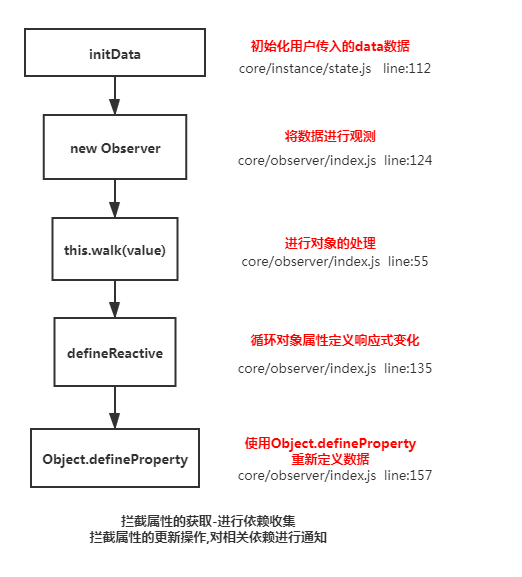
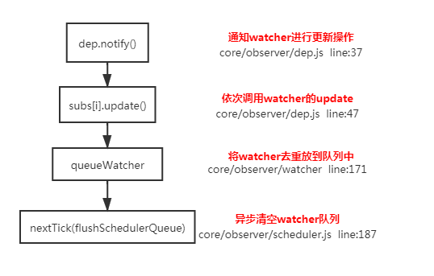
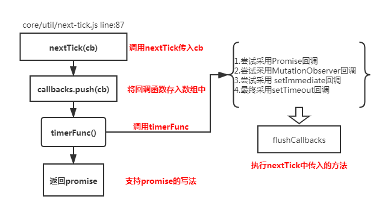
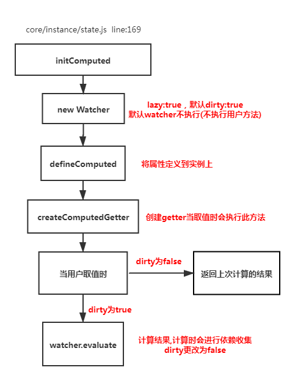
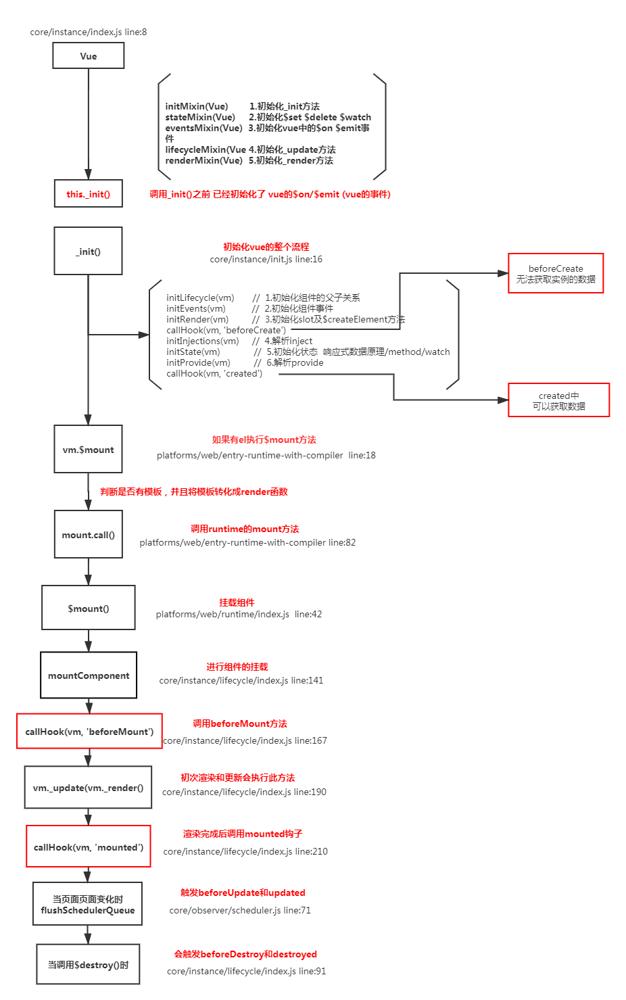

# Vue 面试题汇总之上篇

## 1.谈一下你对`MVVM`原理的理解

<!--  -->


- 传统的`MVC`指的是,用户操作(`View`)会请求服务端路由，路由会调用对应的控制器(`Controller`)来处理,控制器会获取数据(`Model`)。将结果返回给前端,页面重新渲染
- MVVM:传统的前端会将数据手动渲染到页面上, 而 `MVVM` 模式不需要用户操作 `dom` 元素,只需要将数据绑定到 `viewModel` 层上，视图层`View`会自动将数据渲染到页面中，当视图层`View`变化会通知 `ViewModel` 层更新数据。`ViewModel` 就是我们 MVVM 模式中的**桥梁**.

## 2.请说一下响应式数据的原理

### 理解

- 1.核心点:`Object.defineProperty`
- 2.默认 `Vue` 在初始化数据时，会给 `data` 中的**属性**使用 `Object.defineProperty` 重新定义**所有属性**, 当页面**取**到对应属性时。会进行**依赖收集**（收集当前组件的 `watcher`） 如果属性发生变化会**通知**(`notify`)相关`依赖`进行**更新**操作。

### 原理



```javascript
Object.defineProperty(obj, key, {
  enumerable: true,
  configurable: true,
  get: function reactiveGetter() {
    const value = getter ? getter.call(obj) : val;
    if (Dep.target) {
      dep.depend(); // ** 收集依赖 ** /
      if (childOb) {
        childOb.dep.depend();
        if (Array.isArray(value)) {
          dependArray(value);
        }
      }
    }
    return value;
  },
  set: function reactiveSetter(newVal) {
    const value = getter ? getter.call(obj) : val;
    if (newVal === value || (newVal !== newVal && value !== value)) {
      return;
    }
    if (process.env.NODE_ENV !== 'production' && customSetter) {
      customSetter();
    }
    val = newVal;
    childOb = !shallow && observe(newVal);
    dep.notify(); /**通知相关依赖进行更新**/
  }
});
```

## 3.`Vue`中是如何检测数组变化

### 理解

- 使用函数劫持的方式，重写了数组的方法
- `Vue`将`data`中的数组的方法，进行了**重写**。指向了自己定义的数组原型方法，这样当调用数组`api`时，可以通知依赖更新.如果数组中包含着**引用类型**。会对数组中的**引用类型**再次进行监控。

### 原理


```javascript
const arrayProto = Array.prototype;
export const arrayMethods = Object.create(arrayProto);
const methodsToPatch = ['push', 'pop', 'shift', 'unshift', 'splice', 'sort', 'reverse'];
methodsToPatch.forEach(function(method) {
  // 重写原型方法
  const original = arrayProto[method]; // 调用原数组的方法
  def(arrayMethods, method, function mutator(...args) {
    const result = original.apply(this, args);
    const ob = this.__ob__;
    let inserted;
    switch (method) {
      case 'push':
      case 'unshift':
        inserted = args;
        break;
      case 'splice':
        inserted = args.slice(2);
        break;
    }
    if (inserted) ob.observeArray(inserted);
    // notify change
    ob.dep.notify(); // 当调用数组方法后，手动通知视图更新
    return result;
  });
});

this.observeArray(value); // 进行深度监控
```

## 4.为何`Vue`采用异步渲染

### 理解

因为如果不采用异步更新，那么每次更新数据都会对当前组件进行重新渲染.所以为了性能考虑。`Vue`会在**本轮数据更新后**，再去**异步更新视图**!

### 原理



```javascript
update () {
    /* istanbul ignore else */
    if (this.lazy) {
      this.dirty = true
    } else if (this.sync) {
      this.run()
    } else {
      queueWatcher(this); // 当数据发生变化时会将watcher放到一个队列中批量更新
    }
}
export function queueWatcher (watcher: Watcher) {
  const id = watcher.id // 会对相同的watcher进行过滤
  if (has[id] == null) {
    has[id] = true
    if (!flushing) {
      queue.push(watcher)
    } else {
      let i = queue.length - 1
      while (i > index && queue[i].id > watcher.id) {
        i--
      }
      queue.splice(i + 1, 0, watcher)
    }
    // queue the flush
    if (!waiting) {
      waiting = true

      if (process.env.NODE_ENV !== 'production' && !config.async) {
        flushSchedulerQueue()
        return
      }
      nextTick(flushSchedulerQueue) // 调用nextTick方法 批量的进行更新
    }
  }
}
```

## 5.`nextTick`实现原理

### 理解:(**宏任务**和**微任务**) 异步方法

`nextTick`方法主要是使用了**宏任务**和**微任务**,定义了一个**异步方法**.多次调用`nextTick` 会将方法存入队列中，通过这个**异步方法**清空当前队列。 所以这个`nextTick`方法就是异步方法

### 原理



```javascript
let timerFunc; // 会定义一个异步方法
if (typeof Promise !== 'undefined' && isNative(Promise)) {
  // promise
  const p = Promise.resolve();
  timerFunc = () => {
    p.then(flushCallbacks);
    if (isIOS) setTimeout(noop);
  };
  isUsingMicroTask = true;
} else if (
  !isIE &&
  typeof MutationObserver !== 'undefined' && // MutationObserver
  (isNative(MutationObserver) ||
    MutationObserver.toString() === '[object MutationObserverConstructor]')
) {
  let counter = 1;
  // HTML5 Api: https://developer.mozilla.org/zh-CN/docs/Web/API/MutationObserver/observe
  // MutationObserver的 observe() 方法配置了 MutationObserver 对象的回调方法以开始接收与给定选项匹配的DOM变化的通知。根据配置，观察者会观察 DOM 树中的单个 Node，也可能会观察被指定节点的部分或者所有的子孙节点。
  const observer = new MutationObserver(flushCallbacks);
  const textNode = document.createTextNode(String(counter));
  // 监听文字变化后会自动触发回调
  observer.observe(textNode, {
    characterData: true
  });
  timerFunc = () => {
    counter = (counter + 1) % 2;
    textNode.data = String(counter);
  };
  isUsingMicroTask = true;
} else if (typeof setImmediate !== 'undefined') {
  // setImmediate
  timerFunc = () => {
    setImmediate(flushCallbacks);
  };
} else {
  timerFunc = () => {
    // setTimeout
    setTimeout(flushCallbacks, 0);
  };
}
// nextTick实现
export function nextTick(cb?: Function, ctx?: Object) {
  let _resolve;
  callbacks.push(() => {
    if (cb) {
      try {
        cb.call(ctx);
      } catch (e) {
        handleError(e, ctx, 'nextTick');
      }
    } else if (_resolve) {
      _resolve(ctx);
    }
  });
  if (!pending) {
    pending = true;
    timerFunc();
  }
}
```

## 6.`Vue`中`Computed`的特点

### 理解

- 默认`computed`也是一个`watcher`是具备**缓存**的，只要当**依赖的属性发生变化时才会更新视图**

### 原理:



```javascript
function initComputed(vm: Component, computed: Object) {
  const watchers = (vm._computedWatchers = Object.create(null));
  const isSSR = isServerRendering();
  for (const key in computed) {
    const userDef = computed[key];
    const getter = typeof userDef === 'function' ? userDef : userDef.get;
    if (!isSSR) {
      // create internal watcher for the computed property.
      watchers[key] = new Watcher(vm, getter || noop, noop, computedWatcherOptions);
    }

    // component-defined computed properties are already defined on the
    // component prototype. We only need to define computed properties defined
    // at instantiation here.
    if (!(key in vm)) {
      defineComputed(vm, key, userDef);
    } else if (process.env.NODE_ENV !== 'production') {
      if (key in vm.$data) {
        warn(`The computed property "${key}" is already defined in data.`, vm);
      } else if (vm.$options.props && key in vm.$options.props) {
        warn(`The computed property "${key}" is already defined as a prop.`, vm);
      }
    }
  }
}
function createComputedGetter(key) {
  return function computedGetter() {
    const watcher = this._computedWatchers && this._computedWatchers[key];
    if (watcher) {
      if (watcher.dirty) {
        // 如果依赖的值没发生变化,就不会重新求值
        watcher.evaluate();
      }
      if (Dep.target) {
        watcher.depend();
      }
      return watcher.value;
    }
  };
}
```

## 7.`Watch`中的`deep:true` 是如何实现的

### 理解

- 深度监听，当用户指定了`watch`中的 deep 属性为`true`时，如果当前监控的值是数组或者对象类型。会对数组元素或者对象中的每一项进行求值，此时会将当前`watcher`存入到**对应属性的依赖**中，这样数组元素或者对象发生变化时也会通知数据更新

### 原理:

```javascript
get () {
    pushTarget(this) // 先将当前依赖放到 Dep.target上
    let value
    const vm = this.vm
    try {
      value = this.getter.call(vm, vm)
    } catch (e) {
      if (this.user) {
        handleError(e, vm, `getter for watcher "${this.expression}"`)
      } else {
        throw e
      }
    } finally {
      if (this.deep) { // 如果需要深度监控
        traverse(value) // 会对对象中的每一项取值,取值时会执行对应的get方法
      }
      popTarget()
    }
    return value
}
function _traverse (val: any, seen: SimpleSet) {
  let i, keys
  const isA = Array.isArray(val)
  if ((!isA && !isObject(val)) || Object.isFrozen(val) || val instanceof VNode) {
    return
  }
  if (val.__ob__) {
    const depId = val.__ob__.dep.id
    if (seen.has(depId)) {
      return
    }
    seen.add(depId)
  }
  if (isA) {
    i = val.length
    while (i--) _traverse(val[i], seen)
  } else {
    keys = Object.keys(val)
    i = keys.length
    while (i--) _traverse(val[keys[i]], seen)
  }
}

```

## 8.`Vue`组件的生命周期

### 理解

#### 要掌握每个生命周期什么时候被调用

- `beforeCreate` 在实例初始化之后，数据观测(data observer) 之前被调用。
- `created` 实例已经创建完成之后被调用。在这一步，实例已完成以下的配置：数据观测(data observer)，属性和方法的运算， watch/event 事件回调。这里没有\$el
- `beforeMount` 在挂载开始之前被调用：相关的 render 函数首次被调用。
- `mounted` el 被新创建的 `vm.$el` 替换，并挂载到实例上去之后调用该钩子。
- `beforeUpdate` 数据更新时调用，发生在虚拟 DOM 重新渲染和打补丁之前。
- `updated` 由于数据更改导致的虚拟 DOM 重新渲染和打补丁，在这之后会调用该钩子。
- `beforeDestroy` 实例销毁之前调用。在这一步，实例仍然完全可用。
- `destroyed` `Vue` 实例销毁后调用。调用后，`Vue` 实例指示的所有东西都会解绑定，所有的事件监听器会被移除，所有的子实例也会被销毁。 该钩子在服务器端渲染期间不被调用。

#### 要掌握每个生命周期内部可以做什么事

- `created` 实例已经创建完成，因为它是最早触发的原因可以进行一些数据，资源的请求。
- `mounted` 实例已经挂载完成，可以进行一些 DOM 操作
- `beforeUpdate` 可以在这个钩子中进一步地更改状态，这不会触发附加的重渲染过程。
- `updated` 可以执行依赖于 DOM 的操作。然而在大多数情况下，你应该避免在此期间更改状态，因为这可能会导致更新无限循环。 该钩子在服务器端渲染期间不被调用。
- `destroyed` 可以执行一些优化操作,清空定时器，解除绑定事件


### 原理



## 9.`ajax`请求放在哪个生命周期中

### 理解

- 在 `created` 的时候，视图中的`dom`并没有渲染出来，所以此时如果直接去操`dom`节点，无法找到相关的元素
- 在 `mounted` 中，由于此时`dom`已经渲染出来了，所以可以直接操作`dom`节点

一般情况下都放到`mounted`中,保证逻辑的统一性,因为生命周期是同步执行的，`ajax`是异步执行的

> 服务端渲染不支持 mounted 方法，所以在服务端渲染的情况下统一放到 `created` 中

## 10.何时需要使用`beforeDestroy`

### 理解

- 可能在当前页面中使用了`$on`方法，那需要在**组件销毁前解绑**。
- **清除**自己定义的定时器
- **解除事件的绑定** `scroll mousemove ....`

## 最后

文中若有不准确或错误的地方，欢迎指出，有兴趣可以的关注下[Github](https://github.com/GolderBrother)，一起学习呀~

 <comment/>
```
